# Describing the Functional Relationship Between Two Quantities From a Graph

Source: https://www.mathacademy.com/topics/7902?courseId=39
Topic ID: 7902

## Prerequisites

- [Identifying Where a Function Is Increasing or Decreasing](./7900-identifying-where-a-function-is-increasing-or-decreasing.md)

## Lesson

### Introduction

Graphs can show how one real-world quantity changes as another quantity changes.

A **functional relationship** describes how an output quantity depends on an input quantity. On a graph, the input is usually on the horizontal axis, and the output is usually on the vertical axis.

Suppose represents time in hours, and represents distance from school in miles. The graph below shows one possible trip.

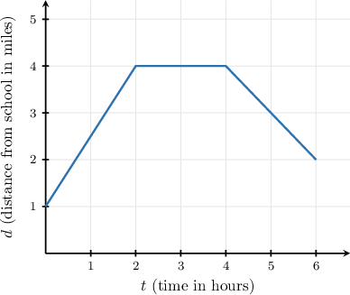

To read the relationship, we move from left to right.

- When the graph goes up, the output value increases.

- When the graph goes down, the output value decreases.

- When the graph is flat, the output value stays the same.

So, a graph is not just a picture of points. It tells a story about how the output changes as the input changes.

### Identifying Increasing, Decreasing, and Constant Intervals

An **interval** is a continuous stretch of input values, such as from to hours.

To identify behavior on intervals, we break the graph at the places where its direction changes. Then we describe each stretch as increasing, decreasing, or constant.

For the trip graph, the behavior changes at and

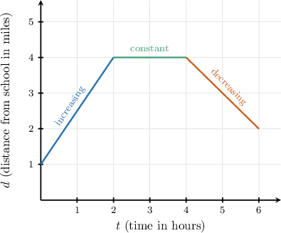

Reading from left to right:

- From to hours, the graph rises, so the distance is increasing.

- From to hours, the graph is flat, so the distance is constant.

- From to hours, the graph falls, so the distance is decreasing.

**Watch out!** We describe the graph as we move from left to right. A high point on the graph does not automatically mean increasing; increasing means the graph is rising over an interval.

### Example: Identifying Increasing and Decreasing Intervals From a Real-World Graph

#### Question

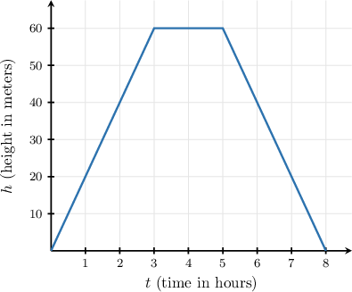

1. The height is constant between and hours.

2. The height is decreasing between and hours.

3. The height is decreasing between and hours.

#### Explanation

To determine which statements are true, let's analyze the graph by following it from left to right.

- Statement I: Between and hours, the graph is flat. This means the height is constant. So, Statement I is true.

- Statement II: Between and hours, the graph rises. This means the height is increasing, not decreasing. So, Statement II is false.

- Statement III: Between and hours, the graph falls. This means the height is decreasing. So, Statement III is true.

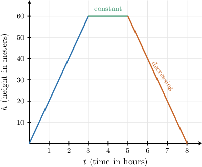

Therefore, the correct answer is "I and III only."

### Example: Identifying Where a Function Is Constant From a Real-World Graph

#### Question

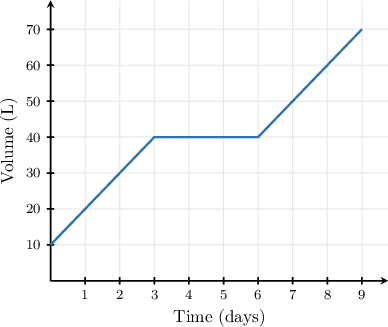

#### Explanation

To interpret the flat part of the graph, we first identify what each axis represents.

- The horizontal -axis represents the time in days.

- The vertical -axis represents the volume of water in liters.

A flat, horizontal line means that as we move from left to right (as time passes), the height of the graph (the volume) does not change.

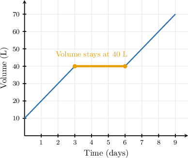

Between and days, the graph is a horizontal line at a volume of liters. This means the amount of water in the barrel did not increase or decrease during this period.

Therefore, the flat part of the graph means that the volume of water in the rain barrel stayed the same for those days.

### Translating Verbal Descriptions Into Graphs

When a description is written in words, we can sketch the graph by translating each phrase into a graph feature.

The image below shows two common translations.

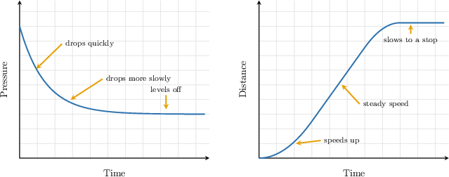

For a quantity that “drops quickly at first, then more slowly, and finally levels off,” the graph should decrease. It starts steep downward, becomes less steep, and then becomes flat.

For total distance, the graph behaves differently. If a runner “speeds up, then jogs at a steady speed, and finally slows to a stop,” the distance graph should keep increasing at first. It gets steeper while the runner speeds up, becomes a straight upward line at steady speed, and then becomes less steep until it levels off.

**Watch out!** A total-distance graph should not go down. Slowing down means the graph rises more slowly, not that the total distance decreases.

### Example: Sketching a Graph From a Verbal Description of a Real-World Relationship

#### Question

The air pressure in a bicycle tire with a slow leak drops quickly at first, then more slowly, and finally levels off at a steady value. Identify the graph that best matches this description of pressure over time.

****

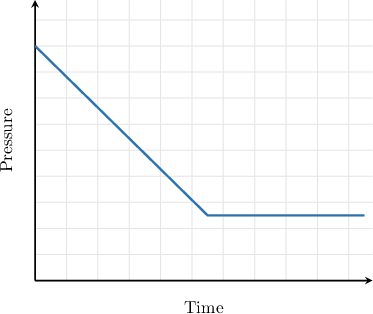

****

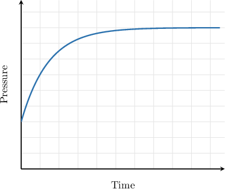

****

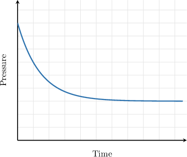

****

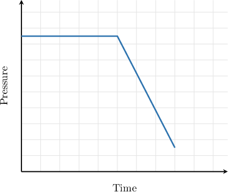

****

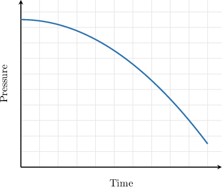

#### Explanation

To find the matching graph, we can break the verbal description into parts and determine how the pressure changes over time.

- ** The pressure decreases rapidly, so the graph must go down with a steep slope at the beginning.

- ** The pressure continues to drop, but at a slower rate. The graph should become less steep, creating a curve rather than a straight line.

- ** The pressure stops changing. The graph should level off and become a flat, horizontal line at a positive value (the steady pressure).

Let's examine the given graphs to see which one fits:

- Graph B shows the pressure increasing. This represents the tire being inflated, not leaking.

- Graph A decreases at a constant rate (a straight line) before leveling off. This does not show the pressure loss slowing down gradually.

- Graph E decreases slowly at first and then more rapidly. This is the opposite of the description.

- Graph D stays constant at first and then drops at a constant rate.

The only graph that shows a steep initial decrease, gradually flattens out, and eventually levels off as a horizontal line is Graph C:

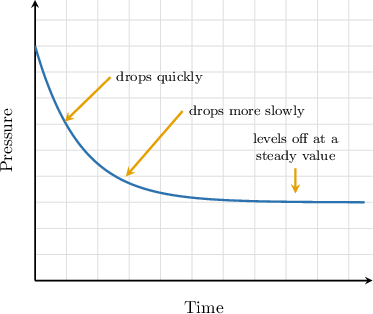

Therefore, Graph C is the correct graph.
