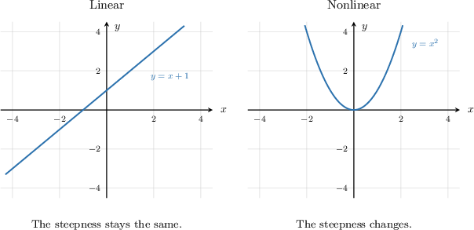
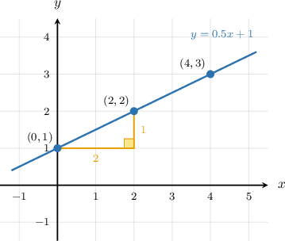
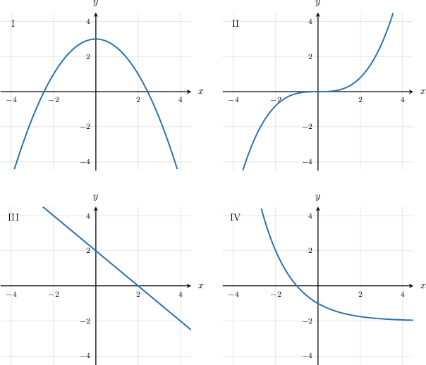
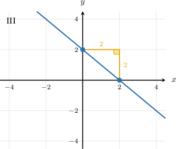
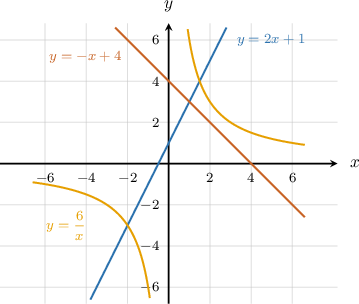

# Linear Functions Versus Nonlinear Functions

Source: https://www.mathacademy.com/topics/7903?courseId=39
Topic ID: 7903

## Prerequisites

- [Equations of Lines in Slope-Intercept Form](./1240-equations-of-lines-in-slope-intercept-form.md)
- [Introduction to Exponents](../../../elementary-school/lessons/grade-5/2314-introduction-to-exponents.md)
- [Visual Representations of Functions](./7938-visual-representations-of-functions.md)
- [Graphs of Functions](./7939-graphs-of-functions.md)

## Lesson

### Introduction

A function can be shown in more than one way. We might see its graph, its equation, or a table of values. In each representation, we are looking for the same idea: do the outputs change at a steady rate as the inputs change?

A **linear function** is a function with a constant rate of change. On a graph, that steady change appears as a straight line.

A **nonlinear function** is a function whose rate of change is not constant. On a graph, that often appears as a curve.

Here is the visual difference we want to notice first.

The straight graph has the same steepness everywhere, so it represents a linear function. The curved graph changes steepness as we move along it, so it represents a nonlinear function.

**Watch out!** A graph can pass through the origin and still be nonlinear. Passing through the origin is not enough. For this lesson, the key question is whether the graph forms a straight line or whether the rate of change changes.

### Linear Functions and Constant Rate of Change

A **constant rate of change** means that equal changes in produce equal changes in On a straight line, every equal step to the right changes the output by the same amount.

Suppose a line contains the points and Each time increases by the value of increases by

We can compare the changes between the first two points.

and

The same change happens from to increases by and increases by Because the change in is consistent for equal changes in the graph has a constant rate of change.

So, when we classify a graph, we ask: do the points form one straight line? If yes, the function is linear. If the graph curves, the function is nonlinear.

### Example: Identifying a Function as Linear or Nonlinear From Its Graph

#### Question

#### Explanation

To determine which graph represents a linear function, we look at the shape of the graph. A linear function has a constant rate of change, which means its graph is a straight line.

Let's examine the four graphs:

- Graph I is a curve (a parabola), so its rate of change is not constant.

- Graph II is a curve, so its rate of change is not constant.

- Graph III is a straight line, which means its rate of change is constant.

- Graph IV is a curve, so its rate of change is not constant.

Because Graph III is the only straight line, it is the only graph that represents a linear function.

### Recognizing Linear Equations

Graphs are not the only way to recognize linear functions. From an equation, we look for whether the rule can be written in slope-intercept form,

where and are constants.

In this form, is the slope and is the -intercept. The input variable appears only to the first power, which is usually unwritten.

Let's classify a few equations.

- is linear because it is in the form with and

- is nonlinear because the equation contains an term.

- is nonlinear because the variable is in the denominator.

- is nonlinear because the variable is an exponent.

A quick test is to ask whether the equation is a constant times plus a constant. If it is, the equation represents a linear function. If is squared, in a denominator, or used as an exponent, the function is nonlinear.

### Example: Identifying a Function as Linear or Nonlinear From Its Equation

#### Question

Which of the following equations represent linear functions?

#### Explanation

To decide whether an equation represents a linear function, we check if it can be written in the slope-intercept form where and are constants.

A function is nonlinear if its equation contains features like a squared variable () or a variable in a denominator because the rate of change depends on the input and is not constant.

With that in mind, let's examine each equation.

- Equation I is This is in the form with and Therefore, it represents a linear function, and its graph is a straight line.

- Equation II is Because the variable is in the denominator, this represents a nonlinear function, and its graph is a curve.

- Equation III is This is in the form with and Therefore, it also represents a linear function, and its graph is a straight line.

We can verify this by looking at their graphs.

Of the given equations, equations I and III represent linear functions.

Therefore, the correct answer is "I and III only."

### Using First Differences in Tables

When a function is shown in a table, we can compare the changes between consecutive output values. These changes are called **first differences**.

First, make sure the input values change by equal amounts. Then compare the output changes. If the first differences are all the same, the function is linear.

Consider this table.

The -values increase by each time. Now, we find the differences between successive -values.

The first differences are all so equal changes in produce equal changes in Therefore, the table represents a linear function.

If the first differences were something like then the output change would not be constant, so the function would be nonlinear.

### Example: Identifying a Function as Linear or Nonlinear From a Table of Values

#### Question

Which of the tables of values above represents a linear function?

#### Explanation

To decide whether a table of values represents a linear function, we check if the function has a constant rate of change. This means that equal changes in the input must produce equal changes in the output

In all four tables, the input increases by a constant amount of at each step. Let's find the difference between successive values of for each table to see if the change is constant.

- ** The values of are The changes are and The change is not constant, so this represents a nonlinear function.

- ** The values of are The changes are and The change is not constant, so this represents a nonlinear function.

- ** The values of are The changes are and The change is a constant so this represents a linear function.

- ** The values of are The changes are and The change is not constant, so this represents a nonlinear function.

Therefore, Table R is the only table that represents a linear function.
