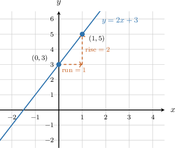
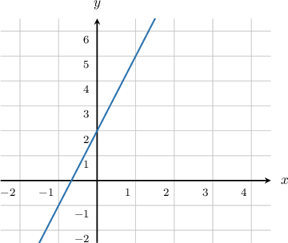
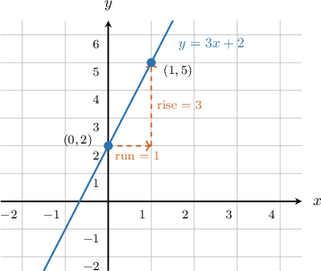

# Modeling Real-World Situations With Linear Equations

Source: https://www.mathacademy.com/topics/7904?courseId=39
Topic ID: 7904

## Prerequisites

- [Analyzing and Interpreting Graphs of Linear Equations](./1588-analyzing-and-interpreting-graphs-of-linear-equations.md)

## Lesson

### Introduction

Suppose a video game gives us points to start and then adds points for each level we complete. If is the number of levels completed and is the total score, we can write

A **linear model** is an equation that represents a real-world situation with a starting value and a constant rate of change.

Here, the input is the number of levels. The output is the total score.

The two important quantities are:

- The starting value is because that is the score when

- The constant rate of change is because the score increases by points for each level.

The same idea works when a quantity decreases. If a tank starts with liters and loses liters each hour, the rate of change is not

**Watch out!** A decreasing situation needs a negative rate of change, because the output gets smaller as the input increases.

### Modeling With y = mx + b

A common way to write a linear model is

In this form, is the input and is the output.

- is the slope, which represents the constant rate of change.

- is the -intercept, which represents the starting value.

Let's model a parking garage that charges a entry fee plus for each hour parked. Let be the number of hours and let be the total cost in dollars.

The cost changes by for each hour, so The starting cost is the entry fee of so Substituting these values gives

So, the linear model is This means the total cost starts at and increases by for each hour.

### Example: Writing a Linear Equation y = mx + b to Model a Real-World Situation

#### Question

A car's fuel tank contains liters of fuel, and the car uses fuel at a constant rate of liters per hour. Write an equation that models the amount of fuel in liters, remaining after hours of driving.

#### Explanation

We can use a linear equation of the form

We fill in the formula as follows:

- The total value is the amount of fuel in the tank in liters.

- The starting value is since the tank initially contains liters of fuel.

- The rate of change is since the car uses fuel (the amount decreases) at a rate of liters per hour. Note that the rate of change is negative because the amount of fuel decreases as time passes.

Substituting into the formula, we reach

### Using a Linear Model to Answer Questions

Once we have a linear model, we can use it to answer a question by substituting the input value.

Suppose the amount of money, in dollars, left on a game card after games is modeled by

Here, is the amount of money left, and is the number of games played. To find the amount left after games, we substitute into the equation and evaluate:

This result tells us that when we have

Therefore, after games, there are left on the game card.

**Watch out!** The number we compute is not just an answer to an equation. It is the output in the situation, so we should include the correct units and context.

### Example: Evaluating a Linear Model to Answer a Question About a Real-World Situation

#### Question

The altitude, in meters, of a hot-air balloon after minutes is modeled by Determine and interpret the altitude of the balloon after minutes.

#### Explanation

We are given the linear model where is the altitude of the balloon in meters, and is the time elapsed in minutes.

To determine the altitude of the balloon after minutes, we substitute into the equation and evaluate:

This result tells us that when we have

Therefore, the correct interpretation is that after minutes, the altitude of the balloon is meters.

### Finding Slope and Intercept From Tables and Graphs

A table or graph can also give us the two pieces we need for We look for the constant rate of change and the starting value.

For a table, first find how much changes when changes.

The cost goes up by each month, so Since the table does not show we use one point, such as to find

So, the model is

For a graph, the -intercept is where the line crosses the -axis, and the slope can be found from two clear points.

In the graph, the line crosses the -axis at so Using the points and we get

So, the graph represents the model

### Example: Constructing a Linear Model From a Description, a Table, or a Graph

#### Question

#### Explanation

The equation is in slope-intercept form where:

- is the slope.

- is the -intercept.

From the graph, the line crosses the -axis at so

To find the slope, use two clear points on the line, such as and

So, the values are

Therefore, and
