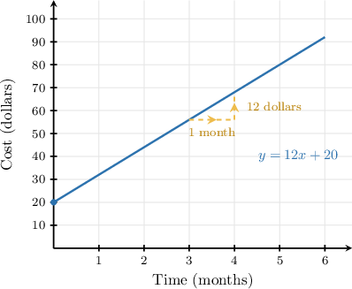
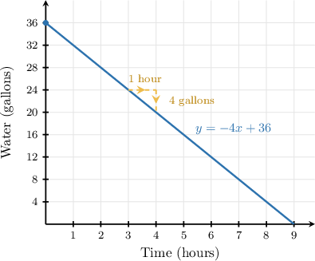
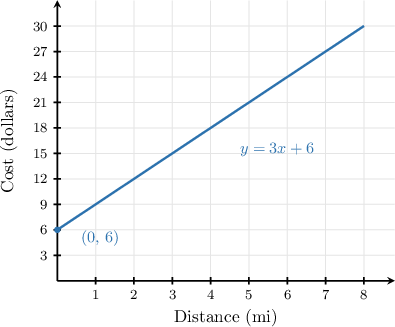
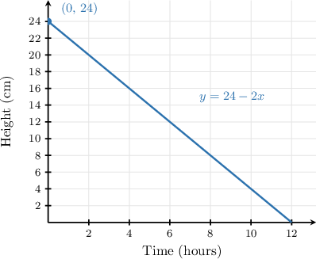
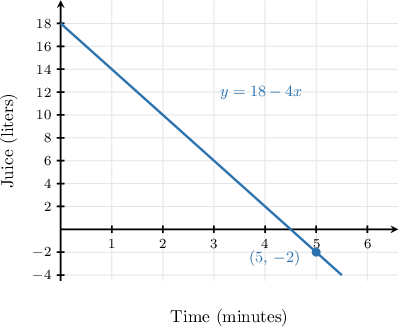

# Interpreting Rate of Change and Initial Value in Context

Source: https://www.mathacademy.com/topics/7905?courseId=39
Topic ID: 7905

## Prerequisites

- [Slope as a Unit Rate in Proportional Relationships](./7897-slope-as-a-unit-rate-in-proportional-relationships.md)

## Lesson

### Introduction

A linear equation can do more than give us numbers. In a real-world situation, each part of the equation tells a story about the quantities being related.

For a linear model written as we usually read the variables like this.

- The input tells us the amount of the independent quantity, such as time, miles, weeks, or hours.

- The output tells us the amount predicted by the model, such as cost, distance, height, or weight.

- The slope tells us how much the output changes for each additional unit of input.

- The -intercept tells us the output when This is the **initial value**, or the value at the starting point of the situation.

For example, if the total cost, in dollars, after months is modeled by then the model starts at and increases by each month.

As we interpret a linear model, we will keep asking, “What do and represent, and what units belong to each value?”

### Interpreting Slope as a Rate of Change

The slope of a linear model describes the constant rate of change. That means it tells us how much the output changes for each additional unit of input.

Suppose the cost, in dollars, of a club membership after months is modeled by

Here, represents the number of months and represents the cost in dollars. The equation is already in slope-intercept form so the slope is

A graph can help us connect the number to the context.

The units of the slope come from

So, a slope of means the cost increases by for each additional month.

**Watch out!** The slope is not the starting cost. The starting cost is the -intercept. The slope tells us the *change per unit of input*.

### Example: Interpreting the Slope of a Linear Equation as a Rate of Change in Context

#### Question

The amount of water, in gallons, remaining in a fish tank being drained after hours is modeled by Complete the following statement describing what the slope means in this context.

The amount of water in the tank by gallons for each additional that passes.

#### Explanation

The given equation is We can rewrite this in the slope-intercept form as: Here, the slope is

The units of the slope are the units of the output (gallons) divided by the units of the input (hours). So, the rate of change is gallons per hour.

Because the slope is negative, the amount of water in the tank is **. The magnitude of the slope is which means the water decreases by gallons for each additional hour that passes.

The complete statement is as follows:

The amount of water in the tank by gallons for each additional that passes.

### Interpreting the Y-Intercept as an Initial Value

The -intercept tells us the output when the input is In a context, this usually means the value at the start of the situation.

Suppose the cost, in dollars, of a taxi ride of miles is modeled by

This equation is in slope-intercept form Here, the -intercept is

We can check the meaning of this value by substituting

In this context, miles means before any distance is traveled. The output means the cost is

So, the -intercept represents the cost of the ride before any distance is traveled. The taxi ride starts with a cost of

### Example: Interpreting the Y-Intercept of a Linear Equation as an Initial Value in Context

#### Question

The height, in centimeters, of a burning candle after hours is modeled by Interpret the value in this context.

#### Explanation

The given equation is We can rewrite this in the slope-intercept form as: Here, the -intercept is

The -intercept corresponds to the value of the output when the input is equal to Substituting into the original equation, we get:

In this context, the input represents the number of hours the candle has been burning, and the output represents the height of the candle in centimeters.

So, when hours (before the candle is lit), the height of the candle is centimeters.

Therefore, the candle is centimeters tall before it is lit.

### Interpreting the Output of a Linear Model

To interpret the output of a linear model, we connect the computed value of back to what represents in the situation.

Suppose the amount of juice, in liters, left in a dispenser after minutes is modeled by

Here, represents the number of minutes and represents the number of liters of juice in the dispenser.

To interpret the output when we first substitute for

So, when the model gives This would mean there are liters of juice in the dispenser after minutes.

Now, we check whether that makes sense. A dispenser can have liters of juice, but it cannot have less than liters. Since a negative amount of juice is not physically possible, the output is not reasonable for the context.

### Example: Interpreting the Output of a Linear Model in a Real-World Context

#### Question

The number of kilograms of sand in a draining hopper after minutes is modeled by Complete the following statements interpreting the output value and judging whether it is reasonable when

When the model gives

This output represents the number of after minutes.

Since a hopper cannot contain a amount of sand, this output is for the context.

#### Explanation

First, we interpret the variables in the given linear model.

- The input represents the number of minutes the hopper has been draining.

- The output represents the number of kilograms of sand in the hopper.

Therefore, the output when represents the number of kilograms of sand in the hopper after minutes.

Next, we judge whether this output is reasonable in the real world. A hopper can be empty, containing kilograms of sand, but it cannot contain less than kilograms. Since a hopper cannot contain a negative amount of sand, an output of kilograms is not physically possible. Thus, this output is not reasonable for the context.

The complete statements are as follows:

When the model gives

This output represents the number of after minutes.

Since a hopper cannot contain a amount of sand, this output is for the context.
