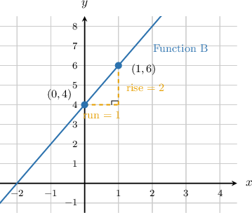
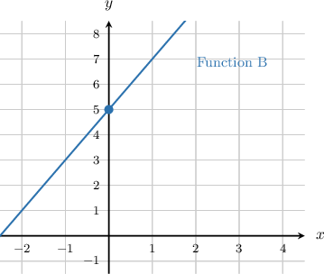
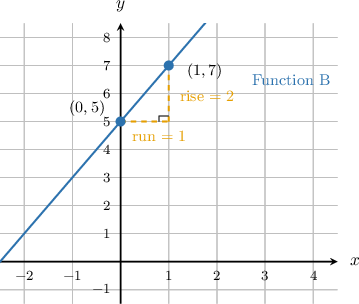
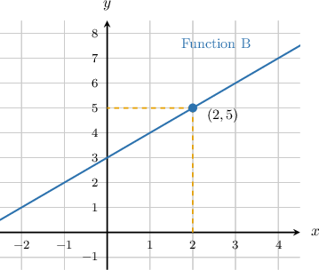
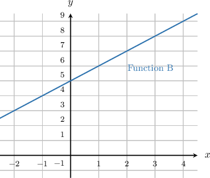
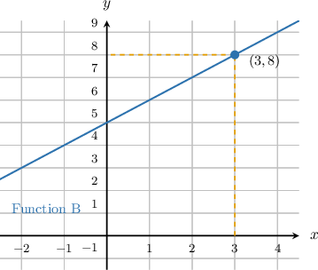

# Comparing Properties of Two Functions Represented Differently

Source: https://www.mathacademy.com/topics/7906?courseId=39
Topic ID: 7906

## Prerequisites

- [Equations of Lines in Slope-Intercept Form](./1240-equations-of-lines-in-slope-intercept-form.md)
- [Visual Representations of Functions](./7938-visual-representations-of-functions.md)
- [Graphs of Functions](./7939-graphs-of-functions.md)

## Lesson

### Introduction

When two functions are **represented differently**, they are shown in different forms, such as an equation, graph, table, or verbal description.

To compare them, we look for the same kinds of evidence in each representation.

- The starting value is the output when

- The rate of change tells how much the output changes for each -unit increase in the input.

- To compare outputs, use the same input value for both functions.

For example, suppose one function is given by and another is described as "starts at and increases by for each -unit increase in the input."

The equation tells us that the first function has rate of change and starting value The verbal description tells us that the second function has rate of change and starting value

So, the first function changes faster, but the second function starts higher. The key is to translate each representation into the same properties before comparing.

### Comparing Rate of Change and Starting Value

An equation in slope-intercept form, gives two comparison facts right away: is the rate of change, and is the starting value.

Suppose Function A is given by and Function B is shown in the graph.

From the equation for Function A, we can see that:

- The rate of change of Function A is

- The starting value of Function A is

For Function B, the graph crosses the -axis at so the starting value is Using the marked points and we calculate the rate of change.

Now, we compare matching properties. Since Function A has the greater rate of change. Since Function A does not have the greater starting value.

Also, the output when is the starting value, so the functions do not have the same output at

### Example: Comparing Two Linear Functions Given Algebraically and Graphically

#### Question

Function A is given by and Function B is shown in the graph above. Which of the following statements are true?

1. Function A has a greater rate of change than Function B.

2. Function A has a greater starting value than Function B.

3. Function A and Function B have the same output when

#### Explanation

Function A is given by the equation This is a linear equation in slope-intercept form, where is the rate of change and is the starting value.

From the equation, we can see that:

- The rate of change of Function A is

- The starting value of Function A is Function B is given by a graph.

We can find its rate of change and starting value by identifying two points on the line, such as and

The line intersects the -axis at the point so the starting value of Function B is

Using the two points, we calculate the rate of change:

So, the rate of change of Function B is Now, let's evaluate each statement:

- **** Function A has a rate of change of and Function B has a rate of change of Since Function A has a greater rate of change. This statement is true.

- **** Function A has a starting value of and Function B has a starting value of Since the two starting values are equal, Function A does not have a greater starting value. This statement is false.

- **** The output of a function when is its starting value. The starting value of Function A is and the starting value of Function B is Since they have the same output. This statement is true.

Therefore, the true statements are I and III only.

### Reading a Table for Rate of Change and Starting Value

A table shows input-output pairs. For a linear function, equal changes in should match equal changes in the output.

Consider Function A.

The starting value is the output when So, Function A has starting value

To find the rate of change, compare consecutive outputs as increases by

Because the output increases by each time increases by the constant rate of change is

If another function is shown by a graph, we still compare at the same input. For example, the graph below shows Function B at

From the table, From the graph, Since Function A has the greater output when

### Example: Comparing Two Linear Functions Given a Table and a Graph

#### Question

**

#### Explanation

To compare the outputs of the two functions at we need to find the value of each function when the input is

First, we find the output of Function A from the table. Looking at the table, we locate in the top row and read the corresponding output below it. When the output of Function A is

Next, we find the output of Function B from the graph. We locate on the horizontal -axis, move vertically up to the line, and read the corresponding value on the vertical -axis.

The point on the line is So, when the output of Function B is

Finally, we compare the two outputs. At the output of Function A is and the output of Function B is Since the output of Function A is ** the output of Function B.

### Interpreting a Verbal Description of a Linear Function

A verbal description can tell us the same properties as an equation, but the information is written in words.

Suppose Function A starts at a value of and increases by units for every -unit increase in the input. Function B is given by

For Function A, the phrase "starts at a value of " gives the starting value.

The phrase "increases by units for every -unit increase in the input" gives the rate of change.

So, Function A has:

- rate of change

- starting value

For Function B, the equation is in slope-intercept form, In the coefficient of is and the constant term is

So, Function B has:

- rate of change

- starting value

Now, we compare. Since Function B changes faster. Since Function A starts higher.

Watch out! A function can change faster without starting higher. Rate of change and starting value are different properties, so we compare them separately.

### Example: Comparing Two Linear Functions Given by a Verbal Description and an Equation

#### Question

Function A increases by units for every -unit increase in the input. Function B is given by Find the rate of change of the function that changes faster.

#### Explanation

To find which function changes faster, we need to determine the rate of change for each function and compare them.

First, we find the rate of change of Function A. The verbal description states that Function A increases by units for every -unit increase in the input. This tells us directly that the rate of change of Function A is

Next, we find the rate of change of Function B. Function B is given by the equation This equation is written in slope-intercept form, where is the slope, or rate of change. Here, the coefficient of is so the rate of change of Function B is

Finally, we compare the two rates of change. Function A has a rate of change of while Function B has a rate of change of Because Function B changes faster.

The rate of change of the function that changes faster is
