# Translations of Geometric Figures

Source: https://www.mathacademy.com/topics/7908?courseId=39
Topic ID: 7908

## Prerequisites

- [Subtracting a Negative Number](../prealgebra/297-subtracting-a-negative-number.md)
- [Polygons in the Coordinate Plane](../grade-6/2448-polygons-in-the-coordinate-plane.md)

## Lesson

### Introduction

A **translation** is a transformation that slides every point the same distance and in the same direction. The original point or figure does not turn, flip, stretch, or shrink.

When a point is translated, its new location is called its **image**. We usually name the image with a prime mark. For example, the image of is written as

The movement can be described by a **translation vector**, which tells us how far to move horizontally and vertically. Let's translate by moving units right and units up.

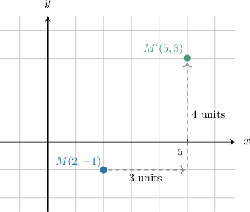

Moving right changes the -coordinate, and moving up changes the -coordinate.

- Moving units right means we add to the -coordinate.

- Moving units up means we add to the -coordinate.

Applying these changes gives the image point.

So, the image of is In general, a translation changes coordinates by adding or subtracting the horizontal and vertical shifts.

### Example: Translating a Point by a Given Vector

#### Question

A translation moves each point units left and units down. What is the image of the point

#### Explanation

To find the coordinates of the image point, we apply the given translation to the - and -coordinates of

- Moving units left means we subtract from the -coordinate.

- Moving units down means we subtract from the -coordinate.

Applying these changes gives the new coordinates:

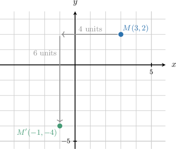

Therefore, the image of the point is

### Translating a Polygon

A polygon translates the same way a point does: we move *each vertex* by the same horizontal and vertical shifts, then connect the image vertices in the same order.

Suppose triangle has vertices and We translate the triangle units left and units down.

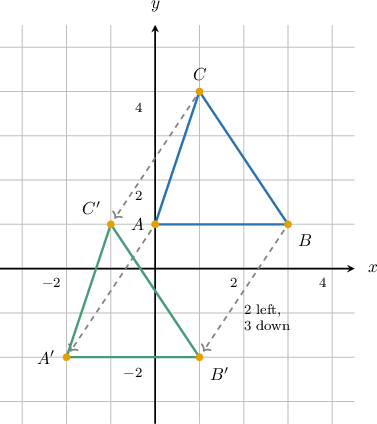

For each vertex, moving units left means subtracting from the -coordinate, and moving units down means subtracting from the -coordinate.

After we plot and we connect them in the order The translated triangle has the same size and shape as the original triangle because every vertex moved the same way.

**Watch out!** Do not move just one vertex and redraw a new triangle. A translation must apply the same shift to every vertex.

### Example: Translating a Polygon by a Given Vector

#### Question

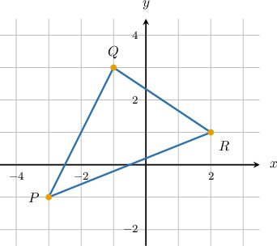

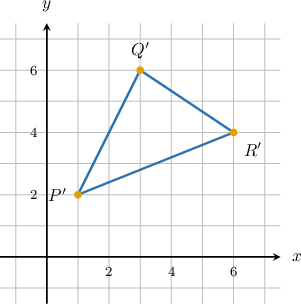

Drawing B

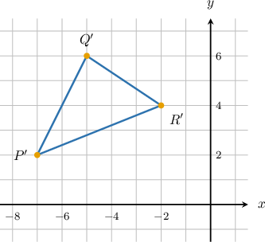

Drawing C

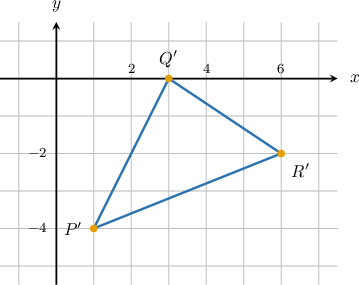

Drawing D

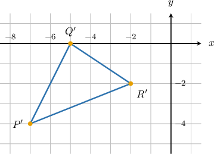

Drawing E

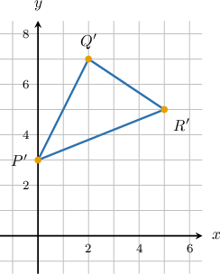

#### Explanation

To translate a polygon, we translate each of its vertices by the given amounts and connect the resulting image vertices.

The vertices of the original triangle are and

- Moving units right means we add to each -coordinate.

- Moving units up means we add to each -coordinate.

Applying these changes to each vertex gives the new coordinates:

Finally, we plot the new vertices and and connect them to form the translated triangle.

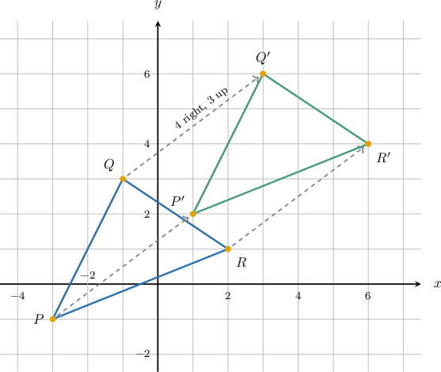

The translated triangle matches Drawing A, so Drawing A shows the image of the triangle.

### Finding the Translation That Maps a Figure to Its Image

Sometimes, we are given a figure and its image, and we need to identify the translation. We can compare any pair of corresponding points.

Suppose a point on a figure moves from to The horizontal shift is the change in the -coordinates.

This means the figure moved units right.

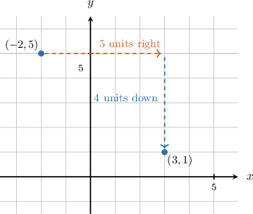

The vertical shift is the change in the -coordinates.

This means the figure moved units down.

So, the translation is units right and units down. In coordinate form, we write this as

**Watch out!** Always subtract in this order: image coordinate minus original coordinate. A negative change tells us the direction is left or down.

### Example: Describing a Translation From a Figure and Its Image

#### Question

A figure is mapped onto its image so that the point is mapped to Complete the following statements describing the translation.

The figure is translated units and units

In coordinate form, the translation is

#### Explanation

The translation maps the point to the point

To find the horizontal shift, we look at the change in the -coordinates: This means the figure is translated units left, which corresponds to subtracting from the -coordinate.

To find the vertical shift, we look at the change in the -coordinates: This means the figure is translated units up, which corresponds to adding to the -coordinate.

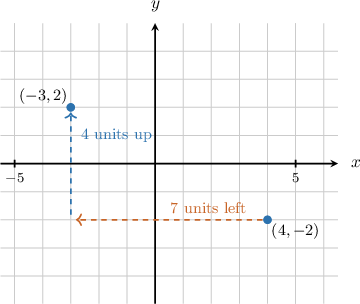

In coordinate form, subtracting from the -coordinate and adding to the -coordinate is written as

The complete statements are as follows:

The figure is translated units and units

In coordinate form, the translation is
