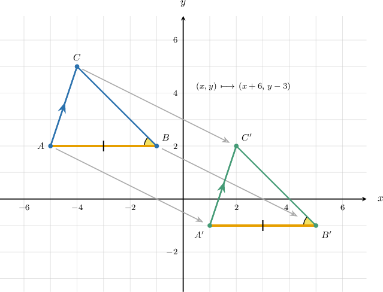
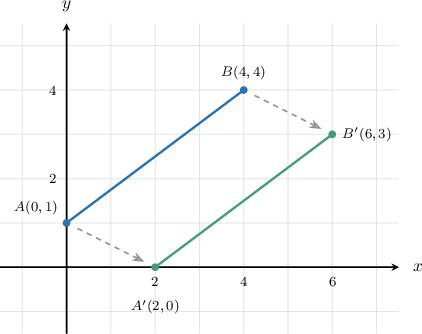
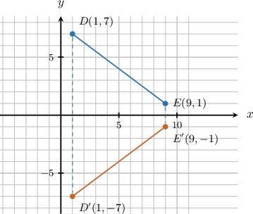
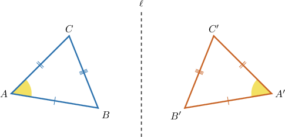
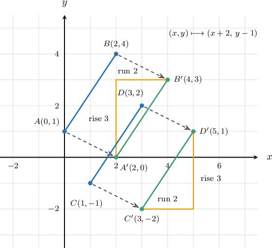
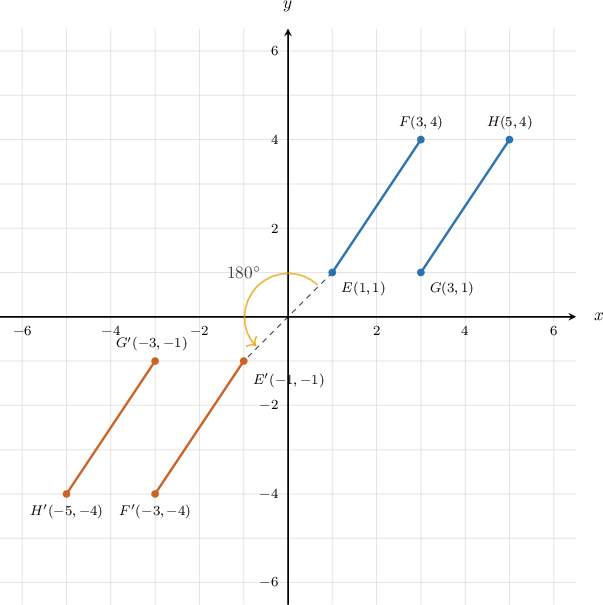

# Verifying Properties of Rigid Motions

Source: https://www.mathacademy.com/topics/7911?courseId=39
Topic ID: 7911

## Prerequisites

- [Calculating Slopes of Straight Lines](./396-calculating-slopes-of-straight-lines.md)
- [The Square Root of a Perfect Square](./1822-the-square-root-of-a-perfect-square.md)
- [Parallel and Perpendicular Lines](../../../elementary-school/lessons/grade-4/3979-parallel-and-perpendicular-lines.md)
- [Translations of Geometric Figures](./7908-translations-of-geometric-figures.md)
- [Reflections of Geometric Figures in the Coordinate Plane](./7909-reflections-of-geometric-figures-in-the-coordinate-plane.md)
- [Rotations of Geometric Figures](./7910-rotations-of-geometric-figures.md)

## Lesson

### Introduction

A **rigid motion** is a transformation that moves a figure without changing its size or shape. Translations, reflections, and rotations are rigid motions.

When a figure is transformed, the original figure is the preimage and the new figure is the image. Matching parts are called corresponding parts. For example, if maps to then and correspond.

Here is the idea we will keep using.

To **verify** that a property is preserved, we do not just say that the transformation is a rigid motion. We give evidence that the matching parts stayed the same.

- To verify length preservation, we compare corresponding segment lengths.

- To verify angle preservation, we compare corresponding angle measures.

- To verify parallelism, we compare slopes or use angle relationships.

So, our goal is to connect each preserved property to a piece of evidence we can calculate or justify.

### Using the Distance Formula to Verify Length Preservation

To show that a rigid motion preserves the length of a segment, we compare the distance between the original endpoints with the distance between the image endpoints.

Suppose segment has endpoints and The segment is translated units right and unit down to form

First, we find the image endpoints. The translation maps each point by So, the image endpoints are

Next, we compute both lengths using the distance formula. For the original segment,

For the image segment,

Since the corresponding segment lengths are equal. This verifies that the translation preserves the length of the segment.

### Example: Verifying That Rigid Motions Preserve Length

#### Question

A segment with endpoints and is reflected across the -axis to form segment Using coordinate-based distance reasoning, prove that the reflection preserves the length of the segment.

#### Explanation

To prove that the reflection preserves the length of the segment, we find the coordinates of the reflected endpoints and then use the distance formula to show that the lengths of the original segment and the reflected segment are equal.

First, we find the coordinates of the image endpoints and by applying the reflection.

Under a reflection across the -axis, a point maps to Therefore, the image endpoints are and

Next, we calculate the length of the original segment

By the distance formula, the length of the original segment is

Evaluating this expression gives

Then, we calculate the length of the reflected segment

By the distance formula, the length of the reflected segment is

Finally, we compare the two lengths to draw our conclusion.

Since the corresponding segment lengths are equal. Therefore, the reflection across the -axis preserves the length of the segment.

### Using Triangle Congruence to Verify Angle Preservation

A rigid motion preserves distances between points. We can use that length preservation to justify why angle measures are preserved.

Suppose is reflected to form The corresponding vertices are

Because the reflection is a rigid motion, each pair of corresponding sides has the same length:

Now, the two triangles have three pairs of equal corresponding sides. By the Side-Side-Side congruence criterion, and are congruent.

Corresponding parts of congruent figures are equal, so the matching angles have equal measures. For example,

The same reasoning applies to the other corresponding angles. So, if we know then its image angle has the same measure:

### Example: Verifying That Rigid Motions Preserve Angle Measure

#### Question

Triangle has It is translated units left and units up to form triangle What is

#### Explanation

A translation is a rigid motion. Rigid motions preserve the measure of all angles in a figure.

Since triangle is the image of triangle after a translation, the corresponding angles are congruent.

Therefore, the measure of is equal to the measure of

### Verifying Parallelism With Slope

In the coordinate plane, equal slopes are evidence that two nonvertical segments are parallel. So, to verify that a rigid motion preserves parallelism, we can compare the slopes of the image segments.

For a segment through and the slope is

Suppose and are parallel, with Both original segments have slope Now translate every point units right and unit down.

The image points are

Now, we compare the image slopes:

Since the image segments are parallel.

The same slope-comparison idea works after reflections and rotations too. First, find the image coordinates. Then, compute and compare the image slopes.

### Example: Verifying That Rigid Motions Preserve Parallelism

#### Question

#### Explanation

We want to verify that the image segments remain parallel after the rotation. We can do this by showing that they have equal slopes.

To show that the two image segments and remain parallel, we show that they have equal slopes. We begin with the two preimage segments.

The slope of segment through and is and the slope of segment through and is

Since the two preimage segments are parallel.

Next, we identify the coordinates of the image endpoints.

The transformation is a rotation of about the origin, which sends each point to

Applying this rule to the endpoints of we obtain

Then, we compute the slopes of the new segments.

Now, we compute the slope of the image segment through and

Applying the same reasoning to and their images are and so the slope of the image segment is

Next, we compare the slopes of the image segments.

Comparing the two image slopes, we find that

Finally, we draw our conclusion.

By the definition of parallel lines, two segments with equal slopes are parallel. Therefore, we conclude that
