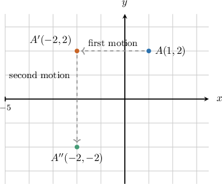
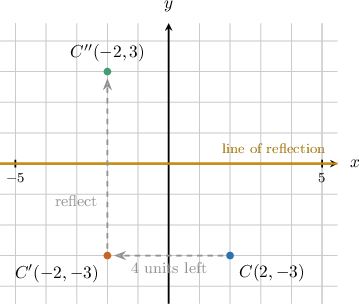
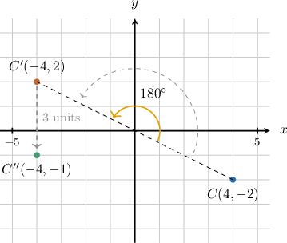
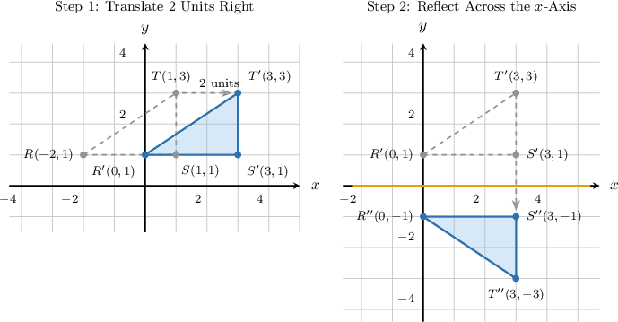
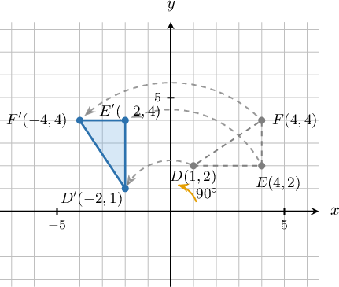
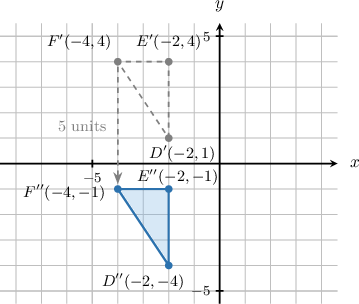
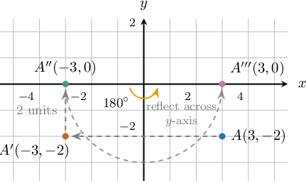
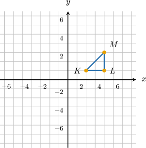
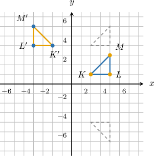

# Applying Sequences of Rigid Motions

Source: https://www.mathacademy.com/topics/7912?courseId=39
Topic ID: 7912

## Prerequisites

- [Translations of Geometric Figures](./7908-translations-of-geometric-figures.md)
- [Reflections of Geometric Figures in the Coordinate Plane](./7909-reflections-of-geometric-figures-in-the-coordinate-plane.md)
- [Rotations of Geometric Figures](./7910-rotations-of-geometric-figures.md)

## Lesson

### Introduction

Translations, reflections, and rotations move a point or figure without changing its size or shape. The new challenge is keeping track of more than one move in a row.

A **sequence of rigid motions** is a list of translations, reflections, and rotations applied one after another in the stated order. The **final image** is the point or figure after the last motion in the sequence.

Here is one way to picture a point moving through rigid motions.

In the diagram, is the starting point. After the first motion, its image is After the second motion, its final image is

**Watch out!** The order matters. If we switch the first and second motions, the final image may land in a different place.

### Tracking Points Through Two Rigid Motions

To track a point through two rigid motions, we apply the first rule, record the intermediate image, and then apply the second rule to that intermediate image.

Suppose is translated units left and then reflected across the -axis.

First, translating units left subtracts from the -coordinate:

Next, reflecting across the -axis changes the -coordinate to its opposite while keeping the -coordinate the same:

So, the final image of is The prime marks help us avoid skipping a step: is the starting point, is after the first motion, and is after both motions.

### Example: Applying a Sequence of Two Rigid Motions to a Point

#### Question

The point is rotated about the origin and then translated units down. Give the coordinates of the final image.

#### Explanation

To find the final coordinates, we apply the two transformations to the point one at a time.

First, we rotate the point by about the origin. A rotation of about the origin maps a point to Applying this rule to we obtain the intermediate image

Next, we translate the point by units down. A translation units down subtracts from the -coordinate, mapping a point to Applying this rule to we obtain the final image

The coordinates of the final image are

### Tracking Polygons Through Two Rigid Motions

For a polygon, we use the same step-by-step idea, but we track every vertex. Matching letters keep the correspondence clear.

Suppose has vertices and The triangle is translated units right and then reflected across the -axis.

First, translating units right adds to each -coordinate:

Next, reflecting across the -axis changes each -coordinate to its opposite:

So, the final image is with vertices and

### Example: Applying a Sequence of Two Rigid Motions to a Polygon

#### Question

Triangle has vertices and It is first rotated counterclockwise about the origin and then translated units down. Determine the final image of each vertex.

#### Explanation

We apply the two rigid motions one at a time, tracking the coordinates of each vertex.

****

A rotation of counterclockwise about the origin maps a point to

Applying this rule to each vertex of we obtain the intermediate images:

****

Next, the triangle is translated units down. A translation units down subtracts from the -coordinate of a point, changing its coordinates by

Applying this translation to each vertex of the intermediate we obtain the final images:

### Applying Three or More Rigid Motions

When a sequence has or more rigid motions, organization matters even more. We keep one image label for each stage:

Suppose is reflected across the -axis, translated units up, and then rotated about the origin.

We apply the rules in order:

So, the final image is For a polygon, we use the same chain for each vertex before naming the final image.

### Example: Determining the Final Image Given a Sequence of Three or More Rigid Motions

#### Question

Triangle has vertices and It undergoes a translation units up, then a reflection across the -axis, then a rotation about the origin. Determine the final image of each vertex.

The triangle is shown below, together with the coordinate axes.

#### Explanation

To find the final image of we apply the sequence of rigid motions one by one to its vertices. The initial vertices are and

First, we apply a translation units up. This adds to each -coordinate, while the -coordinates remain unchanged. The rule for this translation is

Applying this rule to each vertex, we get:

Next, we apply a reflection across the -axis. This keeps the -coordinate the same and negates the -coordinate. The rule for this reflection is

Applying this rule to our previously translated vertices, we get:

Finally, we apply a rotation of about the origin. This negates both the - and -coordinates. The rule for this rotation is

Applying this rule to our previously reflected vertices, we get:

Therefore, the final image of has vertices and

