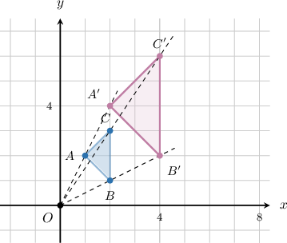
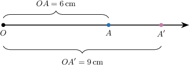
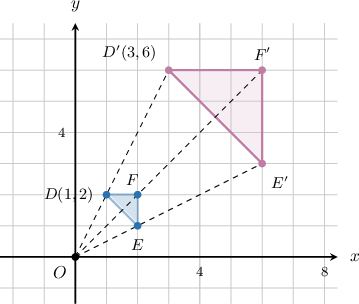
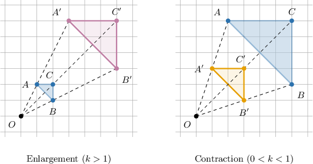
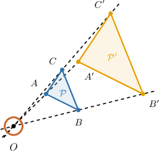
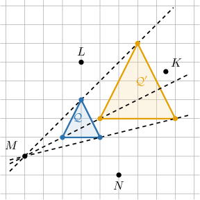
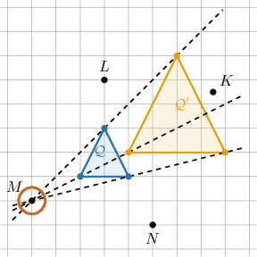

# Dilations of Geometric Figures

Source: https://www.mathacademy.com/topics/7914?courseId=39
Topic ID: 7914

## Prerequisites

- [The Cartesian Coordinate System](../prealgebra/92-the-cartesian-coordinate-system.md)
- [Equivalent Ratios](../prealgebra/553-equivalent-ratios.md)
- [Comparing Rational Numbers](../grade-6/965-comparing-rational-numbers.md)

## Lesson

### Introduction

A rigid motion can slide, flip, or turn a figure without changing its size. A **dilation** is different: it keeps the overall shape of a figure, but changes its size from one fixed point.

Look at a triangle before and after it is resized from point

The original triangle is and its image is The dashed rays show an important pattern: each original point and its image lie on the same ray starting at

A **center of dilation** is the fixed point that the resizing happens from. In the picture, is the center of dilation.

So, in a dilation, the figure changes size, but its corresponding points keep the same direction from the center.

### The Scale Factor of a Dilation

To describe *how much* a dilation resizes a figure, we compare distances from the center.

The **scale factor** of a dilation is the ratio of the distance from the center to a point on the image, to the distance from the center to the corresponding point on the original figure.

Suppose a dilation centered at maps point to The distance from to is and the distance from to is

Using the distance ratio, we get

This means every distance from the center to the image is times the corresponding distance from the center to the original figure.

### Example: Identifying the Scale Factor of a Dilation From a Figure and Its Image

#### Question

#### Explanation

The scale factor of a dilation centered at the origin can be found by comparing the coordinates of an image point to the coordinates of its corresponding original point.

From the graph, let's identify the coordinates of a vertex on the original polygon and its corresponding vertex on the image polygon.

- The original point is located at

- Its image is located at

Since the center of dilation is at the origin we can calculate the scale factor by taking the ratio of the -coordinates (or -coordinates) of the image point and the original point:

We can verify this by checking the -coordinates, which gives or by checking another pair of points. For example, point is at and its image is at which also gives a scale factor of

Therefore, the scale factor is

### Enlargements and Contractions

Once we know the scale factor, we can describe the type of dilation by comparing the scale factor to Let be the scale factor.

- If the image is larger than the original figure. This is called an **enlargement**.

- If the image is smaller than the original figure. This is called a **contraction**.

- If the image is the same size as the original figure.

For example, a scale factor of is less than so the dilation is a contraction. Each point in the image is of its original distance from the center.

**Watch out!** A dilation is not classified by whether the image moves left, right, up, or down. We compare the *size* of the image to the size of the original figure.

### Example: Identifying a Dilation as an Enlargement or a Contraction

#### Question

A dilation has a scale factor of Determine whether the dilation is an enlargement or a contraction, and describe its effect on distances from the center.

#### Explanation

The scale factor of a dilation determines both the size of the image and the distance of its points from the center of dilation.

We are given a dilation with a scale factor of

First, we compare the scale factor to to determine the type of dilation:

- Because the scale factor is less than the image is smaller than the original figure.

- A dilation that creates a smaller image is called a contraction.

Next, we determine the effect on the distances from the center:

- The distance from the center of dilation to any point on the image is the scale factor multiplied by the point's original distance from the center.

- This means each point in the image is of its original distance from the center.

Therefore, it is a contraction, and each point in the image is of its original distance from the center.

### Finding the Center of a Dilation

To find the center of a dilation, we reverse the idea from the earlier pictures. During a dilation, every point moves along a straight path radiating from the center.

The center lies on any straight line that passes through a point and its corresponding image point.

In the diagram, the original figure is and the image is To locate the center, we draw straight lines through corresponding vertices.

- Draw a line through and

- Draw another line through and

- Check where the correspondence lines meet.

The common intersection point is the center of dilation. In this example, the lines meet at so is the center.

This is why center-finding diagrams often show dashed lines through corresponding points: the dashed lines point back to the fixed center of the resizing.

### Example: Identifying the Center of a Dilation

#### Question

#### Explanation

The center of a dilation lies on any straight line that passes through a point and its corresponding image point.

To find the center of dilation, we can trace the straight paths through corresponding vertices of the figure and its image

In the diagram, these paths are shown as dashed lines. Notice that all of these dashed lines intersect at a single point.

As highlighted above, the common intersection point is

Therefore, point is the center of the dilation.
