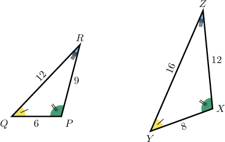
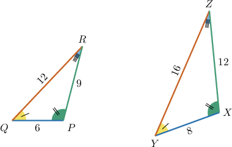
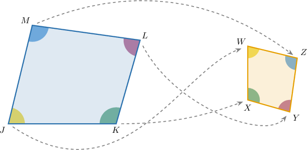
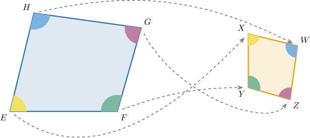

# Similar Polygons

Source: https://www.mathacademy.com/topics/7916?courseId=39
Topic ID: 7916

## Prerequisites

- [Congruent Polygons](../prealgebra/1515-congruent-polygons.md)
- [Dilations of Geometric Figures](./7914-dilations-of-geometric-figures.md)

## Lesson

### Introduction

Two polygons can be different sizes and still have the same shape. We call them **similar polygons** when both of these conditions are true:

- Their **corresponding angles** are equal.

- Their **corresponding sides** are proportional, meaning the matching side lengths all have the same ratio.

Here, corresponding parts are the parts that match each other in the same position.

(image_1)

From the angle markings, the angles match in pairs: matches matches and matches

Now, we compare the matching side lengths from the larger triangle to the smaller triangle:

All three ratios are equal. So, the angles match and the side lengths are proportional. Therefore, the triangles are similar.

### Example: Identifying Two Polygons as Similar Given Their Side Lengths and Angles

#### Question

#### Explanation

From the given figure, the corresponding angles of the two triangles are marked with matching tick marks. This indicates that the corresponding angles are **.

Comparing corresponding sides, the ratios of the larger triangle's sides to the smaller triangle's sides are and Next, we simplify these ratios:

The ratios all simplify to Because the corresponding side lengths share a single common ratio, the corresponding sides are **.

Two polygons are similar if their corresponding angles are equal and their corresponding sides are proportional. Therefore, the two triangles are **.

### Finding the Scale Factor

A **scale factor** tells us what number multiplies each side length of one similar polygon to get the corresponding side length of the other polygon.

The direction matters. If the question asks for the scale factor *from* the smaller polygon *to* the larger polygon, we divide

In the diagram, side on the smaller polygon corresponds to side on the larger polygon. Their lengths are and

So, the scale factor from the smaller polygon to the larger polygon is

This means every side length of the smaller polygon is multiplied by to get the matching side length of the larger polygon.

**Watch out!** If the direction were from the larger polygon to the smaller polygon, we would use the reciprocal,

### Example: Determining the Scale Factor Between Two Similar Polygons

#### Question

#### Explanation

Two polygons are ** if their corresponding side lengths are proportional. This means corresponding side lengths are multiplied by the same **.

The question asks for the scale factor ** the larger polygon ** the smaller polygon. To find this, we divide the length of a side on the smaller polygon by the length of the corresponding side on the larger polygon.

From the diagram, we can identify a pair of corresponding sides:

- The side in the larger polygon has length

- The corresponding side in the smaller polygon has length

Therefore, the scale factor is

### Writing Similarity Statements

Once we know two polygons are similar, we need to name them in a way that preserves the matching order. A **similarity statement** uses the symbol and lists corresponding vertices in the same positions.

Suppose the angle markings show these correspondences:

- Vertex corresponds to vertex

- Vertex corresponds to vertex

- Vertex corresponds to vertex

- Vertex corresponds to vertex

Then we write the vertices in matching order:

This statement tells us more than just “the shapes are similar.” It also tells us the correspondence: and

**Watch out!** The order matters. For example, would match with instead of so it would not describe the same correspondence.

### Example: Writing a Similarity Statement Between Two Similar Polygons

#### Question

#### Explanation

In similar polygons, corresponding vertices must be written in the same order.

Identify the corresponding vertices by matching the colors of the marked angles in the two quadrilaterals.

- Vertex corresponds to vertex (both marked in yellow).

- Vertex corresponds to vertex (both marked in green).

- Vertex corresponds to vertex (both marked in pink).

- Vertex corresponds to vertex (both marked in blue).

Therefore, writing the vertices in matching order, the correct similarity statement is
