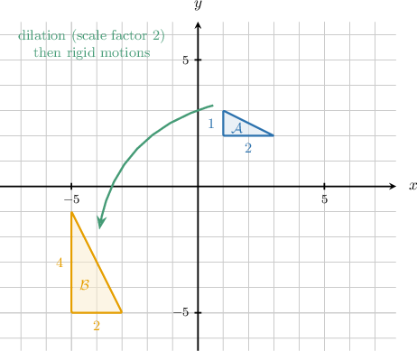
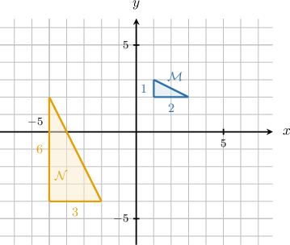
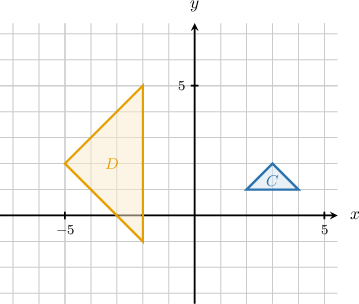
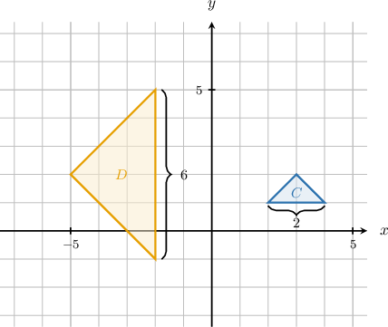
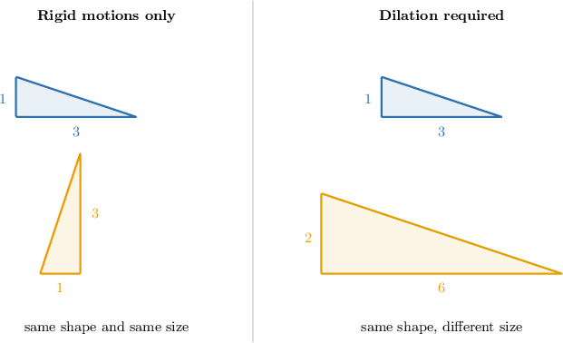
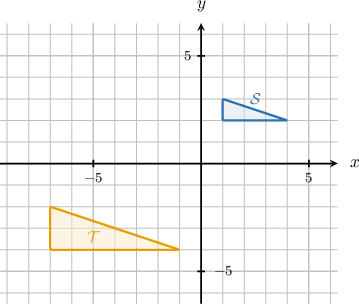
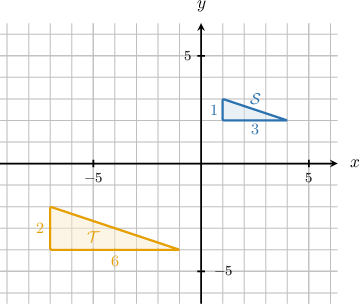

# Similarity Through Sequences of Transformations

Source: https://www.mathacademy.com/topics/7918?courseId=39
Topic ID: 7918

## Prerequisites

- [Translations of Geometric Figures](./7908-translations-of-geometric-figures.md)
- [Rotations of Geometric Figures](./7910-rotations-of-geometric-figures.md)
- [Similar Polygons](./7916-similar-polygons.md)

## Lesson

### Introduction

We already know that translations, rotations, and reflections are rigid motions: they can move or turn a figure, but they do not change its size. We have also seen that a dilation can enlarge or reduce a figure while keeping the same shape.

When two figures have the same shape but may have different sizes, we can ask a transformation question: Can one figure be mapped onto the other by changing size and then moving it into place?

In the picture, triangle has legs of length and Triangle has corresponding legs of length and The side lengths of are twice the corresponding side lengths of so a dilation with scale factor changes the size correctly.

But size is not the only thing to check. If the larger triangle is turned or shifted, we may also need a rotation, reflection, or translation to line it up.

The main idea is this: similar figures can be matched by a dilation together with any rigid motions needed to fix the position or orientation.

### Similarity Transformations

A **similarity transformation** is a sequence of transformations made up of rigid motions and dilations. A similarity transformation maps a figure to a similar figure.

To decide whether two figures are similar using transformations, we compare what must change.

- If the side lengths change by the same scale factor, a dilation is needed.

- If the figure is turned, flipped, or moved, rigid motions may be needed.

- If the shape changes, no sequence of dilations and rigid motions will map one figure exactly onto the other.

Let's check a small example. Suppose triangle has corresponding side lengths and and triangle has corresponding side lengths and The ratios match:

So, the dilation scale factor from to is If is also in a different location or orientation, we add rigid motions after the dilation to map onto

### Example: Identifying Two Figures as Similar if a Sequence of Transformations Maps One Onto the Other

#### Question

1. A dilation alone can change the size of one figure to match the other.

2. Rigid motions may be needed in addition to a dilation to map one figure onto the other.

3. The two figures are similar.

#### Explanation

A ** is a sequence of transformations made up of rigid motions (rotations, reflections, and translations) and dilations. A similarity transformation maps a figure to a similar figure.

First, let's examine the dimensions of the two figures:

- Triangle is a right triangle with a horizontal leg of length and a vertical leg of length

- Triangle is a right triangle with a horizontal leg of length and a vertical leg of length

Next, we compare their corresponding parts. The ratio of the lengths of the corresponding legs is equal:

Because the side-length ratios are equal and both triangles have a right angle, the triangles have the same shape and are similar. Thus, Statement III is true.

Now, we evaluate Statement I. A dilation scales all dimensions equally, keeping horizontal lines horizontal and vertical lines vertical. Dilating triangle by a scale factor of would result in a horizontal leg of length and a vertical leg of length This does not match triangle which has a horizontal leg of length and a vertical leg of length Thus, a dilation alone cannot map one figure to the size and orientation of the other. Statement I is false.

Finally, we evaluate Statement II. Because the corresponding legs have different orientations (the longer leg is horizontal in but vertical in), a rotation (a rigid motion) is needed in addition to a dilation to map one figure onto the other. A translation is also required to move the figure to the correct location. Thus, Statement II is true.

Therefore, only Statements II and III are true.

### Example: Identifying the Type of Transformations Needed to Show Similarity

#### Question

#### Explanation

To determine which combination of transformations maps figure onto figure we can compare their sizes and orientations.

First, we compare the sizes of the figures. Figure is a triangle with a horizontal base of units. Figure is a triangle with a vertical base of units.

Since the side lengths of figure are three times as long as the corresponding side lengths of figure the size changes. To change the size of a figure, a ** is required. Specifically, a dilation with a scale factor of is needed to map the size of figure to figure

Next, we compare the orientations. The base of figure is horizontal, while the corresponding base of figure is vertical. This means figure is turned relative to figure To change the orientation of a figure, a ** is required.

Therefore, the combination of transformations needed to map figure onto figure is a dilation with scale factor and a rotation.

### Congruence vs. Similarity

Now, we can separate two related ideas.

- Figures are congruent when they have the exact same shape and size. Rigid motions alone can map one congruent figure onto the other.

- Figures are similar when they have the same shape, but not necessarily the same size. If the side lengths change by a scale factor, a dilation is required.

In the congruent case, side lengths are preserved. For example, a side of length stays length so a translation, rotation, or reflection may be enough.

In the similar-but-not-congruent case, side lengths are not preserved. For example, if corresponding sides change from to and from to the common scale factor is

Because the side lengths changed, rigid motions alone cannot do the mapping. A dilation is required, so the figures are similar but not congruent.

### Example: Distinguishing Between Congruence and Similarity Through Transformations

#### Question

#### Explanation

First, let's find the side lengths of the two figures.

By counting the grid units on the coordinate plane, we can see:

- For figure the horizontal side length is units and the vertical side length is unit.

- For figure the horizontal side length is units and the vertical side length is units.

The side lengths of are twice the corresponding side lengths of This means the two triangles have the same shape, but is larger than

Because the side lengths are not preserved (they have changed), the mapping from to cannot be done with only rigid motions; it requires a dilation.

Two figures are congruent if they have the exact same shape and size. Two figures are similar if they have the same shape but not necessarily the same size. Since is a scaled copy of the figures are similar but not congruent.
