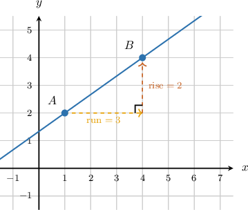
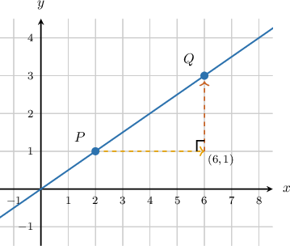
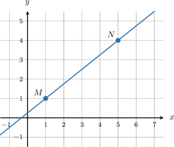
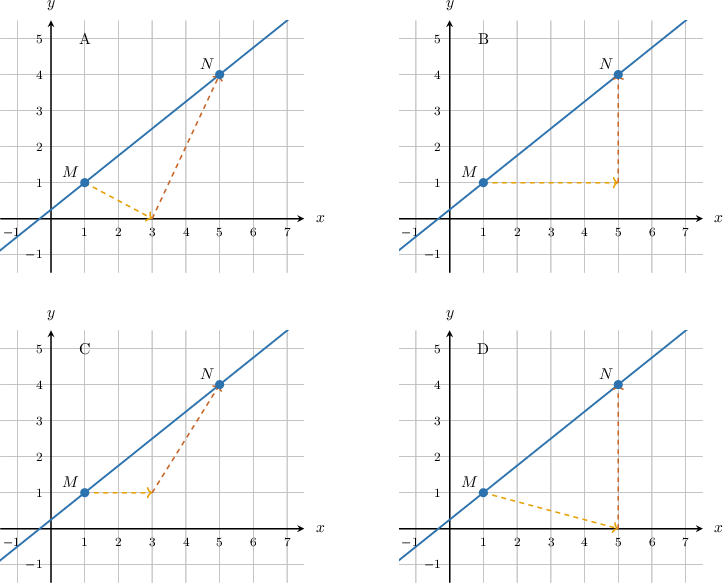
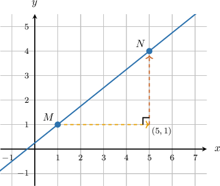
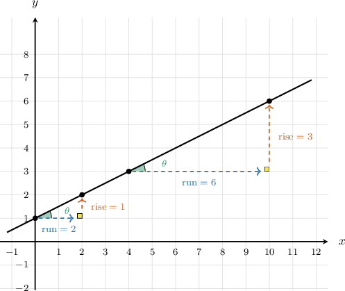
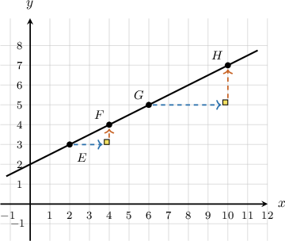
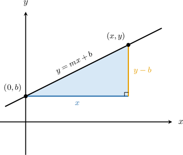
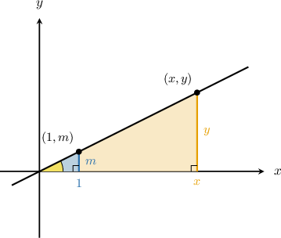

# Using Similar Triangles to Explain Slope

Source: https://www.mathacademy.com/topics/7920?courseId=39
Topic ID: 7920

## Prerequisites

- [Equations of Lines in Slope-Intercept Form](./1240-equations-of-lines-in-slope-intercept-form.md)
- [Classifying Figures Based on Angles](../../../elementary-school/lessons/grade-4/6368-classifying-figures-based-on-angles.md)
- [The Angle-Angle Criterion for Similar Triangles](./7919-the-angle-angle-criterion-for-similar-triangles.md)

## Lesson

### Introduction

A line has the same steepness everywhere. To explain why, we can compare the vertical and horizontal changes between points on the line.

A **slope triangle** is a right triangle drawn between two points on a line. Its horizontal leg shows the run, and its vertical leg shows the rise.

Suppose a line passes through and We can start at move horizontally to match the -coordinate of and then move vertically to reach

The horizontal change is so the run is The vertical change is so the rise is The segment from to lies on the line and forms the hypotenuse of the right triangle.

So, the slope can be read from the triangle as

This triangle gives us a visual way to connect coordinate changes, right triangles, and the steepness of a line.

### Drawing Slope Triangles

To draw a slope triangle correctly, the two points on the line must be the endpoints of the hypotenuse.

Suppose a line passes through and We want a right triangle that measures the change from to

We draw it in two moves.

- First, move horizontally from to match the -coordinate of This gives the point and creates a horizontal leg from to

- Next, move vertically from to reach This creates a vertical leg from to

The two legs meet at a right angle at and the segment from to is the hypotenuse.

**Watch out!** The horizontal and vertical legs should not stop early or point away from the second point. They must connect the two given points through one right-angle corner.

### Example: Constructing Similar Right Triangles Between Points on a Line

#### Question

#### Explanation

To form a right triangle between points and using a horizontal and a vertical leg, we can start at and move horizontally, then move vertically to reach

First, we move horizontally from to match the -coordinate of This creates a horizontal leg from to

Next, we move vertically from this new point to reach This creates a vertical leg from to

These two segments meet at a right angle at and the line segment connecting and forms the hypotenuse.

Comparing this to the given drawings, Drawing correctly shows these horizontal and vertical legs meeting at

### Similar Triangles and Constant Slope

Once we can draw slope triangles, we can explain why a line has one constant slope.

Consider two right triangles drawn along the same line. One triangle has a run of and a rise of A larger triangle on the same line has a run of and a rise of

The two triangles are similar because each has a right angle, and each shares the same angle that the line makes with the horizontal.

Because similar triangles have proportional corresponding sides, the ratio of the vertical leg to the horizontal leg is the same for both triangles:

Each of these ratios is a slope, because slope is the ratio of vertical change to horizontal change:

So, no matter which two points we choose on the line, the slope triangle has the same rise-to-run ratio. That is why the slope of a line is constant.

### Example: Explaining Why Slope Is the Same Between Any Two Points on a Line

#### Question

A line passes through points and Prove that the slope computed from the right triangle formed by and equals the slope computed from the right triangle formed by and using the similarity of the two right triangles.

#### Explanation

We want to prove that the slope is the same between any two pairs of points on a line.

First, we determine the relationship between the two right triangles.

The two right triangles share the same angle where each hypotenuse lies along the line, and each has a right angle. Therefore, by the angle-angle criterion, the triangle formed by and is similar to the triangle formed by and

Recall that the slope of a line is defined as the ratio of its vertical change to its horizontal change.

By the definition of slope, the slope computed from the triangle formed by and is the ratio of its vertical change to its horizontal change.

Since the triangles are similar, the ratios of their corresponding side lengths are equal.

Because the two triangles are similar, the ratios of their corresponding sides are equal.

In particular, the ratio of the vertical leg to the horizontal leg is the same for both triangles, so

Because this ratio is the same no matter which points are chosen, the slope remains constant.

Each of these ratios is, by definition, a slope.

Therefore, the slope computed from the triangle formed by and equals the slope computed from the triangle formed by and

### Deriving Linear Equations From Similar Triangles

Similar slope triangles also explain where the equations and come from.

First, take a line through the origin with slope The point is on the line because a run of gives a rise of Now, compare that small triangle with the triangle from the origin to any point on the same line.

The triangles are similar, so their vertical-to-horizontal ratios are equal: Multiplying both sides by gives

Now, suppose the line crosses the -axis at instead of the origin. For any point on the line, the run from to is and the rise is

The slope is still rise over run, so Multiplying by and then adding gives and

So, similar triangles connect the geometry of a line to the algebraic form of its equation.

### Example: Deriving the Equations y = mx and y = mx + b From Similar Triangles

#### Question

A line with constant slope crosses the -axis at Extend the reasoning for to derive

We start with a line through the origin with constant slope Pick any point on the line with and drop a right triangle down to the -axis, as shown below.

#### Explanation

Let's examine each stage in turn.

- We are given two right triangles formed by the points and on a line through the origin. These triangles share the same angle at the origin, and they both have a right angle. By the angle-angle criterion, two triangles that have two pairs of congruent angles are similar. Therefore, the triangles are similar.

- Because the triangles are similar, the ratio of their corresponding legs must be equal. The vertical leg of the large triangle is and its horizontal leg is The vertical leg of the small triangle is and its horizontal leg is Equating these ratios gives

- Solving this proportion for we multiply both sides by This is the equation for a line through the origin with slope

- Next, we shift the line vertically so that it crosses the -axis at instead of the origin. Since shifting the line does not change its steepness, the slope of the new line is still

- To write an equation for the shifted line, we measure the vertical and horizontal changes between the -intercept and an arbitrary point The vertical change, or rise, is the difference in the -coordinates: The horizontal change, or run, is the difference in the -coordinates:

- The slope is the ratio of the rise to the run. Setting the rise over the run equal to gives the equation

- Finally, we solve this equation for Multiplying both sides by gives Adding to both sides, we obtain the slope-intercept form of the line:
