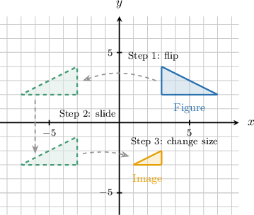
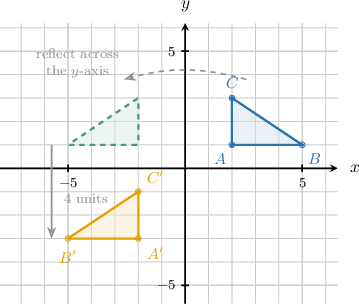
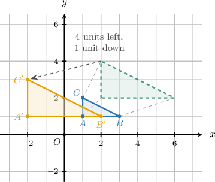
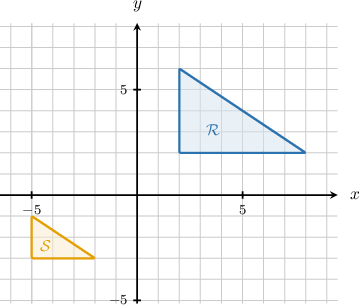
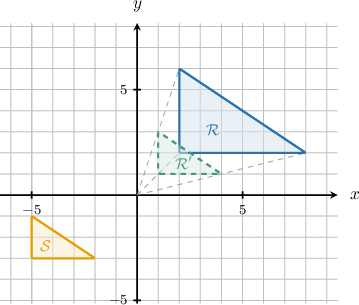
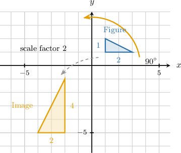
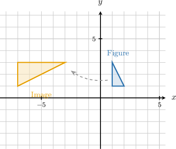
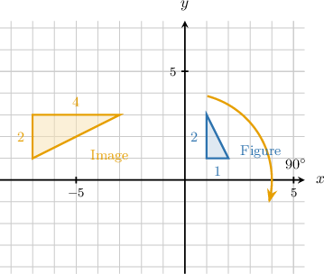

# Describing a Sequence of Transformations That Maps One Figure Onto Another

Source: https://www.mathacademy.com/topics/7921?courseId=39
Topic ID: 7921

## Prerequisites

- [Congruence Through Rigid Motions](./7913-congruence-through-rigid-motions.md)
- [Dilations of Figures in the Coordinate Plane](./7915-dilations-of-figures-in-the-coordinate-plane.md)
- [Similarity Through Sequences of Transformations](./7918-similarity-through-sequences-of-transformations.md)

## Lesson

### Introduction

When we compare a figure and its image, we are asking how the original figure can move, turn, flip, or change size until it lands on the image.

A **sequence of transformations** is an ordered list of transformations that maps a figure onto its image. The order matters because each step starts from the result of the previous step.

As we describe a sequence, we should say three things clearly.

- Name each transformation in order.

- State any needed details, such as a direction, a line of reflection, a center of rotation, a center of dilation, or a scale factor.

- Explain what each step changes and what it preserves.

Rigid motions, such as translations, reflections, and rotations, preserve side lengths and angle measures. So, a sequence using only rigid motions maps a figure to a congruent image.

A dilation may change side lengths by a scale factor, but it preserves angle measures and keeps corresponding side lengths proportional. So, a sequence that includes a dilation can map a figure to a similar image.

Next, we will focus on describing sequences made only of rigid motions.

### Describing a Sequence of Rigid Motions

For congruent images, we use rigid motions. A translation slides a figure, a reflection flips it across a line, and a rotation turns it around a point. Each rigid motion preserves side lengths and angle measures.

Suppose has vertices and We want to describe a sequence that maps it onto with vertices and

We can describe the sequence by checking how the coordinates change.

- First, reflect across the -axis. This maps to so

- Next, translate the reflected triangle units down. This subtracts from each -coordinate, so

Therefore, one valid description is a reflection across the -axis, followed by a translation units down. Since both steps are rigid motions, the final image is congruent to the original triangle.

**Watch out!** Do not just list the transformations. We also need the correct order and the details that make the image land in the right place.

### Example: Describing a Sequence of Rigid Motions That Maps a Figure to a Congruent Image

#### Question

A quadrilateral is translated units left and then rotated about the origin to match a congruent image. What are the missing entries in the following statements describing how each rigid motion changes position or orientation while preserving side lengths and angle measures?

The translation units left changes the of the quadrilateral while keeping every side length and angle measure

The rotation about the origin changes the of the quadrilateral while keeping every side length and angle measure

Because both motions are rigid, the final image is to the original quadrilateral.

#### Explanation

Let's recall the properties of rigid motions (translations, reflections, and rotations). Rigid motions perfectly preserve the shape and size of a figure, meaning that all corresponding side lengths and angle measures remain the same.

- A translation slides a figure a certain distance in a specific direction. This changes the ** of the figure, while keeping every side length and angle measure **.

- A rotation turns a figure around a central point. This changes the ** (the direction the figure faces) and the position of the figure, while keeping every side length and angle measure **.

Because both motions in this sequence are rigid, the size and shape of the original quadrilateral are preserved. Therefore, the final image is ** to the original quadrilateral.

The complete statements are as follows:

The translation units left changes the of the quadrilateral while keeping every side length and angle measure

The rotation about the origin changes the of the quadrilateral while keeping every side length and angle measure

Because both motions are rigid, the final image is to the original quadrilateral.

### Using Dilations to Create Similar Images

When the image is a different size from the original figure, rigid motions are not enough. A dilation can enlarge or shrink a figure while preserving its shape.

Suppose has vertices and Its image has vertices and

First, compare corresponding side lengths. The original horizontal side has length and the image's corresponding horizontal side has length The scale factor is

So, we can start with a dilation centered at the origin with scale factor This maps the vertices to

Then, compare the dilated point with the final point The -coordinate decreases by and the -coordinate decreases by So, the second step is a translation units left and unit down.

The dilation changes size, while the translation changes only position. Because angle measures stay equal and side lengths stay proportional, the final image is similar to the original triangle.

### Example: Describing a Sequence of Transformations That Maps a Figure to a Similar Image

#### Question

The first transformation is a centered at the with scale factor which changes the size of the figure while preserving its shape.

The second transformation is a that changes only the of the figure.

Because the dilation changes size while all angle measures stay equal and side lengths stay proportional, the image is to the original figure.

#### Explanation

To describe the sequence of transformations that maps figure onto its image we first compare their sizes.

The horizontal side of figure has a length of units, while the corresponding side of image has a length of units. Since the size has changed, a dilation was applied. The scale factor is the ratio of the image's side length to the original figure's side length:

Let's apply a dilation with a scale factor of centered at the origin to figure This transformation halves the coordinates of each vertex, mapping the vertices and to the intermediate points and We will call this intermediate figure

Next, we map the intermediate figure to the final image A transformation that slides a figure to a new location is a translation. Applying a translation changes only the position of the figure.

Finally, because the sequence of transformations includes a dilation, the size changes. However, dilations and translations preserve angle measures and keep side lengths proportional, which means the overall shape is preserved. Figures with the same shape are similar, so the image is similar to the original figure.

Therefore, we complete the statements as follows:

The first transformation is a centered at the with scale factor which changes the size of the figure while preserving its shape.

The second transformation is a that changes only the of the figure.

Because the dilation changes size while all angle measures stay equal and side lengths stay proportional, the image is to the original figure.

### Identifying Transformations From a Figure and Its Image

When we are given only a figure and its image, we identify transformations by looking for evidence.

Use these clues first.

- If corresponding side lengths are different, a dilation changed the size. The scale factor is

- If the figure is turned, a rotation changed the orientation.

- If the figure is flipped like a mirror image, a reflection changed the orientation.

- If the figure has the same size and orientation but is in a new location, a translation changed the position.

For example, if a triangle has side lengths and but its image has corresponding side lengths and the side lengths were multiplied by That is evidence of a dilation with scale factor

If the short side that originally pointed upward now points left, the figure has also been turned or reflected. We then use the diagram to decide whether the change is a rotation or a reflection.

Finally, if the resized and reoriented figure still needs to slide to reach the image, a translation is part of the sequence.

The main idea is to connect each visual change to the transformation that causes it: size suggests dilation, orientation suggests rotation or reflection, and position suggests translation.

### Example: Identifying the Transformations Used Given a Figure and Its Image

#### Question

1. A dilation changed the size of the figure.

2. A rotation changed the orientation of the figure.

3. A translation changed the position of the figure.

#### Explanation

To determine which transformations were used, we can compare the properties of the original figure and its image.

- **** The original figure has a horizontal leg of length and a vertical leg of length The image has a vertical leg of length and a horizontal leg of length Because the side lengths are multiplied by a scale factor of the size of the figure has changed. A dilation is the transformation that changes the size of a figure. Therefore, statement I is true.

- **** In the original figure, the short leg points right and the long leg points up. In the image, the short leg points down and the long leg points right. The figure has been turned clockwise. A rotation is the transformation that changes the orientation (the direction a figure is turned). Therefore, statement II is true.

- **** The original figure is located in the first quadrant, while the image is located in the second quadrant. After being rotated and dilated, the figure must also slide into its final location. A translation is the transformation that slides a figure to a new position. Therefore, statement III is true.

In conclusion, the correct answer is "I, II, and III."
