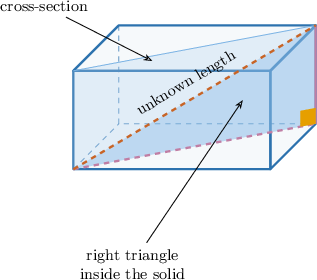
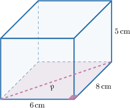
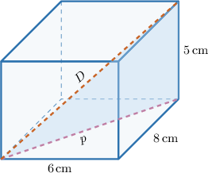
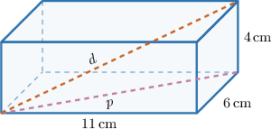
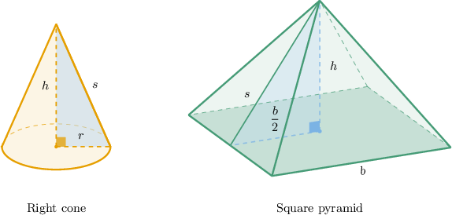
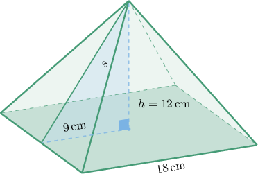
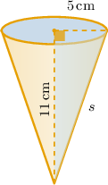

# Applying the Pythagorean Theorem to Three-Dimensional Figures

Source: https://www.mathacademy.com/topics/7928?courseId=39
Topic ID: 7928

## Prerequisites

- [Approximating Square Roots and Cube Roots](./492-approximating-square-roots-and-cube-roots.md)
- [Cross-Sections of Three-Dimensional Shapes](../grade-7/801-cross-sections-of-three-dimensional-shapes.md)
- [Heights of Triangles](../prealgebra/1644-heights-of-triangles.md)
- [Solving Real-World Problems Using the Pythagorean Theorem](./7925-solving-real-world-problems-using-the-pythagorean-theorem.md)

## Lesson

### Introduction

We already know how to use the Pythagorean theorem when a right triangle is drawn flat on a page. In three-dimensional figures, the main new move is to *find* the right triangle hiding inside the solid.

A useful strategy is to look for a flat cross-section that contains the length we want.

Once we identify the right triangle, the calculation is still familiar. If the legs have lengths and and the hypotenuse has length then

So, our work usually follows this pattern.

- Identify the length we are trying to find.

- Locate a right triangle that contains that length.

- Use the given measurements as the legs or hypotenuse of that triangle.

- Apply the Pythagorean theorem and interpret the answer in the original solid.

Next, we will use this idea to find a diagonal running through a rectangular box.

### Finding Space Diagonals in Rectangular Prisms

A **space diagonal** is a segment that connects one corner of a rectangular prism to the opposite corner through the inside of the prism.

To find a space diagonal, we usually use the Pythagorean theorem twice. Suppose a rectangular box has length width and height

First, we find the diagonal of the rectangular base. Let be the base diagonal.

The base diagonal is the hypotenuse of a right triangle whose legs are and so

Now, the base diagonal the height and the space diagonal form a second right triangle.

The space diagonal is the hypotenuse of this second triangle, so

So, the space diagonal is or about

### Example: Finding the Length of a Diagonal of a Rectangular Box Using the Pythagorean Theorem

#### Question

A rectangular box has length width and height Find the length of the box's space diagonal, rounded to two decimal places.

#### Explanation

To find the length of the space diagonal, we can identify right triangles inside the rectangular box.

First, we find the length of the diagonal across the base of the box, which we will call The base is a rectangle with length and width

These sides form a right triangle with the base diagonal as the hypotenuse. By the Pythagorean theorem, we have

Next, the space diagonal the height of the box, and the base diagonal form another right triangle. The height is and the space diagonal is the hypotenuse.

Applying the Pythagorean theorem again, we get

Evaluating the square root gives

Therefore, rounded to two decimal places, the space diagonal has length

### Finding Slant Height in Cones and Pyramids

In a cone or pyramid, the **slant height** is the length measured along the side surface, not straight up and down through the center.

A right-triangle cross-section helps us connect the slant height to the perpendicular height.

For a right cone, the legs of the right triangle are the radius and the perpendicular height The slant height is the hypotenuse, so

For a square pyramid, the legs are the perpendicular height and half of the base side length. If the base side length is then

For example, suppose a square pyramid has base side length and perpendicular height The distance from the center of the base to the midpoint of a base edge is

Then, the slant height satisfies

So, the slant height is **Watch out!** For a square pyramid, we use half the base side length, not the whole base side length.

### Example: Finding the Slant Height of a Pyramid or Cone Using the Pythagorean Theorem

#### Question

A square pyramid has a base side length of and a perpendicular height of Find the slant height from the apex to the midpoint of a base edge.

#### Explanation

To find the slant height of the square pyramid, we can identify a right triangle formed by the perpendicular height, half of the base side length, and the slant height.

The base is a square with a side length of so the distance from the center of the base to the midpoint of a base edge is half of the side length:

In this right triangle, the legs are and the height and the hypotenuse is the slant height

Using the Pythagorean theorem, we have

Taking the square root of both sides gives

Therefore, the slant height is

### Solving Three-Dimensional Distance Word Problems

For a three-dimensional distance word problem, we first translate the story into a solid and a right triangle.

A good plan is to ask these questions.

- Is the object a rectangular box? Then the distance from one corner to the opposite corner is a space diagonal.

- Is the object a cone? Then the distance from the tip to the rim is a slant height.

- Is the object a square pyramid? Then the distance from the apex to the midpoint of a base edge is a slant height.

For rectangular boxes, the two-stage Pythagorean theorem work can be summarized by where is the length, is the width, is the height, and is the space diagonal.

Suppose a storage crate measures long, wide, and high. The longest straight pole that can fit inside the crate lies along the space diagonal. Substituting the dimensions gives

So, the longest straight pole that can fit inside the crate is about The unit is meters because every given length was measured in meters.

### Example: Solving Word Problems Involving Three-Dimensional Distances

#### Question

A funnel has the shape of a cone with a base radius of and a perpendicular height of What is the slant height of the funnel from the tip to the rim?

#### Explanation

To find the slant height of the funnel, we can use the right triangle formed by the cone's radius, height, and slant height.

Let be the slant height, be the base radius, and be the perpendicular height. The relationship between these quantities is given by the Pythagorean theorem:

Substituting the given values and we have

Therefore, the slant height of the funnel is
