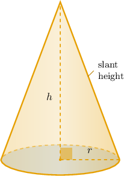
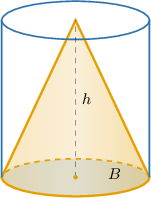
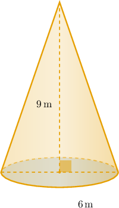
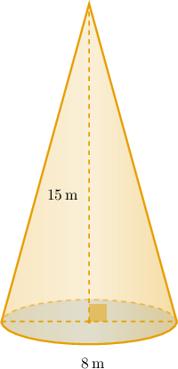

# Volumes of Cones

Source: https://www.mathacademy.com/topics/7930?courseId=39
Topic ID: 7930

## Prerequisites

- [Estimating Expressions With Irrational Numbers](./7894-estimating-expressions-with-irrational-numbers.md)
- [Volumes of Cylinders](./7929-volumes-of-cylinders.md)

## Lesson

### Introduction

We already know that a cylinder has volume equal to its base area multiplied by its height. A cone is related to that idea, but it takes up less space than the matching cylinder.

A **cone** has one circular base and one point at the top called the vertex. When we find the volume of a cone, we use the circular base and the vertical distance from the base to the vertex.

The vertical height is the straight up-and-down distance from the center of the base to the vertex. If the base radius is and the vertical height is those are the measurements that control volume.

**Watch out!** The slant height is the diagonal distance along the outside of the cone. It is useful in some geometry problems, but it is *not* the height used in the volume formula.

Next, we connect a cone to a cylinder with the same base and height so that the volume formula makes sense.

### The Cone-to-Cylinder Volume Relationship

To compare a cone and a cylinder fairly, we match two measurements: the circular base and the vertical height.

Let be the area of the circular base and let be the height. The matching cylinder has volume

A cone with the same base area and height has one third of that volume:

So, three identical cones with the same base and height as the cylinder have the same total volume as that cylinder:

This is why the factor appears in the cone volume formula.

### Example: Stating the Formula for the Volume of a Cone

#### Question

A cone and a cylinder have the same circular base and the same height. Which of the following statements are true?

1. The volume of the cone equals the base area multiplied by the height.

2. Three such cones have the same total volume as the cylinder.

3. The volume of the cylinder is three times the volume of the cone.

#### Explanation

Let be the area of the circular base and be the height.

The volume of a cylinder is given by the formula

The volume of a cone with the same base area and height is given by the formula

Let's analyze each statement in turn.

- Statement I is false. The base area multiplied by the height gives the volume of the cylinder, not the cone. The volume of the cone is ** of the base area multiplied by the height.

- Statement II is true. Since the volume of the cone is one third of the volume of the cylinder, multiplying the cone's volume by gives the volume of the cylinder: This means three such cones have the same total volume as the cylinder.

- Statement III is true. Comparing the two formulas, we have so multiplying both sides by gives which means the volume of the cylinder is three times the volume of the cone.

Therefore, the correct answer is "II and III only."

### Calculating the Volume of a Cone

Since the base of a cone is a circle, its base area is Substituting into gives the cone volume formula where is the radius of the base and is the vertical height.

Suppose a cone has diameter and vertical height

We are given the diameter, not the radius. The radius is half the diameter, so

Now, we substitute and into the formula:

So, the exact volume is If a decimal approximation is requested, we use a calculator:

Rounded to two decimal places, the volume is approximately

### Example: Finding the Volume of a Cone Given Its Radius and Height

#### Question

A cone has diameter and vertical height Find its volume, rounded to two decimal places, in cubic meters.

#### Explanation

The volume of a cone is given by the formula where is the radius of the base and is the vertical height of the cone.

We are given the diameter The radius of a circle is half its diameter, so

Substituting and into the volume formula, we obtain

Using a calculator to approximate the value, we get

Rounding to two decimal places, the volume is approximately

### Solving for a Missing Dimension

Sometimes we know the volume of a cone and need to work backward to find a missing measurement. We still start with

Suppose a cone has volume and radius We want to find its vertical height.

Substituting and into the formula gives

Now, we divide both sides by:

Therefore, the vertical height is

If the radius is missing instead, the same idea applies, but we isolate first and then take the positive square root, because a radius must be positive.

### Example: Finding a Dimension of a Cone Given Its Volume

#### Question

A cone has a volume of and a vertical height of What is its radius?

#### Explanation

We can find the volume of a cone using the formula where is the radius of the base and is the vertical height of the cone.

Substituting the values into the volume formula, we obtain the following:

Therefore, the radius is
