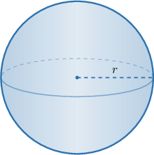
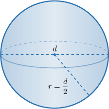
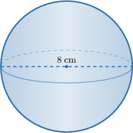
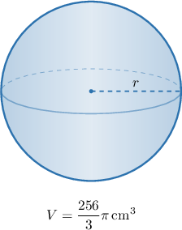
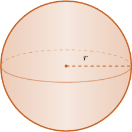

# Volumes of Spheres

Source: https://www.mathacademy.com/topics/7931?courseId=39
Topic ID: 7931

## Prerequisites

- [Identifying Three-Dimensional Shapes](../grade-6/2467-identifying-three-dimensional-shapes.md)
- [Units of Area and Volume](../../../elementary-school/lessons/grade-5/3872-units-of-area-and-volume.md)
- [Estimating Expressions With Irrational Numbers](./7894-estimating-expressions-with-irrational-numbers.md)
- [Solving Equations Using Cube Roots](./13765-solving-equations-using-cube-roots.md)

## Lesson

### Introduction

A **sphere** is a round three-dimensional shape where every point on the surface is the same distance from the center. That distance from the center to the surface is the radius, which we write as

The volume of a sphere is the amount of space inside it. For a sphere with radius the volume is

This formula has three important parts.

- The formula uses the circle constant.

- The term means the radius is multiplied by itself three times:

- Since volume measures three-dimensional space, the answer is measured in cubic units, such as or

So, in words, we multiply by and by the radius multiplied by itself three times. Next, we will use the formula to compute actual volumes.

### Example: Stating the Formula for the Volume of a Sphere

#### Question

Which of the following statements about calculating the volume of a sphere with radius are true?

1. The calculation uses the circle constant

2. The calculation uses the radius multiplied by itself two times.

3. The result is measured in cubic units.

#### Explanation

To calculate the volume of a sphere from its radius we use the formula

Let's analyze each statement in turn.

- Statement I is true. The formula includes which represents the circle constant.

- Statement II is false. The term in the formula means that the radius is multiplied by itself three times, not two.

- Statement III is true. Because we are calculating volume, the final result is measured in cubic units.

Therefore, the correct answer is "I and III only."

### Calculating Volume From a Radius or Diameter

To calculate the volume, we always need the radius. If the problem gives the diameter then we first divide by because the radius is half of the diameter:

Once we know we substitute it into

For example, suppose a sphere has radius Substituting gives

Therefore, the volume is

**Watch out!** If the problem gives the diameter, do not substitute the diameter for First, find the radius, and then use the volume formula.

### Example: Finding the Volume of a Sphere Given Its Radius or Diameter

#### Question

A sphere has diameter Find its volume, rounded to two decimal places, in cubic centimeters.

#### Explanation

First, we must find the radius of the sphere. The radius is half of the diameter, so

To find the volume of the sphere, we use the formula

Substituting into the formula, we evaluate the volume as follows:

Therefore, rounded to two decimal places, the volume of the sphere is

### Finding a Radius or Diameter From Volume

Sometimes, we know the volume and need to work backward to find the size of the sphere. We still start with

Suppose a sphere has volume To find the radius, we substitute this value for and solve for

Now, we take the cube root.

If the problem asks for the diameter, we double the radius:

So, a radius of corresponds to a diameter of

### Example: Finding the Radius or Diameter of a Sphere Given Its Volume

#### Question

A sphere has a volume of Find its diameter in centimeters.

#### Explanation

We can find the volume of a sphere using the formula where is the radius of the sphere.

Substituting into the formula, we get

Therefore,

Finally, the diameter of the sphere is
