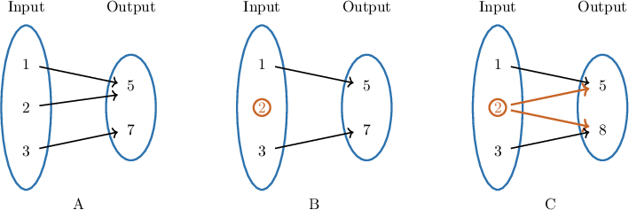
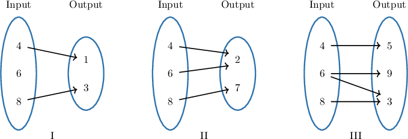
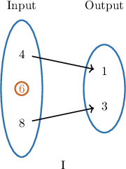
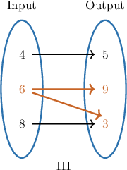
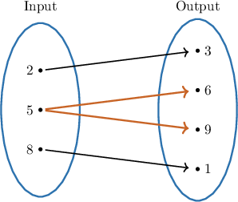
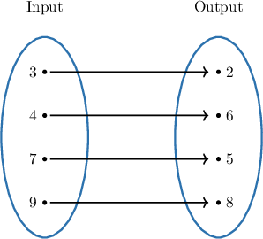

# Introduction to Functions

Source: https://www.mathacademy.com/topics/7937?courseId=39
Topic ID: 7937

## Prerequisites

- [The Cartesian Coordinate System](../prealgebra/92-the-cartesian-coordinate-system.md)
- [Analyzing Two-Variable Equations Using Tables](../grade-6/2518-analyzing-two-variable-equations-using-tables.md)

## Lesson

### Introduction

A **relation** is a collection of input-output pairings. A **function** is a relation where each input is paired with exactly one output.

A mapping diagram makes this rule easy to see. Each input should have exactly one arrow leaving it.

In the function diagram, every input has one arrow. It is okay if two different inputs point to the same output.

What breaks the function rule is an input that does not have exactly one output.

- If an input has no arrow, it is not paired with an output.

- If an input has two arrows, it is paired with more than one output.

So, when we check a mapping diagram, we do not count the number of inputs or outputs. We check the arrows leaving each input.

### Example: Determining Whether a Mapping Diagram Represents a Function

#### Question

#### Explanation

A mapping diagram represents a function if and only if each input is assigned to exactly one output. In other words, exactly one arrow must start from each input.

Let's check each diagram:

- In diagram the input has no arrows pointing from it. Since it is not assigned to any output, this diagram does not represent a function.

- In diagram each input (and) has exactly one arrow pointing from it. It is perfectly fine for multiple inputs to point to the same output (like inputs and both pointing to), as long as no single input points to multiple outputs.

- In diagram the input has two arrows pointing from it (to outputs and). So, it does not represent a function.

Therefore, only mapping diagram represents a function.

### Checking Ordered Pairs for a Function

For ordered pairs, the input is the first coordinate and the output is the second coordinate. So, in the ordered pair the input is and the output is

To decide whether a set of ordered pairs represents a function, we scan the first coordinates.

Consider the set

The input appears in two ordered pairs: and That means the same input is paired with two different outputs, and

So, this set does not represent a function.

Now, compare that with

Here, the inputs and are all different. Since no input is assigned to more than one output, this set represents a function.

**Watch out!** Repeated outputs are not the problem. Repeated inputs are only a problem when the same input is paired with different outputs.

### Example: Determining Whether a Set of Ordered Pairs Represents a Function

#### Question

Which of the following sets of ordered pairs represents a function?

- Set A:

- Set B:

- Set C:

- Set D:

- Set E:

#### Explanation

A set of ordered pairs represents a function if and only if each input (the first coordinate) is assigned to exactly one output (the second coordinate). This means that no two ordered pairs in the set can have the same first coordinate but different second coordinates.

Let's check the given sets for repeated inputs:

- In Set A, the input is paired with both and

- In Set B, the input is paired with both and (and the input is also repeated).

- In Set D, the input is paired with both and

- In Set E, the input is paired with both and

Since these sets have at least one input assigned to more than one output, they do not represent functions.

Now consider Set C, Every input (and) is distinct and is paired with exactly one output.

Therefore, Set C represents a function.

### Checking Tables for a Function

A table can also show input-output pairings. In an - table, the -values are the inputs and the -values are the outputs.

Let's check this table by scanning the -column.

The input appears twice. Looking across those rows, is paired with in one row and in another row.

Because the same input has two different outputs, the table does not represent a function.

If every input value appears only once, then each input is automatically paired with exactly one output. If an input appears more than once, we check whether it is being assigned to different outputs.

### Example: Determining Whether a Table Represents a Function

#### Question

#### Explanation

A relation is a function if and only if each input is paired with exactly one output.

If any input is paired with more than one output, the relation is ** a function.

Let's examine the two given tables by looking for any repeated inputs.

Consider Table P. The inputs are and Notice that the input appears twice.

Looking at the corresponding outputs, the input is paired with the output and it is also paired with the output Because the input is assigned to two different outputs, Table P does ** represent a function.

Consider Table Q. The inputs are and Since each input value appears only once, we know that each input is paired with exactly one output.

Because no input is assigned to more than one output, Table Q ** represent a function.

Therefore, only Table Q represents a function.
