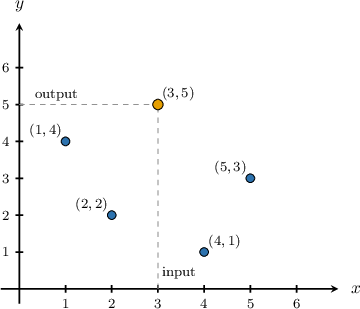
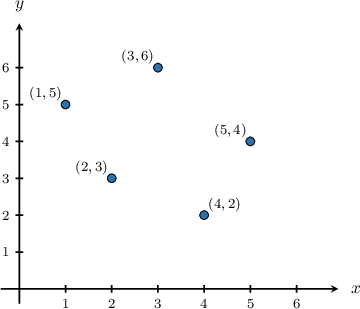
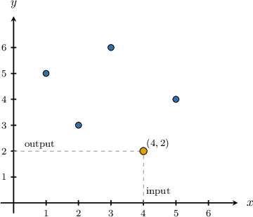
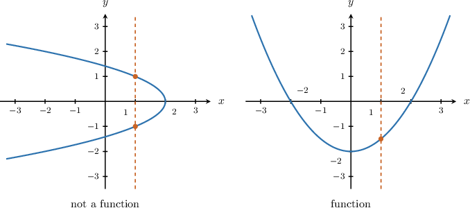
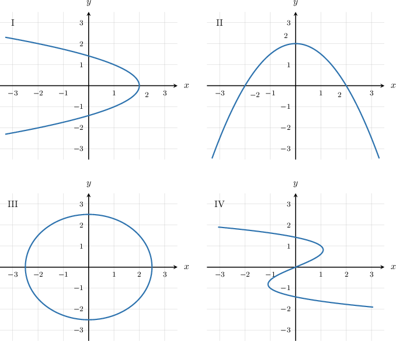
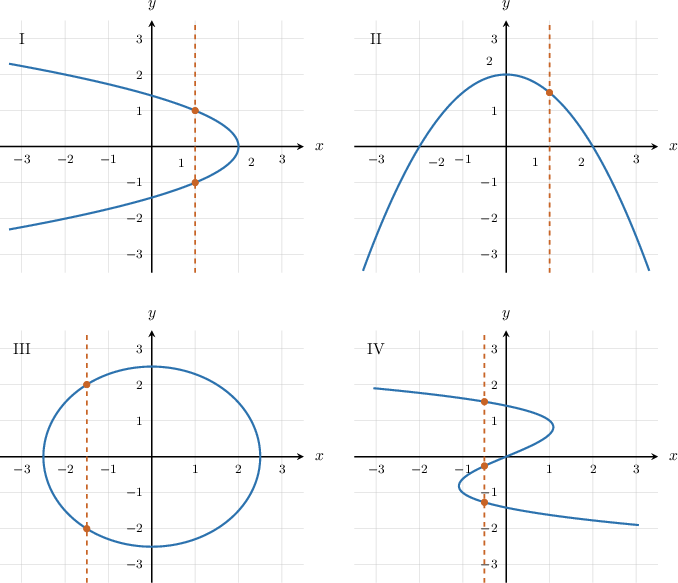
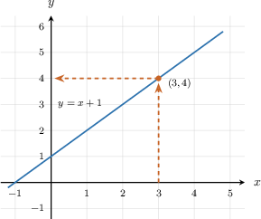
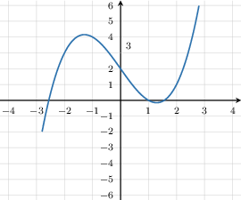
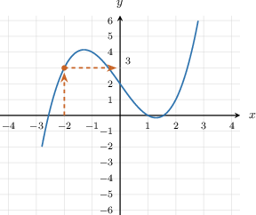

# Graphs of Functions

Source: https://www.mathacademy.com/topics/7939?courseId=39
Topic ID: 7939

## Prerequisites

- [Horizontal and Vertical Lines](./97-horizontal-and-vertical-lines.md)
- [Analyzing Two-Variable Equations Using Graphs](../grade-6/560-analyzing-two-variable-equations-using-graphs.md)
- [Introduction to Functions](./7937-introduction-to-functions.md)

## Lesson

### Introduction

A function pairs each input with exactly one output. When we show that relationship on a coordinate plane, each plotted point tells us one input-output pairing.

A **graph of a function** is the collection of points where is an input and is the output paired with that input.

In the graph, the point means that the input is paired with the output We read the coordinates in order.

- The -coordinate is the input.

- The -coordinate is the output.

- The whole point represents one complete input-output pair.

**Watch out!** A single point cannot represent two different inputs or two different outputs. One point has one -coordinate and one -coordinate.

This same input-output idea works whether the graph is made of separate points or a continuous curve. Next, we'll use that idea to decide when a whole graph represents a function.

### Example: Interpreting the Graph of a Function as a Set of Ordered Pairs

#### Question

1. Each point on the graph represents one input value matched with one output value.

2. The point shows that the input is paired with the output

3. A single point can represent two different input values for one output.

#### Explanation

To interpret a graph as a collection of input-output pairs, we read the -coordinate of each point as the input and the -coordinate as the output.

Let's analyze each statement.

- Statement I is true. An ordered pair plotted on the coordinate plane specifies exactly one -value and one -value. Therefore, each point on the graph represents one input value matched with one output value.

- Statement II is true. For the point the -coordinate is and the -coordinate is

This shows that the input is paired with the output

- Statement III is false. A single point has only one -coordinate, so it can only represent one input value. It is impossible for one point to represent two different input values.

Therefore, the correct answer is "I and II only."

### The Vertical Line Test

The key question for a graph is whether any input is paired with more than one output. A vertical line helps us check this because every point on a vertical line has the same -value.

The **vertical line test** says that a graph represents a function if no vertical line intersects the graph more than once.

In the left graph, one vertical line hits the curve at two points. Those two points have the same input but different outputs, so that graph does not represent a function.

In the right graph, any vertical line hits the graph at most once. That means each input shown on the graph is paired with only one output, so the graph represents a function.

**Watch out!** The test uses vertical lines, not horizontal lines. A function may have the same output for more than one input, but it cannot have one input paired with more than one output.

### Example: Determining Whether a Graph Represents a Function Using the Vertical Line Test

#### Question

#### Explanation

The vertical line test states that a graph represents a function if and only if no vertical line intersects the graph more than once. This is because a function must assign exactly one output (or -value) to each input (or -value) in its domain.

To determine whether each graph represents a function, we apply the vertical line test:

- For graph I, we can draw a vertical line that intersects the graph in two places. Therefore, it does not represent a function.

- For graph II, any vertical line we draw will intersect the graph exactly once. Therefore, it represents a function.

- For graph III, we can draw a vertical line that intersects the graph in two places. Therefore, it does not represent a function.

- For graph IV, we can draw a vertical line that intersects the graph in more than one place. Therefore, it does not represent a function.

Therefore, the only graph that represents a function is graph II, which corresponds to the choice "II only".

### Reading Output Values From a Graph

Once we know a graph represents a function, we can read the output for a given input by finding the point on the graph with that input value.

Suppose the input is We want the output paired with

We read the output from the graph in a consistent way.

- First, find on the horizontal axis.

- Then, move vertically to the graph.

- Finally, move horizontally to the vertical axis to read the -value.

In the graph, the point with input is So, the output value paired with is

This is the same as saying that the graph shows the input-output pair

### Example: Reading the Output of a Function From Its Graph for a Given Input

#### Question

The output value at is

#### Explanation

To find the output value that is paired with a given input, we look for the point on the graph with that input value as its -coordinate. The output value will be the point's corresponding -coordinate.

First, we locate the input on the horizontal axis.

From there, we move vertically to the graph to find the point on the curve.

Finally, we move horizontally from this point to the vertical axis to read the corresponding -value.

The -value on the vertical axis is Therefore, the output value at is
