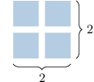

# Prime and Composite Numbers

Source: https://www.mathacademy.com/topics/840?courseId=39
Topic ID: 840

## Prerequisites

- [The Factors of a Number](../../../elementary-school/lessons/grade-4/3942-the-factors-of-a-number.md)

## Lesson

### Introduction

Remember that a number is a **factor** of another number if it divides the number with no remainder.

A whole number is a **prime number** if it has *exactly two* factors: itself and $1.$

For instance, $3$ is a prime number because it has only two factors, namely $3$ and $1{:}$

$$

3 = 3\times 1

$$

There are infinitely many prime numbers. The first few prime numbers are

$$

2,\quad 3,\quad 5,\quad 7,\quad 11,\quad 13,\quad 17,\quad 19,\quad 23,\quad 29,\quad \ldots

$$

Prime numbers are very important. For example, computers use them to send and receive information across the internet securely.

### Example: Identifying Prime Numbers

#### Question

Which of the following is a list containing only prime numbers?

1. $3, \: 5, \: 8, \: 17$

2. $3, \: 7, \: 11, \: 29$

3. $2, \: 4, \: 7, \: 13$

#### Explanation

A prime number is a positive whole number with exactly two distinct whole number factors: itself and $1.$

With that in mind, let's examine the numbers in each list.

- List I includes $8$, which is not prime as it has more than two factors: $1,$ $2,$ $4,$ and $8.$

- List II contains only prime numbers since $3,$ $7,$ $11,$ and $29$ have only two factors each: $1$ and themselves.

- List III contains $4$, which is not prime as it has more than two factors: $1,$ $2,$ and $4.$

Therefore, the correct answer is "II only."

### Composite Numbers

Numbers with *more* than two factors are called **composite numbers**.

For example, $4$ is composite because it has three factors, namely $1, 2,$ and $4.$

We can think of composite numbers geometrically. Let the number $4$ be represented by a collection of four items:

We can pile the objects up to form a rectangle where the length and width are both greater than $1{:}$

In contrast, a prime number of objects *cannot* be rearranged to form a rectangle where the length and width are *both* greater than $1.$

### Example: Identifying Composite Numbers

#### Question

Which of the following lists contains only composite numbers?

1. $4, \: 16, \: 24, \: 28$

2. $6, \: 15, \: 19, \: 20$

3. $8, \: 15, \: 21, \: 29$

#### Explanation

A prime number is a positive whole number with exactly two distinct whole number factors: itself and $1.$ A composite number is a number that has more than two distinct factors.

With that in mind, let's examine each list.

- List I contains only composite numbers. Notice that all of them have $2$ as a factor.

- List II includes $19,$ which is prime.

- List III contains $29,$ which is prime.

Therefore, the correct answer is "I only."

### One Is Neither Prime Nor Composite

Every positive whole number is either prime or composite, but not both.

The only exception is the number $1.$ The number $1$ is neither prime nor composite because it only has one whole number factor, namely $1.$

### Example: Identifying One as Neither Prime Nor Composite

#### Question

Which of the following numbers are prime?

$$

13, \quad 15, \quad 17, \quad 1, \quad 6

$$

#### Explanation

A prime number is a positive whole number with exactly two distinct whole number factors: itself and $1.$ A composite number is a number that has more than two distinct factors.

The number $1$ is neither prime nor composite.

With that in mind, let's examine the numbers in the list.

- $13$ is prime since it has only two factors: $1$ and $13.$

- $15$ is ** prime as it has factors distinct from itself and $1.$ For example, $3$ is a factor of $15\mathbin{:}$

- $17$ is prime since it has only two factors: $1$ and $17.$

- $1$ is ** prime since it has only one factor. Moreover, $1$ is ** composite either.

- $6$ is ** prime as it has factors distinct from itself and $1.$ For example, $3$ is a factor of $6\mathbin{:}$

Therefore, only $13$ and $17$ are prime.
