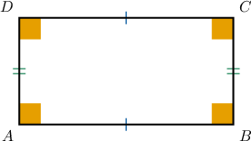
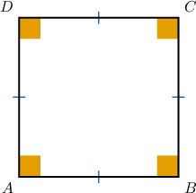
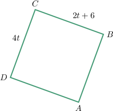
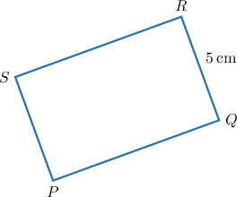
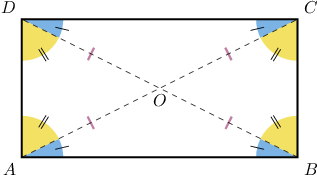
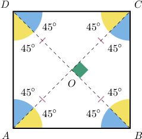
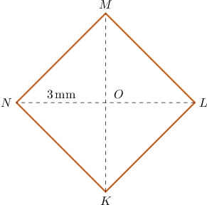
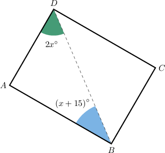

# Properties of Rectangles and Squares

Source: https://www.mathacademy.com/topics/1461?courseId=99
Topic ID: 1461

## Prerequisites

- [Segment Bisectors and the Perpendicular Bisector Theorem](./521-segment-bisectors-and-the-perpendicular-bisector-theorem.md)
- [The Perimeter of a Polygon](./1386-the-perimeter-of-a-polygon.md)
- [Angle Bisectors](./1508-angle-bisectors.md)
- [Rectangles, Rhombuses, and Squares](../../../elementary-school/lessons/grade-5/3751-rectangles-rhombuses-and-squares.md)

## Lesson

### Introduction

A **rectangle** is a parallelogram where all angles are right. It has all the properties of parallelograms: its opposite sides are parallel and congruent.

If all $4$ sides of a rectangle are congruent, then it is a **square**.

### Example: Finding the Value of a Variable That Makes a Rectangle a Square

#### Question

For which value of $t$ is the rectangle below also a square?

#### Explanation

In order for the rectangle to be a square, all of its sides must be congruent.

So, we must have

$$

\begin{aligned}𝐵𝐶 & =𝐶𝐷 \\ 2𝑡+6 & =4𝑡 \\ 2𝑡 & =6 \\ 𝑡 & =3.\end{aligned}

$$

### Example: Finding the Measures of the Sides of a Rectangle

#### Question

The perimeter of the rectangle $PQRS$ below equals $25\, \mathrm{cm}.$ What is the length of $\overline{PQ}?$

#### Explanation

The opposite sides of a rectangle are congruent, so we have

$$

PS=QR=5\, \mathrm{cm}.

$$

For the same reason, we also have

$$

PQ = RS.

$$

Now, since the perimeter is $p=25 \, \text{cm},$ we have

$$

\begin{aligned}𝑝 & =𝑃𝑄+𝑅𝑆+𝑃𝑆+𝑄𝑅 \\ 25 & =𝑃𝑄+𝑃𝑄+5+5 \\ 25 & =2𝑃𝑄+10 \\ 15 & =2𝑃𝑄 \\ 7.5 & =𝑃𝑄.\end{aligned}

$$

Therefore, $PQ = 7.5 \, \text{cm}.$

### The Diagonals of Rectangles and Squares

The diagonals of a rectangle are equal and bisect each other. Consequently, they divide a rectangle into four isosceles triangles, as shown below.

In a square, the diagonals also bisect the angles.

### Example: Finding the Measure of a Diagonal of a Square

#### Question

In the square below, $NO=3\,\mathrm{mm}.$ Find $KM.$

#### Explanation

The diagonals of a square are equal and bisect each other. So we have

$$

\begin{aligned}𝐾𝑀 & =𝐿𝑁 \\ & =2𝑁𝑂 \\ & =2⋅3\,mm \\ & =6\,mm.\end{aligned}

$$

### Example: Finding the Value of a Variable That Makes a Given Quadrilateral a Rectangle

#### Question

For which value of $x$ is the parallelogram below also a rectangle?

#### Explanation

If $ABCD$ is a rectangle, then $m\angle A = 90^\circ.$ Now, since the interior angles of $\triangle ABD$ must sum to $180^\circ,$ we have

$$

\begin{aligned}𝑚∠𝐴𝐷𝐵+𝑚∠𝐴𝐵𝐷+𝑚∠𝐵𝐴𝐷 & =180^{∘} \\ 2𝑥^{∘}+(𝑥+15)^{∘}+90^{∘} & =180^{∘} \\ 3𝑥+15 & =90 \\ 3𝑥 & =75 \\ 𝑥 & =25.\end{aligned}

$$
