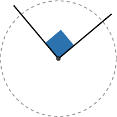
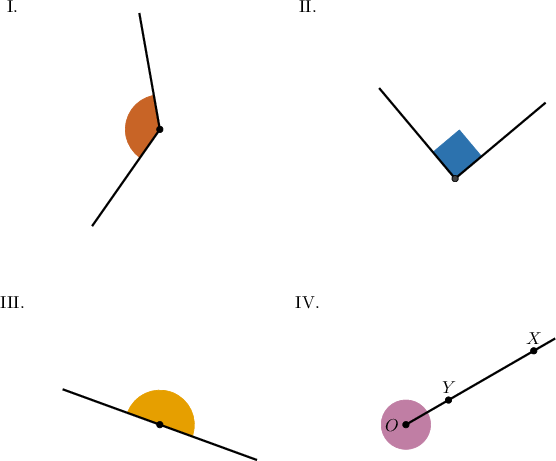
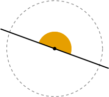
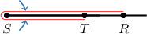
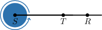

# Right, Straight, Full, and Null Angles

Source: https://www.mathacademy.com/topics/1509?courseId=99
Topic ID: 1509

## Prerequisites

- [Angles and Measures of Angles](./2172-angles-and-measures-of-angles.md)
- [Writing Unit Fractions in Words](../../../elementary-school/lessons/grade-4/3951-writing-unit-fractions-in-words.md)

## Lesson

### Introduction

Some angles have special names.

- A **right angle** has a measure of $90^\circ.$ It corresponds to one-quarter of a full turn.

- A **straight angle**, which is just a straight line, has a measure of $180^\circ.$ It corresponds to one-half of a full turn.

- A **null angle** has a measure of $0^\circ.$ You can imagine "closing" the angle until the two sides of the angle overlap. In this case, we don't have any turn, so its measure is zero!

- A **full angle** has a measure of $360^\circ.$ You can imagine "opening" the angle until one of the sides goes all the way around. So, this is the angle between a ray and itself after it has made one full turn.

On a diagram, null and full angles can look the same, so it is up to us what we choose to call it.

### Example: Identifying Right Angles

#### Question

Which of the following shows a right angle?

#### Explanation

An angle of $90^\circ$ has the same measure as one-quarter of a full turn.

Among the given options, the only $90^\circ$ angle is the following:

Therefore, the correct answer is II.

### Example: Identifying Straight Angles

#### Question

Which of the following shows a straight angle?

#### Explanation

A straight angle has a degree measure of $180^\circ.$ This corresponds to one-half of a full turn.

Among the given options, the only straight angle is the following:

Therefore, the correct answer is III.

### Example: Identifying Null and Full Angles

#### Question

What type of angle is $\angle RST,$ shown in the figure above?

#### Explanation

Notice that the vertex of $\angle RST$ is point $S,$ not point $T.$ So $\angle RST$ is ** a straight angle.

As a result, the two rays $\overset{\longrightarrow}{SR}$ and $\overset{\longrightarrow}{ST}$ of our angle coincide. So, we can think of $\angle RST$ as:

- A ** angle, assuming it doesn't turn at all.

- A ** angle, assuming it makes one full turn.

So, the answer is "Null" or "Full."
