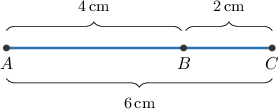
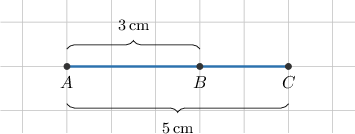
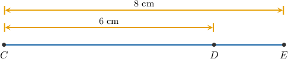
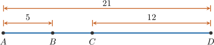
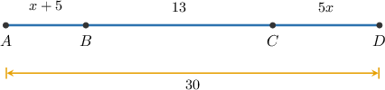

# The Segment Addition Postulate

Source: https://www.mathacademy.com/topics/2278?courseId=99
Topic ID: 2278

## Prerequisites

- [Midpoints](./1463-midpoints.md)
- [Collinear Points](./1500-collinear-points.md)
- [Simplifying Linear Expressions When a Group of Terms Is Subtracted](./3873-simplifying-linear-expressions-when-a-group-of-terms-is-subtracted.md)

## Lesson

### Introduction

Let's look at the three points $A,$ $B,$ and $C$ below.

As indicated in the diagram, the distances between the points are

$$

\begin{aligned}𝐴𝐵=4\,cm,\,𝐵𝐶=2\,cm,\,𝐴𝐶=6\,cm.\end{aligned}

$$

Can we be sure that the points are collinear? To answer this, we use the **segment addition postulate**.

The postulate states the following:

*Three points are collinear if and only if the largest distance between two of them is equal to the sum of the other two distances.*

Here, the largest distance is $AC,$ so the points $A,$ $B,$ and $C$ are collinear *if and only if*

$$

AC=AB + BC.

$$

Substituting the given information $AC=6\,\mathrm{cm},$ $AB=4\,\mathrm{cm},$ and $BC=2\,\mathrm{cm}$ we get

$$

\begin{aligned}𝐴𝐶 & =𝐴𝐵+𝐵𝐶 \\ 6 & =4+2 \\ 6 & =6.\,✓\end{aligned}

$$

This is a true statement, so the three points $A,$ $B,$ and $C$ are indeed collinear.

**Note:** The postulate works in both directions:

- If the points $A,$ $B,$ and $C$ are collinear then $AC= AB + BC.$

- If $AC= AB + BC$ then the points $A,$ $B,$ and $C$ are collinear.

### Calculating the Distance Between Collinear Points

Given two of the three distances between three collinear points, we can calculate the third distance using the segment addition postulate.

To demonstrate, consider the collinear points $A,$ $B,$ and $C$ below.

We are given two of the distances:

$$

\begin{aligned}𝐴𝐵=3\,cm,\,𝐴𝐶=5\,cm\end{aligned}

$$

We can calculate the third distance, $BC,$ using the segment addition postulate.

First, we state the equation and substitute the known quantities $AB=3$ and $AC=5,$ as follows:

$$

\begin{aligned}𝐴𝐶 & =𝐴𝐵+𝐵𝐶 \\ 5 & =3+𝐵𝐶\end{aligned}

$$

Now, we can solve for $BC$ by subtracting $3$ from both sides of the equation:

$$

\begin{aligned}5 & =3+𝐵𝐶 \\ 𝐵𝐶 & =2\end{aligned}

$$

Therefore, the distance between the points $B$ and $C$ is $2\,\textrm{cm}.$

### Example: Calculating the Distance Between Three Collinear Points

#### Question

Let $C,$ $D$ and $E$ be three collinear points such that $D$ is between $C$ and $E.$ If $CE = 8\,\text{cm}$ and $CD = 6\,\text{cm}$, find the length of $\overline{DE}$.

#### Explanation

The segment addition postulate states that

$$

CE = CD + DE.

$$

Substituting the known values into the formula above, we obtain:

$$

\begin{aligned}𝐶𝐸 & =𝐶𝐷+𝐷𝐸 \\ 8 & =6+𝐷𝐸 \\ 8−6 & =𝐷𝐸 \\ 2 & =𝐷𝐸\end{aligned}

$$

Therefore, $DE = 2 \, \text{cm}$.

### Example: Calculating the Distance Between More Than Three Collinear Points

#### Question

Given the diagram shown below, what is the measure of $\overline{BC}?$

#### Explanation

The segment addition postulate can be applied to a set of more than three collinear points. In the given situation, it states that

$$

AD = AB + BC +CD.

$$

Substituting the known values into the equation above, we obtain:

$$

\begin{aligned}𝐴𝐷 & =𝐴𝐵+𝐵𝐶+𝐶𝐷 \\ 21 & =5+𝐵𝐶+12 \\ 21 & =17+𝐵𝐶 \\ 21−17 & =𝐵𝐶 \\ 𝐵𝐶 & =4\end{aligned}

$$

### Example: Calculating the Value of an Unknown Quantity Using Collinearity

#### Question

Given the diagram shown below, what is the value of $x?$

#### Explanation

By the segment addition postulate, we have

$$

AD = AB + BC +CD.

$$

To solve for $x,$ we can substitute the given information

$$

AD=30, \quad AB=x+5, \quad BC=13, \quad CD=5x,

$$

and then solve the resulting equation:

$$

\begin{aligned}𝐴𝐷 & =𝐴𝐵+𝐵𝐶+𝐶𝐷 \\ 30 & =(𝑥+5)+13+5𝑥 \\ 30 & =6𝑥+18 \\ 6𝑥 & =12 \\ 𝑥 & =2\end{aligned}

$$

### Example: Calculating the Value of an Unknown Quantity Using Collinearity and Midpoints

#### Question

In the diagram below, the length of the line segment $\overline{AD}$ is $8d+12,$ $AB = 4d+4,$ and $C$ is the midpoint of $\overline{BD}.$ Express the length of $\overline{AC}$ in terms of $d.$

#### Explanation

First, note that according to the segment addition postulate, we have

$$

AD = AB + BD,

$$

which, in turn, gives

$$

\begin{aligned}𝐵𝐷 & =𝐴𝐷−𝐴𝐵 \\ & =(8𝑑+12)−(4𝑑+4) \\ & =4𝑑+8.\end{aligned}

$$

Now, since $C$ is the midpoint of $BD$, we have that

$$

\begin{aligned}𝐵𝐶 & =\frac{1}{2}𝐵𝐷 \\ & =\frac{1}{2}(4𝑑+8) \\ & =2𝑑+4.\end{aligned}

$$

Thus, we obtain:

$$

\begin{aligned}𝐴𝐶 & =𝐴𝐵+𝐵𝐶 \\ & =(4𝑑+4)+(2𝑑+4) \\ & =6𝑑+8\end{aligned}

$$
