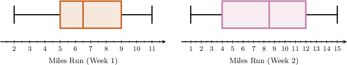
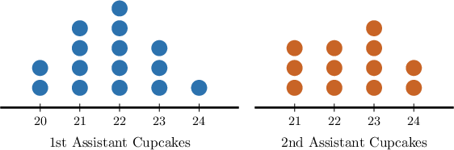

# Comparing Data Sets Using Range and Quartiles

Source: https://www.mathacademy.com/topics/2498?courseId=99
Topic ID: 2498

## Prerequisites

- [Box Plots](./2482-box-plots.md)
- [Measuring Range and MAD From Dot Plots](./2501-measuring-range-and-mad-from-dot-plots.md)
- [Measuring Quartiles and IQR From Dot Plots](./3757-measuring-quartiles-and-iqr-from-dot-plots.md)

## Lesson

### Introduction

One way to compare the spread of two data sets is by using the range.

For example, suppose a study compared students' reading proficiencies across two $4$th-Grade classes. Both classes sat the same standardized test. Let's assume we know the following:

- The range of the scores for class $A$ is $8.$

- The results for each of the students in class $B$ are as follows:

Before comparing the spread, we compute the range of class $B$'s scores by taking the difference between the greatest value ($10$) and the smallest value ($4$) in the data set:

$$

\text{range} = \text{greatest} - \text{smallest} = 10 - 4 = 6

$$

So, the range of class $B$'s scores is smaller than class $A$'s. This tells us that the overall spread of class $B$'s results is smaller, *suggesting* that class $B$'s results are more consistent overall.

It's important to realize that there are numerous ways to compare the spread of two data sets. Comparing the ranges is only one way. While a comparison of the ranges might *suggest* that class $B$'s results are more consistent, it is not conclusive. We'd need to gather more evidence (e.g., calculating the interquartile range and mean absolute deviation, too) to support this conclusion.

### Example: Comparing Visual Data Sets Using the Range

#### Question

A fitness center tracked the number of miles each runner completed during two different weeks. This information is displayed using the box plots shown above.

Calculate the range for each dataset and identify which dataset has the greater spread.

#### Explanation

Recall that on a box plot,

- the smallest value in the data corresponds to the left whisker, and

- the greatest value corresponds to the right whisker.

The range of a dataset is the difference between the greatest and the smallest values.

With that in mind, let's find the ranges of the given datasets.

- Consider the box plot corresponding to the first week. Here, we have the following: So, the range of the dataset is

- Consider the box plot corresponding to the second week. Here, we have the following: So, the range of the dataset is

Since $9 < 14,$ a comparison of the ranges suggests that the dataset corresponding to the second week is more spread out.

### Example: Comparing Data Sets Using the Range

#### Question

A fan recorded the total number of goals scored by a Spanish and an English soccer team in the last $5$ rounds of the Champions League. The range in the number of goals scored per round by the Spanish team was $4.$ The number of goals scored in each round by the English team is shown below:

$$

4, \, \, \, 6, \, \, \, 2, \, \, \, 8, \, \, \, 10

$$

Which of the following statements are true?

1. The range in the number of goals scored per round by the English team is $6.$

2. The range for the English team is greater than that of the Spanish team.

3. A comparison of the ranges suggests that the Spanish team is less consistent (in terms of goals scored per round) than the English team.

#### Explanation

Let's examine the statements one by one.

- Statement I is false. Arranging the data for the English team from smallest to greatest, we get the following: Here, the smallest value is $\color{red}2$ and the greatest value is $\color{blue}10.$ So, the range is

- Statement II is true. Since $8 > 4,$ the range for the English team is greater than that of the Spanish team.

- Statement III is false. The range is greater for the English team, indicating more variability in the data compared to the Spanish team. Therefore, there is no suggestion that the Spanish team is less consistent regarding goals scored per round.

Therefore, the correct answer is "II only."

### Interquartile Range

One problem with comparing data sets using the range is that it is very sensitive to unusually large or unusually small values (known as outliers).

Another way to compare the spread of two data sets is by using the interquartile range (IQR). The IQR is resistant to outliers, making it a more robust statistical tool.

To demonstrate, let's revisit the previous study that compared students' reading proficiencies across two $4$th-Grade classes. Both classes sat the same standardized test. Now, we assume we know the following:

- the interquartile range of the scores for class $A$ is $4,$ and

- the results for each of the students in class $B$ are as follows:

Before comparing the spread, we compute the interquartile range of class $B$'s scores. Notice that our data set is already arranged from smallest to greatest, and that the number of data points is odd (7). The median of the dataset is the middle number (${\color{blue}6}$).

- The lower part of the data set comprises all values below the median: Now, we find the median of the lower part. In this case, it's the middle number: So, the lower quartile is $5.$

- The upper part of the data set comprises all values above the median: Now, we find the median of the upper part. In this case, it's the middle number too: So, the upper quartile is $10.$

Finally, we find the interquartile range by taking the difference between the upper quartile ($10$) and the lower quartile ($5$):

$$

\text{IQR} = \text{upper quartile} - \text{lower quartile} = 10 - 5 = 5

$$

So, the interquartile range of class $A$'s scores is smaller than class $B$'s. This tells us that the overall spread of class $A$'s results is smaller, *suggesting* that this class's results are more consistent overall, and aligns with the comparison of the range we made earlier.

### Example: Comparing Data Sets Using IQR

#### Question

The number of ** ice creams sold per day over a particular eight-day period at Tom's shop is given below:

$$

22 \, , \quad 35 \, , \quad 43 \, , \quad 52 \, , \quad 58\, , \quad 65 \, , \quad 68\, , \quad 72

$$

The interquartile range (IQR) of the number of ** ice creams sold per day over the same eight-day period is $30.$

Which of the following statements are true?

1. The interquartile range (IQR) of the number of coconut ice creams sold per day is $27.5$

2. The IQR for strawberry ice creams is greater than for coconut ice creams.

3. A comparison of the IQRs suggests it is more difficult for Tom to predict how many strawberry ice creams he'll sell tomorrow compared to coconut ice creams.

#### Explanation

Let's compute the interquartile range for the number of coconut ice creams sold.

Notice that our data set is already arranged from smallest to greatest, and that the number of data points is even ($8$).

- The lower part is the first half of the data: Now, we find the median of the lower part. In this case, it's the mean of the two middle numbers: So, the lower quartile is

- The upper part is the second half of the data: Now, we find the median of the upper part. In this case, it's the mean of the two middle numbers: So, the upper quartile is

Therefore, the interquartile range of the data set is

$$

\text{upper quartile} - \text{lower quartile} = 66.5 - 39= 27.5.

$$

So, the interquartile range of the number of coconut ice creams sold per day is $27.5$

Let's now examine the statements one by one:

- Statement I is true.

- Statement II is true. Since $30 > 27.5$, the interquartile range is larger for the strawberry ice creams

- Statement III is true. The IQR is greater for strawberry ice creams, indicating more variability in the data than for coconut ice creams, suggesting that it's more difficult for Tom to predict the number of strawberry ice creams he'll sell tomorrow.

Therefore, the correct answer is "I, II, and III."

### Example: Comparing Visual Data Sets Using IQR

#### Question

A chef recorded the number of cupcakes baked by two different assistants in a single month. This information is displayed using the dot plots shown above.

Compare the interquartile ranges of the two data sets.

#### Explanation

The interquartile range (IQR) of a dataset is the difference between the upper and the lower quartiles.

With that in mind, let's find the interquartile ranges of the given datasets.

- Consider the dot plot corresponding to the first assistant. Notice that the number of data points ($15$) is odd. As a result, we can separate the data into its lower and upper parts, as illustrated in the diagram below. Here, we have the following: The lower quartile is the median of the lower part. In this case, it's just the middle number. So, the lower quartile is The upper quartile is the median of the upper part. In this case, it's just the middle number. So, the upper quartile is Thus, the interquartile range is

- Consider the dot plot corresponding to the second assistant. Notice that the number of data points ($12$) is even. As a result, we can separate the data into its lower and upper parts, as illustrated in the diagram below. Here, we have the following: The lower quartile is the median of the lower part. In this case, it's the average of the two middle numbers. So, the lower quartile is The upper quartile is the median of the upper part. In this case, it's the average of the two middle numbers. So, the upper quartile is Thus, the interquartile range is

Since $2 > 1.5,$ a comparison of the interquartile ranges suggests that the dataset corresponding to the first assistant is more spread out.
