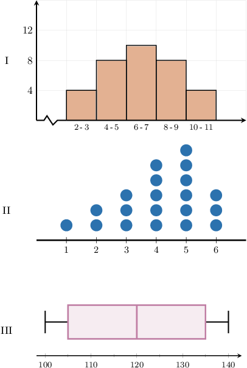
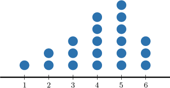
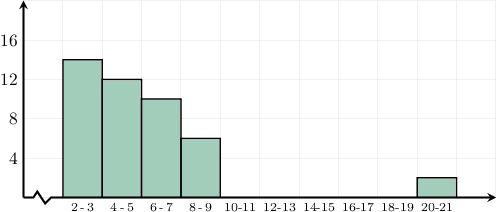

# Comparing Measures of Center

Source: https://www.mathacademy.com/topics/2516?courseId=99
Topic ID: 2516

## Prerequisites

- [Box Plots](./2482-box-plots.md)
- [Symmetry, Skew, and Outliers](./2502-symmetry-skew-and-outliers.md)
- [Histograms](./2510-histograms.md)

## Lesson

### Introduction

When a data set is *strongly skewed* or contains *extreme outliers*, the *mean* may not be the most reliable measure of center. In these situations, we say that the mean is **sensitive to skew and outliers**.

When the skew is small or there are no extreme outliers, the mean often provides a good description of the data’s center. However, large outliers can pull the mean away from where most of the data values lie.

To see how an extreme outlier can affect the mean, consider the following data set:

$$

0, \quad 0, \quad 1, \quad 1, \quad 2, \quad 2, \quad 134

$$

Most of the numbers in this data set are between $0$ and $2.$ However, because of the outlier $134,$ the mean is much larger than the majority of the data points:

$$

\begin{aligned}mean & =\frac{0+0+1+1+2+2+134}{7} \\ & =\frac{140}{7} \\ & =20\end{aligned}

$$

In this example, the outlier $134$ is much larger than the rest of the data, so it pulls the mean far to the right of most data values.

On the other hand, the *median* equals ${\color{blue}\underline{1}},$ which better represents the center of this data set because it is not affected by the extreme outlier.

$$

0, \quad 0, \quad 1, \quad {\color{blue}\underline{1}}, \quad 2, \quad 2, \quad 134

$$

In general, the median is a *more reliable* measure of center when data are highly skewed or contain extreme outliers. For this reason, we say the median is **resistant to skew and outliers**.

Choosing between the mean and the median depends on the data's shape and the presence of outliers.

### Example: Determining When to Use Mean Versus the Median

#### Question

In which of the following distributions might it be preferable to use the median instead of the mean to measure the center?

#### Explanation

The mean is sensitive to skew and outliers, whereas the median is resistant to skew and outliers.

So, we should use the median instead of the mean when we are measuring the center of a skewed distribution or a distribution with outliers.

Among the given options, all distributions are symmetric except for the following, which is left-skewed.

### Example: Identifying Reliable Measures of Center Given a Dot Plot, Box Plot, or Histogram

#### Question

Which of the following is true regarding the data set represented by the histogram below?

1. The distribution has outliers.

2. The median is not sensitive to the skew of the distribution.

3. The mean is the best measure of the center for the given distribution.

#### Explanation

First, let's reсall the following facts.

- The mean is sensitive to skew and outliers.

- The median is not sensitive to skew nor outliers.

With that in mind, let's examine each of the statements.

- Statement I is true. Our distribution has outliers.

- Statement II is true. Our distribution is right-skewed, but the median is not sensitive to the skew.

- Statement III is false. Since the distribution is skewed and has outliers, the median is the best measure of the center.

Therefore, the correct answer is "I and II only."
