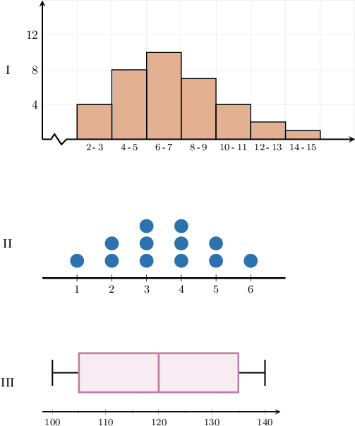
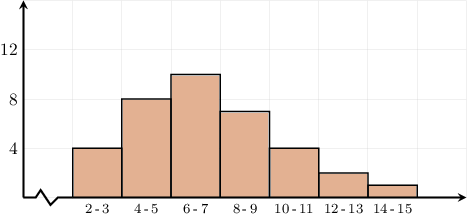
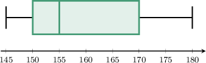

# Comparing Measures of Spread

Source: https://www.mathacademy.com/topics/3758?courseId=99
Topic ID: 3758

## Prerequisites

- [Comparing Measures of Center](./2516-comparing-measures-of-center.md)

## Lesson

### Introduction

When a data set has outliers, some spread measures are unreliable.

To understand this, let's consider the following data set:

$$

0, \: 0, \: 1, \: 1, \: 2, \: 2, \: 134

$$

Most of the numbers in this data set are between $0$ and $2.$ Therefore, we'd expect any measure of spread for this group to be fairly small.

Let's now compute the range and mean absolute deviation (MAD) for this data set:

- We compute the range as follows: Due to the outlier of $134,$ the range is large. Therefore, the range is *not* a reliable measure of the data set's spread.

- Let's now compute the MAD. First, we compute the mean: Notice that the mean is affected by the outlier. Now, computing the MAD, we get So, the outlier inflates the mean, and this causes the MAD to become very high. Therefore, the MAD is *not* a reliable measure of the data set's spread.

### Interquartile Range

Let's now compute the interquartile range (IQR) of our data set:

$$

0, \: 0, \: 1, \: 1, \: 2, \: 2, \: 134

$$

Dividing the dataset into the upper half and the lower half, we have the following:

$$

\underbrace{0, \: 0, \: 1,}_{\text{lower half}} \: \,{\color{blue}\underline{1}}, \: \underbrace{2, \: 2, \: 134}_{\text{upper half}}

$$

The lower quartile is the median of the lower half, which is ${\color{blue}0}\mathbin{:}$

$$

0, \: {\color{blue}\underline{0}}, \: 1

$$

The upper quartile is the median of the upper half, which is ${\color{red}2}\mathbin{:}$

$$

2, \: {\color{red}\underline{2}}, \: 134

$$

So, the interquartile range is

$$

\begin{aligned}IQR & =upper quartile−lower quartile \\ & =2−0 \\ & =2.\end{aligned}

$$

This example shows that the IQR gives a more reliable measure of the spread than the range and MAD.

### A Summary

To summarize:

- The range is *sensitive to outliers*.

- The MAD is *sensitive to outliers*. Also, since it depends on the mean, the MAD is *sensitive to skew*.

- The IQR is *resistant to outliers.* In addition, the IQR is also *resistant to skew*.

We should also bear in mind the following:

- If a data set is *symmetric*, we use the *mean* to compute the center and the *MAD* to calculate the spread.

- If a data set contains *outliers* or is *skewed*, we use the *median* to compute the center and the *IQR* to calculate the spread.

- In practice, the range is rarely used because it's so sensitive to outliers and only considers two values in the data set.

### Example: Determining When to Use MAD Versus IQR

#### Question

In which of the following distributions might it be preferable to use the interquartile range (IQR) instead of the mean absolute deviation (MAD) to measure the spread?

#### Explanation

The mean absolute deviation (MAD) is sensitive to skew and outliers, whereas the interquartile range (IQR) is resistant to outliers.

So, we should use the IQR instead of the mean absolute deviation (MAD) when measuring the spread of a distribution containing skew or outliers.

Among the given options, all distributions are symmetric and have no outliers except for the following, which is right-skewed.

### Example: Identifying Reliable Measures of Spread Given a Dot Plot, Box Plot, or Histogram

#### Question

The box plot below shows the distribution of some students' heights.

Which of the following statements are true?

1. The distribution is right-skewed.

2. The interquartile range (IQR) is sensitive to the distribution's skew.

3. The mean absolute deviation (MAD) is the best measure of the distribution's spread.

#### Explanation

First, let's reсall the following facts.

- The range is sensitive to outliers, while the mean absolute deviation (MAD) is sensitive to skew and outliers.

- The interquartile range (IQR) is resistant to skew and outliers.

With that in mind, let's examine each of the statements.

- Statement I is true. Our distribution is right-skewed.

- Statement II is false. The IQR is not sensitive to the skew of our distribution.

- Statement III is false. Since the distribution is skewed, the IQR is the best measure of the spread of the given data.

Therefore, the correct answer is "I only."
