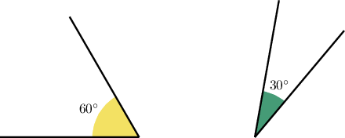

# Non-Adjacent Complementary Angles

Source: https://www.mathacademy.com/topics/6207?courseId=99
Topic ID: 6207

## Prerequisites

- [Solving Systems of Equations by Substitution](./487-solving-systems-of-equations-by-substitution.md)
- [Complementary Angles](./1639-complementary-angles.md)

## Lesson

### Introduction

Two angles don't have to be adjacent to be *complementary*. As long as their measures add up to $90^\circ,$ they are *complementary*.

For instance, the following angles are also complementary, even though they are not adjacent:

Notice that $60^\circ + 30^\circ = 90^\circ,$ so the two angles are complementary.

### Example: Finding the Expression for the Complementary Angle

#### Question

Find the measure of the angle that's complementary to the angle of $4x - 18^\circ.$

#### Explanation

Two angles are complementary if the sum of their measures is equal to $90^\circ.$ So, the measure of the angle that's complementary to the angle of $4x - 18^\circ$ must be

$$

\begin{aligned}90^{∘}−(4𝑥−18^{∘}) & =90^{∘}−4𝑥+18^{∘} \\ & =108^{∘}−4𝑥.\end{aligned}

$$

### Example: Using Complementary Angles to Solve for a Variable

#### Question

Calculate $x$, given that $\angle{A}$ and $\angle{B}$ are complementary, and that

$$

m\angle{A} = 3x, \qquad m\angle{B} = 4x-8^\circ\,.

$$

#### Explanation

Since angles $\angle{A}$ and $\angle{B}$ are complementary, we have

$$

m \angle A + m \angle B = 90^\circ.

$$

Hence, we can solve for $x$ as follows:

$$

\begin{aligned}𝑚∠𝐴+𝑚∠𝐵 & =90^{∘} \\ 3𝑥+(4𝑥−8^{∘}) & =90^{∘} \\ 7𝑥−8^{∘} & =90^{∘} \\ 7𝑥 & =98^{∘} \\ 𝑥 & =14^{∘}\end{aligned}

$$

### Using Complementary Angles in Equations

Now, let $\angle A$ and $\angle B$ be two complementary angles. If

$$

5m\angle A - 2m\angle B =310^\circ,

$$

what is $m \angle B?$

There are two variables in the equation above. But we can eliminate one of them using the relationship between complementary angles.

Since $\angle A$ and $\angle B$ are complementary angles, we have

$$

\begin{aligned}𝑚∠𝐴+𝑚∠𝐵 & =90^{∘} \\ 𝑚∠𝐴 & =90^{∘}−𝑚∠𝐵.\end{aligned}

$$

Substituting $m \angle A =90^\circ - m\angle B$ into $5m\angle A - 2m\angle B =310^\circ,$ we obtain:

$$

\begin{aligned}5𝑚∠𝐴−2𝑚∠𝐵 & =310^{∘} \\ 5(90^{∘}−𝑚∠𝐵)−2𝑚∠𝐵 & =310^{∘} \\ 450^{∘}−5𝑚∠𝐵−2𝑚∠𝐵 & =310^{∘} \\ 450^{∘}−7𝑚∠𝐵 & =310^{∘} \\ 7𝑚∠𝐵 & =140^{∘} \\ 𝑚∠𝐵 & =20^{∘}\end{aligned}

$$

Therefore,

$$

m\angle B = 20^\circ.

$$

### Example: Finding an Unknown Complementary Angle Given an Equation

#### Question

Let $\angle A$ and $\angle B$ be two complementary angles. If $m \angle B = 2m \angle A,$ find $m \angle B.$

#### Explanation

Since $\angle A$ and $\angle B$ are complementary angles, we have

$$

m \angle A + m \angle B = 90^\circ.

$$

Substituting $m \angle B = 2m \angle A,$ we obtain:

$$

\begin{aligned}𝑚∠𝐴+𝑚∠𝐵 & =90^{∘} \\ 𝑚∠𝐴+2𝑚∠𝐴 & =90^{∘} \\ 3𝑚∠𝐴 & =90^{∘} \\ 𝑚∠𝐴 & =30^{∘}\end{aligned}

$$

Therefore,

$$

\begin{aligned}𝑚∠𝐵 & =2𝑚∠𝐴 \\ & =2(30^{∘}) \\ & =60^{∘}.\end{aligned}

$$
