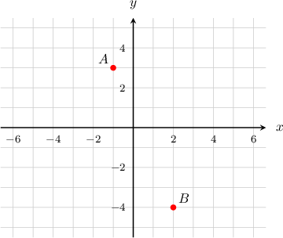

# Two-Variable Linear Equations and Their Solutions

Source: https://www.mathacademy.com/topics/94?courseId=99
Topic ID: 94

## Prerequisites

- [Solving Two-Step Equations](./66-solving-two-step-equations.md)
- [The Cartesian Coordinate System](./92-the-cartesian-coordinate-system.md)

## Lesson

### Introduction

A **linear equation** in the variables $x$ and $y$ is an equation that involves just these two variables, possibly with some constants. There should be no powers on any of the variables and the variables can't be multiplied together.

For example, the following are linear equations:

$$

y = x + 4, \qquad y = -3x, \qquad 5y = 6x,\qquad 2x + 3y = 9

$$

On the other hand, the following are *not* linear equations:

$$

y = x^2 - 2x, \qquad y^2 = - 4x + 2, \qquad y = 2xy

$$

A **solution** of a linear equation is an **ordered pair** $(x,y)$ that makes the equation true.

For instance, the ordered pair $(3, 7)$ is a solution to the equation $y = 3x - 2$ because if we replace $x$ with $3$ and $y$ with $7,$ we get

$$

\begin{aligned}𝑦 & =3𝑥−2 \\ (7) & =3(3)−2 \\ 7 & =9−2 \\ 7 & =7\,✓\end{aligned}

$$

The above is a true statement, so $(3, 7)$ is a solution to the equation $y = 3x - 2.$

**Important**: A linear equation in two variables has an infinite number of solutions, not just one!

### Example: Identifying a Solution to a Given Equation

#### Question

Which of the given points is a solution to $y=-2x+1?$

#### Explanation

The plotted points correspond to the $xy$-pairs $A(-1, 3)$ and $B(2,-4).$ To check whether each point is a solution to the equation, we substitute it into the equation and see if it results in a true statement.

First, we substitute $A(-1,3)$ into the equation:

$$

\begin{aligned}𝑦 & =−2𝑥+1 \\ (3) & =−2(−1)+1 \\ 3 & =3\,✓\end{aligned}

$$

The result is a true statement, so $A(-1,3)$ is a solution to the equation.

Next, we substitute $B(2,-4)$ into the equation:

$$

\begin{aligned}𝑦 & =−2𝑥+1 \\ (−4) & =−2(2)+1 \\ −4 & =−4+1 \\ −4 & =−3\,×\end{aligned}

$$

The result is a false statement, so $B(2,-4)$ is ** solution to the equation.

Therefore, only $A(-1,3)$ is a solution to the equation.

### Example: Finding a Missing Coordinate in a Solution

#### Question

A solution to the linear equation $y-5x=2$ is the ordered pair $(2,k).$ What is the value of $k?$

#### Explanation

Since $(2,k)$ is a solution to the linear equation $y-5x=2,$ the equation must turn into a true statement if we substitute $2$ and $k$ for $x$ and $y.$ So, we replace $x$ with $2$ and $y$ with $k,$ as follows:

$$

\begin{aligned}𝑦−5𝑥 & =2 \\ (𝑘)−5(2) & =2 \\ 𝑘−10 & =2\end{aligned}

$$

Then, we solve for $k\mathbin{:}$

$$

\begin{aligned}𝑘−10 & =2 \\ 𝑘 & =12\end{aligned}

$$
