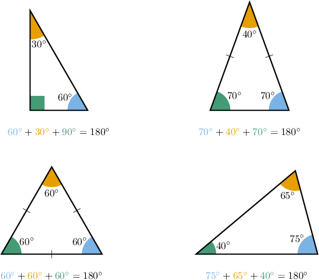
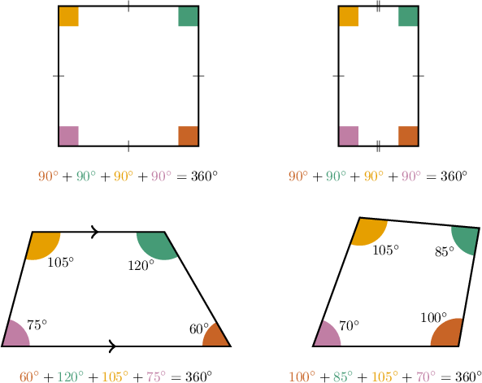
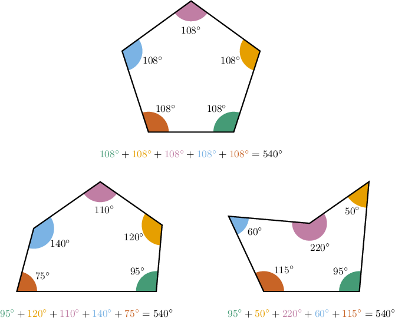
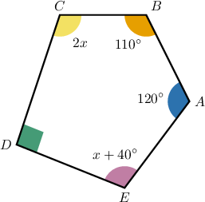
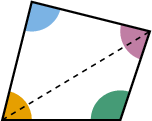
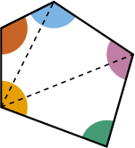
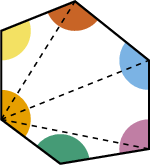

# Interior Angles of Polygons

Source: https://www.mathacademy.com/topics/1319?courseId=120
Topic ID: 1319

## Prerequisites

- [Interior Angles of Triangles](../../../middle-school/lessons/grade-7/496-interior-angles-of-triangles.md)
- [Polygons](../../../middle-school/lessons/grade-7/1317-polygons.md)
- [Four-Digit by Two-Digit Division](../../../elementary-school/lessons/grade-5/2331-four-digit-by-two-digit-division.md)

## Lesson

### Introduction

The sum of the interior angles of *any* triangle equals $180^\circ.$

As it turns out, there is a general rule for the sum of the interior angles that applies to all polygons:

*The sum of the interior angles of a polygon with $n$ sides equals $180^\circ \cdot (n-2).$*

For example, every triangle has ${\color{blue}3}$ sides. Let's substitute $n={\color{blue}3}$ into the formula to check that it works:

$$

\begin{aligned}180^{∘}⋅(𝑛−2) & =180^{∘}⋅(3−2) \\ & =180^{∘}⋅1 \\ & =180^{∘}\,✓\end{aligned}

$$

So, the formula tells us that the sum of the interior angles of a triangle equals $180^\circ,$ which we know is correct.

Let's see some more examples.

### The Sum of the Interior Angles of a Quadrilateral

The sum of the interior angles of a polygon with $n$ sides equals

$$

180^\circ \cdot (n-2).

$$

Every quadrilateral has $n={\color{blue}4}$ sides. Applying the formula, we get

$$

\begin{aligned}180^{∘}⋅(𝑛−2) & =180^{∘}⋅(4−2) \\ & =180^{∘}⋅2 \\ & =360^{∘}.\end{aligned}

$$

So, the formula tells us that the sum of the interior angles of a quadrilateral equals $360^\circ.$

### Example: Identifying Possible Interior Angles of a Quadrilateral

#### Question

Which of the following could be the interior angles of a quadrilateral?

1. $40^{\circ}$, $50^{\circ}$, $100^{\circ}$, $170^{\circ}$

2. $20^{\circ}$, $50^{\circ}$, $150^{\circ}$, $140^{\circ}$

3. $30^{\circ}$, $35^{\circ}$, $140^{\circ}$, $175^{\circ}$

#### Explanation

A quadrilateral has $n=4$ sides. Therefore, the sum of the interior angles of a quadrilateral must be

$$

\begin{aligned}180^{∘}⋅(𝑛−2) & =180^{∘}⋅(4−2) \\ & =180^{∘}⋅2 \\ & =360^{∘}.\end{aligned}

$$

Let's check this for the above three options:

$$

\begin{aligned}40^{∘}+50^{∘}+100^{∘}+170^{∘}=360^{∘}\,✓ & \\ & \\ 20^{∘}+50^{∘}+150^{∘}+140^{∘}=360^{∘}\,✓ & \\ & \\ 30^{∘}+35^{∘}+140^{∘}+175^{∘}=380^{∘}\,𝖷 & \end{aligned}

$$

Therefore, only options I and II could be the angles of a quadrilateral.

### The Sum of the Interior Angles of a Pentagon

The sum of the interior angles of a polygon with $n$ sides equals

$$

180^\circ \cdot (n-2).

$$

Every pentagon has $n={\color{blue}5}$ sides. Applying the formula, we get

$$

\begin{aligned}180^{∘}⋅(𝑛−2) & =180^{∘}⋅(5−2) \\ & =180^{∘}⋅3 \\ & =540^{∘}.\end{aligned}

$$

So, the formula tells us that the sum of the interior angles of a pentagon equals $540^\circ.$

We can use the same formula to deduce the sum of the interior angles of hexagons, heptagons, octagons, and so forth.

### Example: Finding Unknown Quantities in Quadrilaterals and Pentagons

#### Question

Given the pentagon $ABCDE$ shown below, find the value of $x.$

#### Explanation

A pentagon has $n=5$ sides. Therefore, the sum of the interior angles of a pentagon must be

$$

\begin{aligned}180^{∘}⋅(𝑛−2) & =180^{∘}⋅(5−2) \\ & =180^{∘}⋅3 \\ & =540^{∘}.\end{aligned}

$$

Adding up the internal angles and solving for $x,$ we get

$$

\begin{aligned}𝑚∠𝐴+𝑚∠𝐵+𝑚∠𝐶+𝑚∠𝐷+𝑚∠𝐸 & =540^{∘} \\ 120^{∘}+110^{∘}+2𝑥+90^{∘}+𝑥+40^{∘} & =540^{∘} \\ 2𝑥+𝑥+40^{∘}+120^{∘}+110^{∘}+90^{∘} & =540^{∘} \\ 3𝑥+360^{∘} & =540^{∘} \\ 3𝑥 & =180^{∘} \\ 𝑥 & =60^{∘}\,.\end{aligned}

$$

### Example: Finding the Number of Sides of a Polygon Given the Sum of Its Interior Angles

#### Question

The sum of the interior angles of a polygon is $720^\circ.$ How many sides does it have?

#### Explanation

Remember that the sum of the interior angles of a polygon with $n$ sides is $180^\circ \cdot (n-2).$

To find the number of sides in our polygon, we start by setting up the following equation:

$$

180^\circ \cdot (n-2) = 720^\circ

$$

Now, we solve for $n,$ as follows:

$$

\begin{aligned}180^{∘}⋅(𝑛−2) & =720^{∘} \\ 𝑛−2 & =\frac{720^{∘}}{180^{∘}} \\ 𝑛−2 & =4 \\ 𝑛 & =6\end{aligned}

$$

Therefore, the polygon has $n=6$ sides (it is a hexagon).

### Justification of the Formula

We've made use of the following theorem throughout this lesson.

*The sum of the interior angles of a polygon with $n$ sides equals $180^\circ \cdot (n-2).$*

This formula works because any $n$-sided polygon can be split into $n-2$ triangles using diagonals that meet at one fixed vertex of the polygon.

Let's illustrate this for a few different polygons.

The sum of the interior angles of each polygon is the same as the sum of the interior angles of the corresponding triangles.

Each triangle has interior angles that sum to $180^\circ,$ and any $n$-sided polygon can be split into $n-2$ triangles in the manner shown above. Therefore, the sum of the interior angles in an $n$-sided polygon is

$$

\begin{aligned}180^{∘}⋅(𝑛−2).\end{aligned}

$$
