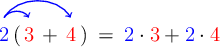
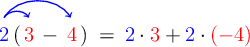

# Applying the Distributive Law With Linear Expressions

Source: https://www.mathacademy.com/topics/135?courseId=120
Topic ID: 135

## Prerequisites

- [Adding a Negative Number](../../../middle-school/lessons/grade-7/328-adding-a-negative-number.md)
- [Identifying Coefficients and Constants](../../../middle-school/lessons/grade-6/645-identifying-coefficients-and-constants.md)
- [Multiplying Negative Numbers](../../../middle-school/lessons/grade-7/3718-multiplying-negative-numbers.md)

## Lesson

### Introduction

The **distributive law** states that multiplying a group of terms by a number is the same as multiplying each term separately by that same number and adding the products.

For example, let's take a look at the following expression:

$$

2(3+4).

$$

We can evaluate this expression using the distributive law:

Therefore,

$$

\begin{aligned}2(3+4) & = \\ 2⋅3+2⋅4 & = \\ 6+8 & = \\ 14 & .\end{aligned}

$$

The distributive law also applies when the multiplication occurs on the right of the parentheses:

$$

\begin{aligned}(3+4)⋅2 & = \\ 3⋅2+4⋅2 & = \\ 6+8 & = \\ 14 & \end{aligned}

$$

### Example: Distributing a Positive Number Over the Sum of Two Terms

#### Question

Expand $3(4x+2).$

#### Explanation

Using the distributive law, we multiply each term inside the parentheses by the number $3\mathbin{:}$

$$

\begin{aligned}3(4𝑥+2) & = \\ 3⋅4𝑥+3⋅2 & = \\ 12𝑥+6 & \end{aligned}

$$

### Example: Distributing a Negative Number Over the Sum of Two Terms

#### Question

Expand $(2y+7) \cdot (-3).$

#### Explanation

Using the distributive law, we multiply each term inside the parentheses by the number $(-3)\mathbin{:}$

$$

\begin{aligned} (2y+7) \cdot (-3)&=\\[5pt] 2y\cdot(-3)+7\cdot(-3)&=\\[5pt] (-6y) + (-21)&=\\[5pt] -6y-21 \end{aligned}

$$

### Dealing With a Minus Inside the Parentheses

The distributive law also works when there is subtraction inside the parentheses.

For example, we can expand the expression $2(3-4)$ as follows:

Notice that we keep a plus ($+$) sign between the two terms. This helps us to avoid mistakes when multiplying with negative numbers.

Now, evaluating our expression, we have

$$

\begin{aligned}2(3−4) & = \\ 2⋅3+2⋅(−4) & = \\ (6)+(−8) & = \\ 6−8 & = \\ −2 & .\end{aligned}

$$

Finally, the distributive law also applies when the multiplication occurs on the right of the parentheses:

$$

\begin{aligned}(3−4)⋅2 & = \\ 3⋅2+(−4)⋅2 & = \\ (6)+(−8) & = \\ 6−8 & = \\ −2 & .\end{aligned}

$$

### Example: Distributing a Positive Number Over the Difference of Two Terms

#### Question

Expand $7(5x-3y).$

#### Explanation

Using the distributive law, we multiply each term inside the parentheses by the number $7\mathbin:$

$$

\begin{aligned}7(5𝑥−3𝑦) & = \\ 7⋅5𝑥+7⋅(−3𝑦) & = \\ (35𝑥)+(−21𝑦) & = \\ 35𝑥−21𝑦 & \end{aligned}

$$

### Example: Distributing a Negative Number Over the Difference of Two Terms

#### Question

Expand $-11(4x - 3y).$

#### Explanation

Using the distributive law, we multiply each term inside the parentheses by the number $(-11)\mathbin{:}$

$$

\begin{aligned}−11(4𝑥−3𝑦) & = \\ (−11)⋅4𝑥+(−11)⋅(−3𝑦) & = \\ (−44𝑥)+(33𝑦) & = \\ −44𝑥+33𝑦 & \end{aligned}

$$
