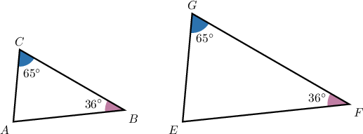
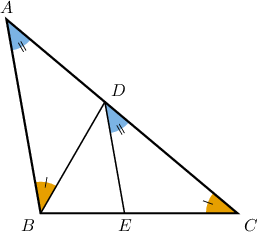
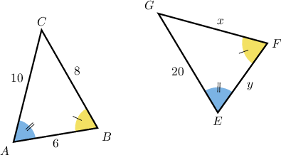
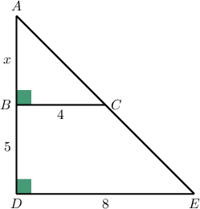
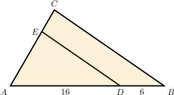

# The AA Similarity Criterion

Source: https://www.mathacademy.com/topics/1365?courseId=120
Topic ID: 1365

## Prerequisites

- [Side Lengths and Angle Measures of Similar Polygons](../../../high-school/traditional/lessons/geometry/1367-side-lengths-and-angle-measures-of-similar-polygons.md)
- [Vertical Angles](../../../middle-school/lessons/grade-7/1507-vertical-angles.md)
- [Solving Rational Equations Containing Binomials Using Cross-Multiplication](../../../high-school/traditional/lessons/algebra-i/3555-solving-rational-equations-containing-binomials-using-cross-multiplication.md)

## Lesson

### Introduction

We know that two polygons are **similar** if

- their corresponding angles are congruent, and

- the ratios of the lengths of their corresponding sides are equal.

We have a few shortcuts for proving that two triangles are similar. One shortcut is the **angle-angle (AA) criterion**, which states the following:

*If two angles of one triangle are congruent to two angles of another triangle, then these two triangles are similar.*

Consider the triangles below.

We see there are two pairs of congruent angles:

$$

\angle{B}\cong \angle{F}, \quad \angle{C}\cong \angle{G}. \quad

$$

Therefore, the AA Criterion guarantees that these triangles are similar, and we can write

$$

\triangle ABC \sim \triangle EFG.

$$

### Example: Identifying Similar Triangles Using the AA Criterion

#### Question

According to the AA criterion only, which of the following triangles are similar to $\triangle ABC?$

1. $\triangle ADB$

2. $\triangle DEC$

3. $\triangle BDC$

#### Explanation

Recall that the angle-angle (AA) criterion states the following:

If two angles of one triangle are congruent to two angles of another triangle, then these two triangles are similar.

With that in mind, let's examine each of the given triangles.

- $\triangle ADB \sim \triangle ABC$ by AA since $\angle A$ is their common angle and $\angle DBA \cong \angle C.$

- $\triangle DEC \sim \triangle ABC$ by AA since $\angle C$ is their common angle and $\angle A \cong \angle EDC.$

- $\triangle BDC$ is ** similar to $\triangle ABC$ by AA since they have only one pair of congruent angles.

Therefore, the correct answer is "I and II only."

### Example: Solving for Unknowns Given Two Similar Triangles

#### Question

Given the triangles $\triangle ABC$ and $\triangle EFG$ shown below, find the value of $x+y.$

#### Explanation

From the diagram, the triangles have two congruent angles: $\angle{A}\cong\angle{E}$ and $\angle{B}\cong\angle{F}.$ As a result, they are similar by the AA criterion.

Now, since the triangles are similar, the corresponding sides must be proportional. So, we get

$$

\begin{aligned}\frac{𝐹𝐺}{𝐵𝐶} & =\frac{𝐺𝐸}{𝐶𝐴} \\ \frac{𝑥}{8} & =\frac{20}{10} \\ 𝑥 & =16.\end{aligned}

$$

Similarly, we obtain

$$

\begin{aligned}\frac{𝐸𝐹}{𝐴𝐵} & =\frac{𝐺𝐸}{𝐶𝐴} \\ \frac{𝑦}{6} & =\frac{20}{10} \\ 𝑦 & =12.\end{aligned}

$$

Therefore,

$$

x+y=16+12=28.

$$

### Example: Identifying Parts of a Triangle That are Similar to a Whole Triangle

#### Question

Given the diagram below, find the value of $x.$

#### Explanation

Consider the triangles $ABC$ and $ADE.$ Here, $\angle A$ is their common angle and $\angle{D}\cong\angle{B}$ since they both are right angles.

Hence, $ABC\sim ADE$ by the AA criterion.

Now, since the triangles are similar, the corresponding sides must be proportional. Therefore, we obtain

$$

\begin{aligned} \dfrac{{AD}}{{AB}} &= \dfrac{{DE}}{{BC}}\\\[5pt] \dfrac{x+5}{x} &= \dfrac{8}{4}\\\[5pt] \dfrac{x+5}{x} &= 2\\\[5pt] x+5 &= 2x \\\[5pt] x&=5. \end{aligned}

$$

### Example: Using the AA Criterion to Find Perimeters

#### Question

In the figure shown above, $\overline{DE} \parallel \overline{BC}.$ If the perimeter of the triangle $\triangle ABC$ is $p_{ABC}=55,$ what is the perimeter of the triangle $\triangle ADE?$

#### Explanation

Since $\overline{DE} \parallel \overline{BC},$ we have that $\angle ADE \cong \angle ABC$ and $\angle AED \cong \angle ACB$, as they are both pairs of corresponding angles.

Therefore, the triangles $\triangle AED$ and $\triangle ACB$ are similar by the AA criterion. Hence, the lengths of the corresponding sides must be proportional, and the similarity ratio $k$ is

$$

\begin{aligned}𝑘 & =\frac{𝐴𝐷}{𝐴𝐵} \\ & =\frac{𝐴𝐷}{𝐴𝐷+𝐷𝐵} \\ & =\frac{16}{16+6} \\ & =\frac{16}{22} \\ & =\frac{8}{11}.\end{aligned}

$$

Therefore,

$$

\begin{aligned}𝐴𝐸=\frac{8}{11}𝐴𝐶,\, & 𝐸𝐷=\frac{8}{11}𝐶𝐵,\, & 𝐴𝐷=\frac{8}{11}𝐴𝐵.\end{aligned}

$$

Now, the perimeter of the triangle $\triangle ADE$ is given by

$$

\begin{aligned}𝑝_{𝐴𝐷𝐸} & =𝐴𝐷+𝐸𝐷+𝐴𝐸 \\ & =\frac{8}{11}𝐴𝐵+\frac{8}{11}𝐶𝐵+\frac{8}{11}𝐴𝐶 \\ & =\frac{8}{11}(𝐴𝐵+𝐶𝐵+𝐴𝐶) \\ & =\frac{8}{11}𝑝_{𝐴𝐵𝐶} \\ & =\frac{8}{11}⋅55 \\ & =40.\end{aligned}

$$
