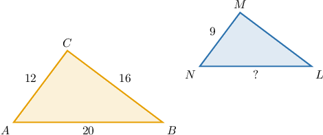
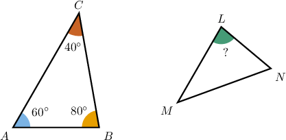
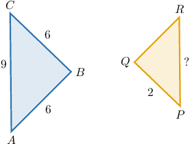
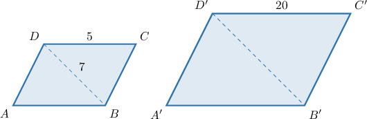
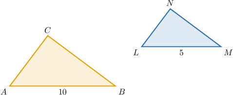
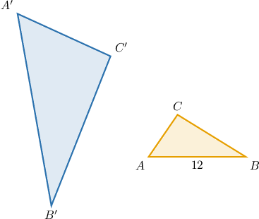

# Side Lengths and Angle Measures of Similar Polygons

Source: https://www.mathacademy.com/topics/1367?courseId=120
Topic ID: 1367

## Prerequisites

- [Similarity and Similar Polygons](../../../high-school/traditional/lessons/geometry/490-similarity-and-similar-polygons.md)
- [Solving Rational Equations Using Cross-Multiplication](../../../high-school/traditional/lessons/algebra-i/698-solving-rational-equations-using-cross-multiplication.md)
- [The Perimeter of a Polygon](../../../middle-school/lessons/grade-7/1386-the-perimeter-of-a-polygon.md)

## Lesson

### Introduction

Suppose we know that the triangles $ABC$ and $NLM$ shown below are similar such that $\triangle ABC\sim\triangle NLM.$ How do we find the length of $\overline{NL}?$

According to the similarity statement, $\triangle ABC\sim \triangle NLM.$ Therefore,

- $\overline{AB}$ corresponds to $\overline{NL},$

- $\overline{BC}$ corresponds to $\overline{LM},$

- $\overline{AC}$ corresponds to $\overline{NM}.$

In similar polygons, the ratio of any two corresponding sides are in proportion. Therefore, we have

$$

\begin{aligned}\frac{𝐴𝐶}{𝑁𝑀} & =\frac{𝐴𝐵}{𝑁𝐿} \\ \frac{12}{9} & =\frac{20}{𝑁𝐿} \\ \frac{9}{12} & =\frac{𝑁𝐿}{20} \\ 𝑁𝐿 & =\frac{20⋅9}{12} \\ 𝑁𝐿 & =15.\end{aligned}

$$

### Example: Finding the Measure of a Angle of a Polygon Given a Similar Polygon

#### Question

Given that $\triangle ABC\sim \triangle NLM,$ find $m \angle L.$

#### Explanation

Since the triangles are similar, the corresponding angles are congruent.

According to the similarity statement, $\triangle A{{\color{blue}B}}C \sim \triangle N{{\color{blue}L}}M.$ So $\angle L$ in $NLM$ corresponds to $\angle B$ in $ABC,$ and therefore

$$

m \angle L = m \angle B = 80^\circ.

$$

### Example: Finding the Measure of a Side of a Polygon Given a Similar Polygon

#### Question

Given that $\triangle ABC\sim \triangle PQR,$ what is the length of $\overline{PR}?$

#### Explanation

According to the similarity statement, $\triangle ABC\sim \triangle PQR.$ Therefore,

- $\overline{AB}$ corresponds to $\overline{PQ},$

- $\overline{BC}$ corresponds to $\overline{QR},$

- $\overline{AC}$ corresponds to $\overline{PR}.$

In similar polygons, corresponding sides are proportional. Therefore, we have

$$

\begin{aligned}\frac{𝐴𝐵}{𝑃𝑄} & =\frac{𝐴𝐶}{𝑃𝑅} \\ \frac{6}{2} & =\frac{9}{𝑃𝑅} \\ 𝑃𝑅 & =\frac{9⋅2}{6} \\ 𝑃𝑅 & =3.\end{aligned}

$$

### Example: Determining the Length of a Diagonal Using Similar Quadrilaterals

#### Question

Given $ABCD \sim A'B'C'D'$, then what is $B'D'?$

#### Explanation

According to the similarity statement, $ABCD \sim A'B'C'D'.$ Therefore, the side $\overline{CD}$ in $ABCD$ corresponds to the side $\overline{C'D'}$ in $A'B'C'D'.$ As a result, the similarity ratio is

$$

k =\dfrac{C'D'}{CD} =\dfrac{20}{5}=4.

$$

In similar polygons, the ratio between corresponding diagonals is also equal to the similarity ratio. Therefore,

$$

\begin{aligned}\frac{𝐵^{′}𝐷^{′}}{𝐵𝐷} & =4 \\ \frac{𝐵^{′}𝐷^{′}}{7} & =4 \\ 𝐵^{′}𝐷^{′} & =28.\end{aligned}

$$

### Perimeters of Similar Polygons

Consider the diagram below, where $\triangle ABC \sim \triangle LMN$ and the perimeter of $\triangle{ABC}$ is $p_{\triangle ABC}=24\, \mathrm{cm}.$ With this information, how can we find the perimeter of $\triangle{LMN}?$

From the diagram, the similarity ratio is

$$

k=\dfrac{LM}{AB}=\dfrac{5}{10}=\dfrac{1}{2}.

$$

In similar polygons, the ratio of the perimeters is equal to the similarity ratio. Therefore, we obtain

$$

\begin{aligned}\frac{𝑝_{𝐿𝑀𝑁}}{24} & =\frac{1}{2} \\ 𝑝_{𝐿𝑀𝑁} & =\frac{24⋅1}{2} \\ 𝑝_{𝐿𝑀𝑁} & =12.\end{aligned}

$$

### Example: Computing Side Lengths and Perimeters of Similar Polygons

#### Question

The triangles $\triangle ABC$ and $\triangle A'B'C'$ are similar. The perimeter of the triangle $\triangle ABC$ is $30\, \mathrm{cm},$ and ${AB}=12\, \mathrm{cm}.$ If the perimeter of the triangle $\triangle A'B'C'$ is $60 \, \mathrm{cm},$ determine the value of $A'B'.$

#### Explanation

In similar polygons, the ratio of the perimeters is equal to the similarity ratio. So, the similarity ratio is

$$

k=\dfrac{p_{\triangle A'B'C'}}{p_{\triangle ABC}}=\dfrac{60}{30}=2.

$$

Notice that $\overline{AB}$ is the longest side of $ABC.$ So, it corresponds to the longest side $\overline{A'B'}$ of $A'B'C'.$ As a result, we obtain

$$

\begin{aligned}\frac{𝐴^{′}𝐵^{′}}{𝐴𝐵} & =𝑘 \\ \frac{𝐴^{′}𝐵^{′}}{𝐴𝐵} & =2 \\ \frac{𝐴^{′}𝐵^{′}}{12} & =2 \\ 𝐴^{′}𝐵^{′} & =24\,cm.\end{aligned}

$$
