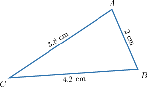
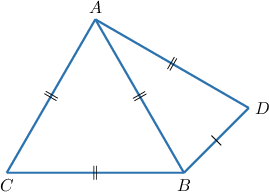
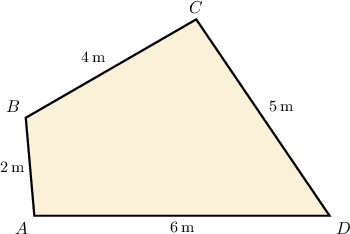
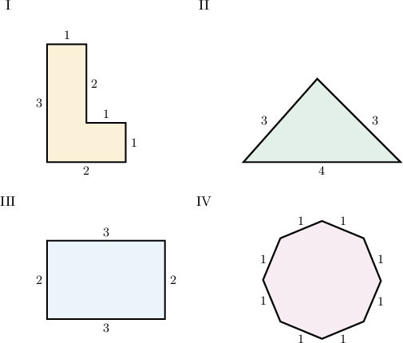

# The Perimeter of a Polygon

Source: https://www.mathacademy.com/topics/1386?courseId=120
Topic ID: 1386

## Prerequisites

- [Polygons](../../../middle-school/lessons/grade-7/1317-polygons.md)
- [Classifying Triangles](../../../middle-school/lessons/grade-7/1601-classifying-triangles.md)

## Lesson

### Introduction

Consider the triangle $\triangle ABC$ shown below.

The sum of the length of its sides is called the **perimeter**. Here, the perimeter of our triangle is

$$

\begin{aligned}𝑝 & =𝐴𝐵+𝐵𝐶+𝐴𝐶 \\ & =2+4.2+3.8 \\ & =10\,cm.\end{aligned}

$$

### Example: Calculating the Perimeter of a Triangle Given the Perimeter of Another Triangle

#### Question

The perimeter $p_1$ of the triangle $\triangle{ABC}$ shown below is $21.$ What is the perimeter of the triangle $\triangle{ABD}$ if ${BD}=3?$

#### Explanation

From the diagram, we can see that $\triangle{ABC}$ is an equilateral triangle.

We're told that the perimeter of $\triangle ABC$ is $p_1=21,$ and since all $3$ sides have equal length, each side must have a length of

$$

\dfrac{p_1}{3}= \dfrac{21}{3} = 7\,.

$$

So now we know that $AB=BC=AC = 7,$ and we have enough information to compute the perimeter of the triangle $\triangle{ABD}\mathbin{:}$

$$

\begin{aligned}𝑝 & =𝐴𝐵+𝐵𝐷+𝐷𝐴 \\ & =7+3+7 \\ & =17\end{aligned}

$$

Therefore, the perimeter of $\triangle ABD$ is $p=17.$

### Perimeters of Polygons

Suppose we have a quadrilateral $ABCD$ as shown below and it is known that ${AD} = 6\,\mathrm{m},$ ${AB} = 2\,\mathrm{m},$ ${BC} = 4\,\mathrm{m},$ and $CD=5\,\mathrm{m}.$ What is the perimeter of the quadrilateral?

Remember that the **perimeter** $p$ of a polygon is the sum of the measures of all its sides. So, we can simply calculate

$$

\begin{aligned}𝑝 & =𝐴𝐷+𝐴𝐵+𝐵𝐶+𝐶𝐷 \\ & =6+2+4+5 \\ & =17\,m.\end{aligned}

$$

### Example: Calculating the Perimeter of a Polygon

#### Question

In a pentagon $ABCDE$, the measures of the sides are ${AB} = 25\,\mathrm{mm},$ ${BC} = 26\,\mathrm{mm},$ ${CD} = 30\,\mathrm{mm},$ ${DE} = 18\,\mathrm{mm},$ and ${EA} = 21\,\mathrm{mm}.$ What is the perimeter of the pentagon?

#### Explanation

The perimeter $p$ of a polygon is the sum of the measures of all its sides. So, we can simply calculate

$$

\begin{aligned}𝑝 & =25\,mm+26\,mm+30\,mm+18\,mm+21\,mm \\ & =120\,mm\end{aligned}

$$

Finally, since the perimeter is a large quantity of $\textrm{mm},$ we will convert to $\textrm{cm}\mathbin{:}$

$$

p = 120\, \mathrm{mm} = 12\,\mathrm{cm}.

$$

### Isoperimetric Polygons

Let's take a look at the polygons depicted below and find their perimeters.

From the picture, we conclude that polygons I, II and III all have a perimeter of $10$ while polygon IV has a perimeter of $8.$

Polygons that have the same perimeter are called **isoperimetric**. So I, II and III are isoperimetric polygons.

### Example: Determining the Value of Variables Given Two Isoperimetric Polygons

#### Question

A regular pentagon has the same perimeter as an equilateral triangle whose side is $15\,\mathrm{cm}.$ Find the length of the side of the pentagon.

#### Explanation

Since all the sides of an equilateral triangle are equal, its perimeter is

$$

p=3\cdot 15=45.

$$

Let $a$ be the side of the pentagon. We know that our polygons have equal perimeters. Therefore,

$$

\begin{aligned}𝑝 & =5𝑎 \\ 45 & =5𝑎 \\ 9 & =𝑎.\end{aligned}

$$

So, the length of the side is $9 \,\mathrm{cm}.$
