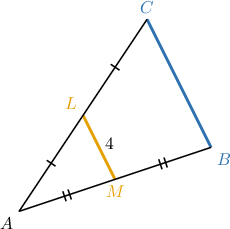
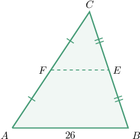
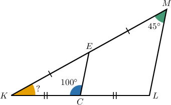
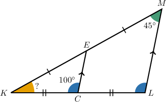
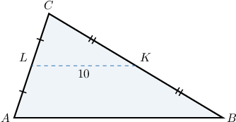
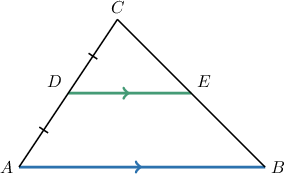
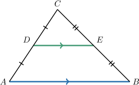
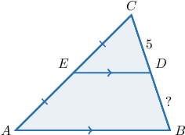

# The Midpoint Theorem

Source: https://www.mathacademy.com/topics/1387?courseId=120
Topic ID: 1387

## Prerequisites

- [The Perimeter of a Polygon](../../../middle-school/lessons/grade-7/1386-the-perimeter-of-a-polygon.md)
- [Midpoints](../../../middle-school/lessons/grade-7/1463-midpoints.md)
- [Parallel and Perpendicular Lines](../../../elementary-school/lessons/grade-4/3979-parallel-and-perpendicular-lines.md)

## Lesson

### Introduction

The **midpoint theorem** states the following:

*The line segment joining the midpoints of two sides of a triangle is parallel to the third side, and its length is equal to half the length of the third side.*

To illustrate, consider the triangle $\triangle ABC$ shown below, where $M$ is the midpoint of $\overline{AB}$ and $L$ is the midpoint of $\overline{AC}.$ How can we find the length of $\color{SteelBlue}{\overline{BC}}$ if ${\color{DarkGoldenrod}{ML}} = 4?$

According to the midpoint theorem, since $\overline{LM}$ joins the midpoints of the two sides $\overline{AB}$ and $\overline{AC},$ the length of $\overline{LM}$ is half the length of the third side $\overline{BC}\mathbin{:}$

$$

{\color{DarkGoldenrod}{ML}} =\dfrac{1}{2}{ \color{SteelBlue}{{BC}}}

$$

Therefore,

$$

{\color{SteelBlue}{BC}} = 2 {\color{DarkGoldenrod}{ML}} =2\cdot 4 = 8.

$$

Note that the midpoint theorem also guarantees that $\overline{ML} \parallel \overline{BC},$ even though we didn't need to use that fact to solve this particular problem.

### Example: Calculating Lengths of Segments Using the Midpoint Theorem

#### Question

In the triangle $\triangle ABC,$ $F$ is the midpoint of the side $\overline{AC}$ and $E$ is the midpoint of the side $\overline{BC}.$ Find the measure of $\overline{FE}$ if $AB = 26.$

#### Explanation

According to the midpoint theorem, the line segment joining the midpoints of two sides is equal to half the length of the third side. Therefore, we obtain

$$

FE = \dfrac{AB}{2} = 13.

$$

### Example: Determining Measures of Angles Using the Midpoint Theorem

#### Question

Given the triangle above, find the measure of $\angle{K}.$

#### Explanation

According to the midpoint theorem, the line segment joining the midpoints of two sides of a triangle is parallel to the third side.

Now, since $\overline{CE} \parallel \overline{LM},$ we have a pair of corresponding angles, $\angle{KCE}$ and $\angle{L},$ as shown below.

Therefore, we obtain

$$

m\angle{L} = m\angle{KCE} = 100^{\circ}.

$$

We now find the measure of $\angle{K}$ using the sum of the interior angles of a triangle. We get

$$

\begin{aligned}𝑚∠𝐾 & =180^{∘}−𝑚∠𝐿−𝑚∠𝑀 \\ & =180^{∘}−100^{∘}−45^{∘} \\ & =35^{∘}.\end{aligned}

$$

### Example: Calculating Perimeters Using the Midpoint Theorem

#### Question

Given the diagram below, find the perimeter of the quadrilateral $LKBA$ if the perimeter of $\triangle CKL$ is $25.$

#### Explanation

According to the midpoint theorem, the line segment joining the midpoints of two sides of a triangle is equal to half the length of the third side. Therefore,

$$

AB = 2KL.

$$

Now, the perimeter of the quadrilateral $LKBA$ is

$$

\begin{aligned}𝑝 & =𝐾𝐿+𝐾𝐵+𝐴𝐵+𝐴𝐿 \\ & =𝐾𝐿+𝐶𝐾+2𝐾𝐿+𝐶𝐿 \\ & =2𝐾𝐿+(𝐾𝐿+𝐶𝐾+𝐶𝐿) \\ & =2𝐾𝐿+𝑝_{△𝐶𝐾𝐿} \\ & =2⋅10+25 \\ & =20+25 \\ & =45.\end{aligned}

$$

### The Converse of the Midpoint Theorem

The converse of the midpoint theorem is also true. This states the following:

*A line drawn through the midpoint of one side of a triangle and parallel to another side bisects the third side.*

To illustrate, consider the triangle $\triangle{ABC}$ below.

Here, ${\color{DarkGreen}{\overline{DE}}}$ passes through $D,$ the midpoint of $\overline{AC},$ and is parallel to the side ${\color{SteelBlue}\overline{AB}}.$

So, by the converse of the midpoint theorem, we have that ${\color{DarkGreen}{\overline{DE}}}$ bisects the third side, $\overline{CB}.$

### Example: Finding Lengths of Line Segments Using the Converse of the Midpoint Theorem

#### Question

Given the diagram below, where $\overline{AB} \parallel \overline{DE},$ determine the value of $BD.$

#### Explanation

Since $AE = CE$ and $\overline{AB} \parallel \overline{DE},$ by the converse of the midpoint theorem, $D$ is the midpoint of $\overline{BC}.$ Therefore,

$$

BD = CD = 5.

$$
