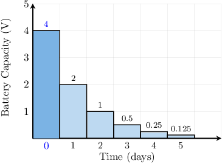

# Creating Exponential Decay Expressions

Source: https://www.mathacademy.com/topics/142?courseId=120
Topic ID: 142

## Prerequisites

- [Exponents With Rational Bases](../../../middle-school/lessons/grade-7/125-exponents-with-rational-bases.md)
- [Applying Percentages in Succession](../../../middle-school/lessons/grade-7/6642-applying-percentages-in-succession.md)
- [Applying Percentage Decreases](../../../middle-school/lessons/grade-7/6643-applying-percentage-decreases.md)

## Lesson

### Introduction

A situation involves **exponential decay** if some initial amount repeatedly shrinks due to being multiplied by some constant rate.

For example, suppose that a certain battery had a voltage of $4\,\text{V}$ when it was healthy. Following a sharp impact, the battery's voltage decreased by $\dfrac12$ every day since the day of the impact. What was the voltage of the battery $3$ days after it was damaged?

Starting with a voltage of $4\,\text{V},$ we know that this number will halve every day. So after $1$ day, the voltage (measured in volts) was

$$

{\color{blue}{4\cdot \dfrac 1 2}}.

$$

On the second day, this number halved again. So the voltage after $2$ days was

$$

\left({\color{blue}{4\cdot \dfrac 1 2}}\right)\cdot \dfrac 1 2 = {\color{red}{4\cdot \left(\dfrac 1 2\right)^2}}.

$$

After one more day, the number above halves once again. So the voltage after $3$ days was

$$

{\color{red}{4\cdot \left(\dfrac 1 2\right)^2}}\cdot \dfrac 1 2 = {\color{black}{4\cdot \left(\dfrac 1 2\right)^3}}.

$$

If we evaluate the above expression, we get:

$$

4\cdot \left(\dfrac 1 2\right)^3 = 4\cdot \dfrac 1 8 = \dfrac 1 2

$$

So after $3$ days, the voltage reduced to just $\dfrac 1 2\,\text{V}.$

This is an example of exponential decay. The voltage decreases by $\dfrac 1 2$ over a time interval of $1$ day, every day. The voltage decays very rapidly, as we can see from the graph below.

### Example: Creating an Exponential Decay Expression From a Decay Factor

#### Question

A radioactive substance decays exponentially such that its mass reduces by $\dfrac 1 3$ every year. If the mass of the substance was initially $4\,\text{kg},$ what is the mass of the substance after $6$ years?

#### Explanation

If the mass of the substance reduces by $\dfrac 1 3$ every year, then $\dfrac 2 3$ of its mass remains every year.

Therefore:

- After $1$ year, the mass is $4\cdot \left(\dfrac 2 3\right)\,\text{kg}.$

- After $\color{blue}2$ years, the mass is $4\cdot \left(\dfrac 2 3\right)^{\color{blue}2}\,\text{kg}.$

- After $\color{blue}3$ years, the mass is $4\cdot \left(\dfrac 2 3\right)^{\color{blue}3}\,\text{kg}.$

- $\ldots$

Repeating this pattern, we see that the mass after $\color{blue}6$ years is $4\cdot \left(\dfrac 2 3\right)^{\color{blue}6}\,\text{kg}.$

### Example: Creating an Exponential Decay Expression From a Decay Rate

#### Question

Carlton initially made $40\,000$ annual profit from his business. However, since then, Carlton's annual profit decreased by $12\%$ every year due to increased competition. To the nearest dollar, what was Carlton's annual profit $4$ years after the increased competition began?

#### Explanation

The number $12\%$ written as a decimal is $0.12.$ Therefore, a decrease of $12\%$ corresponds to multiplication by a factor of

$$

1-0.12 = 0.88.

$$

Therefore:

- After $1$ year, the annual profit was $40\,000\cdot (0.88)$ dollars.

- After $\color{blue}2$ years, the annual profit was $40\,000\cdot (0.88)^{\color{blue}2}$ dollars.

- After $\color{blue}3$ years, the annual profit was $40\,000\cdot (0.88)^{\color{blue}3}$ dollars.

- After $\color{blue}4$ years, the annual profit $40\,000\cdot (0.88)^{\color{blue}4}$ dollars.

Finally, let's evaluate the last expression:

$$

40\,000\cdot (0.88)^{4} \approx 23\,988

$$

Therefore, Carlton's profit reduced to $23\,988$ after $4$ years.
