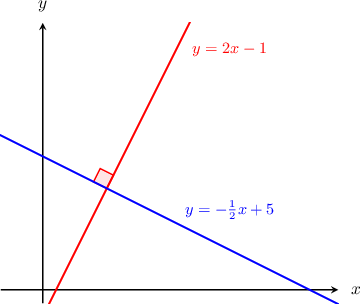

# Perpendicular Lines in the Coordinate Plane

Source: https://www.mathacademy.com/topics/1427?courseId=120
Topic ID: 1427

## Prerequisites

- [Properties of Lines Given in Standard Form](../../../high-school/traditional/lessons/algebra-i/3725-properties-of-lines-given-in-standard-form.md)
- [Parallel and Perpendicular Lines](../../../elementary-school/lessons/grade-4/3979-parallel-and-perpendicular-lines.md)

## Lesson

### Introduction

Two lines are **perpendicular** if they intersect at a right angle. For example, the lines ${\color{red}y = 2x - 1}$ and ${\color{blue}y=-\dfrac{1}{2}x+5}$ shown below are perpendicular:

We can tell whether two lines are perpendicular by looking at their slopes. In general,

*If two lines are perpendicular, then the product of their slopes is equal to $-1.$*

We see this with the two lines graphed above: the lines ${\color{red}y = 2x - 1}$ and ${\color{blue}y=-\dfrac{1}{2}x+5}$ have slopes $\color{red}2$ and ${\color{blue}-\dfrac{1}{2}},$ respectively. If we take the product of the slopes, we get

$$

{\color{red}2} \cdot {\color{blue}{\left( -\dfrac{1}{2} \right) }} = -1.

$$

**Watch out!** The only exception is for horizontal and vertical lines. Horizontal and vertical lines are perpendicular, but the slope of a vertical line is undefined, so we cannot multiply it by anything.

### Example: Determining Whether Two Lines in Slope-Intercept Form are Perpendicular

#### Question

Which of the following lines is perpendicular to $y= -\dfrac{2}{5}x-3?$

1. $y = 5x + 1$

2. $y = \dfrac{5}{2}x + 3$

3. $y = -\dfrac{x}{2} + 5$

#### Explanation

For the two lines to be perpendicular, their slopes must multiply to $-1.$

The line $y=-\dfrac{2}{5}x-3$ is in slope-intercept form, and its slope is $-\dfrac{2}{5}.$

Looking at the answer choices, the line $y = \dfrac{5}{2}x + 3$ has a slope of $\dfrac{5}{2}.$

Multiplying the slopes together, we have

$$

\left( -\dfrac{2}{5}\right) \cdot \dfrac{5}{2} = -1.

$$

Since the slopes multiply to $-1,$ we conclude that the line $y = \dfrac{5}{2}x + 3$ is perpendicular to the given line.

So, the correct answer is "II only".

### Example: Determining Whether Two Lines in Standard Form are Perpendicular

#### Question

Which of the following lines is perpendicular to $4x - 2y = 10?$

1. $y = \dfrac{1}{2}x + 3$

2. $y = -4x + 1$

3. $y = -\dfrac{1}{2}x -5$

#### Explanation

For the two lines to be perpendicular, their slopes must multiply to $-1.$

To find the slope of the given line $4x - 2y = 10,$ we convert to slope-intercept form:

$$

\begin{aligned}4𝑥−2𝑦 & =10 \\ −2𝑦 & =−4𝑥+10 \\ 𝑦 & =2𝑥−5\end{aligned}

$$

In slope-intercept form, the slope is the $x$-coefficient. So, the slope of the given line is $2.$

Looking at the answer choices, the line $y = -\dfrac{1}{2}x -5$ has a slope of $-\dfrac{1}{2}.$

Multiplying the slopes together, we have

$$

2 \cdot \left(-\dfrac{1}{2}\right) = -1.

$$

Since the slopes multiply to $-1,$ we conclude that the line $y = -\dfrac{1}{2}x -5$ is perpendicular to the given line.

So, the correct answer is "III only".

### Example: Determining Unknown Parameters Given Two Perpendicular Lines

#### Question

The lines $y=2x+9$ and $3y+kx = 12$ are perpendicular. What is the value of $k?$

#### Explanation

For the two lines to be perpendicular, their slopes must multiply to $-1.$

- The first line is in slope-intercept form, and the slope is the $x$-coefficient. So the slope of the line $y=2x+9$ is $2.$

- To find the slope of $3y+kx = 12,$ we convert to slope-intercept form: Therefore, the slope of the line $3y +kx = 12$ is $-\dfrac{k}{3}.$

Multiplying the slopes together, we have

$$

2 \cdot\left(- \dfrac{k}{3}\right) = -1\qquad\Longrightarrow\qquad k = \dfrac{3}{2}.

$$

### Example: Finding Equations of Perpendicular Horizontal and Vertical Lines

#### Question

Find the equation of the line that is perpendicular to $x=2$ and passes through the point $(3,4).$

#### Explanation

Since the line $x=2$ is a vertical line, a perpendicular line would need to be horizontal. So, the perpendicular line must take the form $y=k$ for some value of $k.$

The perpendicular line needs to go through the point $(3,4),$ which has a $y$-coordinate of $4.$ So, the perpendicular line is $y=4.$
