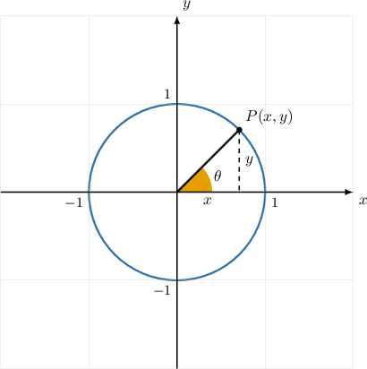
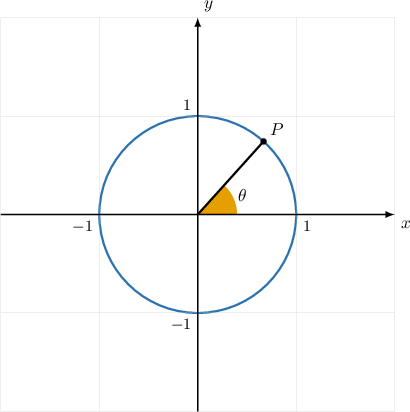
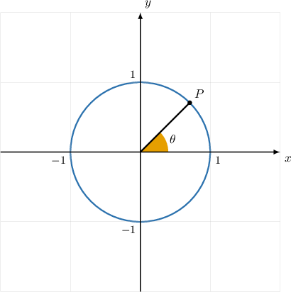
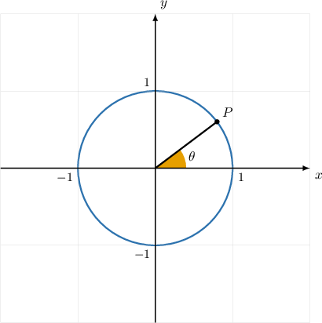

# Using the Pythagorean Identity in the First Quadrant

Source: https://www.mathacademy.com/topics/1453?courseId=120
Topic ID: 1453

## Prerequisites

- [Properties of the Unit Circle in the First Quadrant](../../../high-school/traditional/lessons/algebra-ii/112-properties-of-the-unit-circle-in-the-first-quadrant.md)

## Lesson

### Introduction

Suppose that $P$ is a point in the first quadrant that lies on the unit circle. We can then draw a right triangle, where the hypotenuse is the line segment between the origin and the point.

Since the hypotenuse is the radius of the unit circle, its length must be equal to $1.$ And, since the triangle is a right triangle, the $(x,y)$ coordinates of any point on the unit circle in the first quadrant must satisfy the Pythagorean theorem:

$$

x^2+y^2=1.

$$

We can use this to find the $y$-coordinate of a point given the $x$-coordinate, and vice-versa.

For example, suppose that the $x$-coordinate of a point $P$ in the first quadrant on the unit circle is $\dfrac{3}{7}.$ To find the $y$-coordinate, we substitute $x=\dfrac{3}{7}$ into the above and solve for $y\mathbin{:}$

$$

\begin{aligned} x^2+y^2&=1\\\[5pt] \left(\dfrac{3}{7}\right)^2+y^2&=1\\\[5pt] \dfrac{9}{49}+y^2&=1\\\[5pt] y^2&= 1-\dfrac{9}{49}\\\[5pt] y^2&= \dfrac{40}{49}\\\[5pt] y&= \pm\sqrt{\dfrac{40}{49}}\\\[5pt] y &= \pm \dfrac{2\sqrt{10}}{7} \end{aligned}

$$

Since $P$ lies in the first quadrant, $y$ must be positive. So we select the positive answer.

Therefore, our final answer is $y=\dfrac{2\sqrt{10}}{7}.$

### Example: Using the Pythagorean Theorem on the Unit Circle

#### Question

The point $A$ is located in the first quadrant and lies on the unit circle. The $y$-coordinate of $A$ is $\dfrac{5}{9}.$ What is the $x$-coordinate of $A?$

#### Explanation

Since the point $A$ lies on the unit circle, it must satisfy the Pythagorean theorem:

$$

x^2+y^2=1 .

$$

Substituting $y=\dfrac{5}{9}$ into the above and solving for $x$ gives

$$

\begin{aligned} x^2+y^2&=1\\\[5pt] x^2+\left(\dfrac{5}{9}\right)^2&=1\\\[5pt] x^2+\left(\dfrac{25}{81}\right)&=1\\\[5pt] x^2&= 1-\dfrac{25}{81}\\\[5pt] x^2&= \dfrac{56}{81}\\\[5pt] x&= \sqrt{\dfrac{56}{81}}\\\[5pt] x&= \pm \dfrac{2\sqrt{14}}{9}. \end{aligned}

$$

Since $A$ lies in the first quadrant, $x$ must be positive. So, we select the positive answer.

Therefore, our final answer is $x=\dfrac{2\sqrt{14}}{9}.$

### The Pythagorean Identity

Recall that the coordinates of a point on the unit circle with a central angle $\theta$ have the property

$$

x = \cos\theta, \qquad y = \sin\theta.

$$

If this point is in the first quadrant, we can substitute these values into the Pythagorean Identity from before to get

$$

\begin{aligned}𝑥^{2}+𝑦^{2} & =1 \\ (cos⁡𝜃)^{2}+(sin⁡𝜃)^{2} & =1 \\ cos^{2}⁡𝜃+sin^{2}⁡𝜃 & =1.\end{aligned}

$$

The last expression is known as the **Pythagorean trigonometric identity,** and is arguably the most important equation in trigonometry.

The Pythagorean trigonometric identity holds for *every* angle $\theta,$ not just if $\theta$ is in the first quadrant. In this lesson, we're focusing on the first quadrant only. We'll learn how to deal with angles in other quadrants in a future lesson.

### Example: Computing a Trigonometric Ratio Using the Pythagorean Identity

#### Question

The diagram above shows the unit circle. Given that the $x$-coordinate of the point $P$ is $\dfrac{2}{3},$ use the Pythagorean identity to find $\sin\theta.$

#### Explanation

Any point $(x,y)$ on the unit circle is related to the central angle $\theta$ as follows:

$$

x = \cos\theta, \qquad y = \sin\theta.

$$

We're given that $x=\dfrac{2}{3}$ at the point $P.$ Therefore, we have

$$

\cos\theta = \dfrac{2}{3}.

$$

We can use the Pythagorean identity to find $\sin\theta\mathbin{:}$

$$

\begin{aligned}sin^{2}⁡𝜃+cos^{2}⁡𝜃 & =1 \\ sin^{2}⁡𝜃 & =1−cos^{2}⁡𝜃 \\ sin⁡𝜃 & =±\sqrt{√1−cos^{2}⁡𝜃}\end{aligned}

$$

Substituting $\cos\theta = \dfrac{2}{3}$ gives

$$

\begin{aligned}sin⁡𝜃 & =±\sqrt{√1−(\frac{2}{3})^{2}} \\ & =±\sqrt{√1−\frac{4}{9}} \\ & =±\sqrt{√\frac{5}{9}} \\ & =±\frac{\sqrt{√5}}{3}.\end{aligned}

$$

Finally, we select the positive answer since $\sin\theta$ is positive in the first quadrant.

So our final answer is $\sin\theta = \dfrac{\sqrt 5}{3}.$

### Example: Computing a Reciprocal Ratio Using the Pythagorean Identity

#### Question

The diagram above shows the unit circle. Given that the $x$-coordinate of the point $P$ is $\dfrac{2\sqrt 6}{7},$ use the Pythagorean identity to find $\csc\theta.$

#### Explanation

Again, any point $(x,y)$ on the unit circle is related to the central angle $\theta$ as follows:

$$

x = \cos\theta, \qquad y = \sin\theta.

$$

We're given that $x=\dfrac{2\sqrt 6}{7}$ at the point $P.$ Therefore, we have

$$

\cos\theta = \dfrac{2\sqrt 6}{7}.

$$

We can use the Pythagorean identity to find $\sin\theta\mathbin{:}$

$$

\begin{aligned}sin^{2}⁡𝜃+cos^{2}⁡𝜃 & =1 \\ sin^{2}⁡𝜃 & =1−cos^{2}⁡𝜃 \\ sin⁡𝜃 & =±\sqrt{√1−cos^{2}⁡𝜃}\end{aligned}

$$

Substituting $\cos\theta = \dfrac{2\sqrt 6}{7}$ gives

$$

\begin{aligned}sin⁡𝜃 & =±\sqrt{1−(\frac{2\sqrt{√6}}{7})^{2}} \\ & =±\sqrt{√1−\frac{24}{49}} \\ & =±\sqrt{√\frac{25}{49}} \\ & =±\frac{5}{7}.\end{aligned}

$$

We select the positive answer since $\sin\theta$ is positive in the first quadrant. So, $\sin\theta = \dfrac{5}{7}.$

Finally, knowing that $\csc\theta = \dfrac{1}{\sin\theta},$ we have

$$

\csc\theta = \dfrac{1}{\left(\dfrac{5}{7}\right)} = \dfrac{7}{5}.

$$

### Example: Computing a Tangent or Cotangent Using the Pythagorean Identity

#### Question

The diagram above shows the unit circle. Given that the $x$-coordinate of the point $P$ is $\dfrac{4}{5},$ what is $\tan\theta?$

#### Explanation

We're given that $x=\dfrac{4}{5}$ at the point $P.$ Therefore, we have

$$

\cos\theta = \dfrac{4}{5}.

$$

We can use the Pythagorean identity to find $\sin\theta\mathbin{:}$

$$

\begin{aligned}sin^{2}⁡𝜃+cos^{2}⁡𝜃 & =1 \\ sin^{2}⁡𝜃 & =1−cos^{2}⁡𝜃 \\ sin⁡𝜃 & =±\sqrt{√1−cos^{2}⁡𝜃}\end{aligned}

$$

Substituting $\cos\theta = \dfrac{4}{5}$ gives

$$

\begin{aligned}sin⁡𝜃 & =±\sqrt{√1−(\frac{4}{5})^{2}} \\ & =±\sqrt{√1−\frac{16}{25}} \\ & =±\sqrt{√\frac{9}{25}} \\ & =±\frac{3}{5}.\end{aligned}

$$

We select the positive answer since $\sin\theta$ is positive in the first quadrant. Therefore $\sin\theta = \dfrac{3}{5}.$

Using the fact that

$$

\tan\theta = \dfrac{\sin\theta}{\cos\theta},

$$

we finally get

$$

\tan\theta = \dfrac{\left(\dfrac{3}{5}\right)}{\left(\dfrac{4}{5}\right)} = \dfrac {3}{4}.

$$
