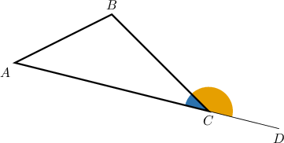
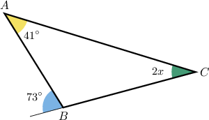
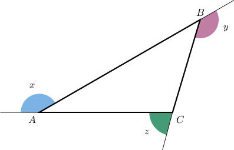
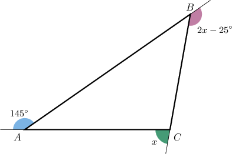
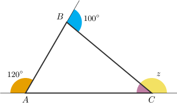

# Exterior Angles of Triangles

Source: https://www.mathacademy.com/topics/1458?courseId=120
Topic ID: 1458

## Prerequisites

- [Interior Angles of Triangles](../../../middle-school/lessons/grade-7/496-interior-angles-of-triangles.md)
- [Supplementary Angles](../../../middle-school/lessons/grade-7/1511-supplementary-angles.md)

## Lesson

### Introduction

Consider the following triangle, where the side has been extended beyond the vertex

The resulting angle is called the **exterior angle** at vertex

Exterior angles have the following properties:

- An exterior angle and its corresponding interior angle form a linear pair and are therefore supplementary. Here, we have

- The measure of an exterior angle is equal to the sum of the measures of the two non-adjacent interior angles. This is called the **exterior angles theorem**. To see why it is true, notice that since the internal angles of a triangle sum to we have

- At each vertex of a triangle, there are two exterior angles. They are vertical angles, and consequently, they have the same measure.

### Example: Finding the Value of a Variable Given an Exterior Angle and Two Internal Angles

#### Question

Find the value of $x$ in the following figure.

#### Explanation

**

Let's start by finding the value of the missing interior angle at $B.$ We use the fact that the interior and exterior angles are supplementary:

$$

\begin{aligned}73^{∘}+𝑚∠𝐵 & =180^{∘} \\ 𝑚∠𝐵 & =180^{∘}−73^{∘} \\ 𝑚∠𝐵 & =107^{∘}\end{aligned}

$$

Now, we calculate $x$ using the fact that the interior angles of a triangle sum to $180^\circ\mathbin{:}$

$$

\begin{aligned}𝑚∠𝐴+𝑚∠𝐵+𝑚∠𝐶 & =180^{∘} \\ 41^{∘}+107^{∘}+2𝑥 & =180^{∘} \\ 148^{∘}+2𝑥 & =180^{∘} \\ 2𝑥 & =32^{∘} \\ 𝑥 & =16^{∘}\end{aligned}

$$

**

We could rewrite the equation $m\angle{A} +m\angle{B} +m\angle{C} = 180^\circ$ as

$$

\begin{aligned}\underset{Exterior angle at B}{\underset{}{180^{∘}−𝑚∠𝐵}}\,\,\,=𝑚∠𝐴+𝑚∠𝐶.\end{aligned}

$$

Substituting, we can solve for $x\mathbin{:}$

$$

\begin{aligned}\underset{Exterior angle at B}{\underset{}{180^{∘}−𝑚∠𝐵}}\,\,\, & =𝑚∠𝐴+𝑚∠𝐶 \\ 73^{∘} & =41^{∘}+2𝑥 \\ 32^{∘} & =2𝑥 \\ 16^{∘} & =𝑥\end{aligned}

$$

### The Sum of Exterior Angles

Yet another important fact about exterior angles is:

The sum of the measures of the exterior angles of a triangle is always equal to $360^\circ.$

So, for the triangle below, we have

$$

x+y+z = 360^\circ.

$$

To see why, first recall that the measure of an exterior angle is equal to the sum of the measures of the two non-adjacent interior angles. So, we have

$$

\begin{aligned}𝑥 & =𝑚∠𝐵+𝑚∠𝐶 \\ 𝑦 & =𝑚∠𝐴+𝑚∠𝐶 \\ 𝑧 & =𝑚∠𝐴+𝑚∠𝐵.\end{aligned}

$$

Now, remember that the internal angles of a triangle sum to $180^\circ.$ Then we have

$$

\begin{aligned}𝑥+𝑦+𝑧 & =(𝑚∠𝐵+𝑚∠𝐶)+(𝑚∠𝐴+𝑚∠𝐶)+(𝑚∠𝐴+𝑚∠𝐵) \\ & =2𝑚∠𝐴+2𝑚∠𝐵+2𝑚∠𝐶 \\ & =2(𝑚∠𝐴+𝑚∠𝐵+𝑚∠𝐶) \\ & =2(180^{∘}) \\ & =360^{∘}.\end{aligned}

$$

### Example: Finding the Value of a Variable Given the Exterior Angles

#### Question

Find the value of $x$ in the figure below.

#### Explanation

Since the exterior angles of a triangle sum to $360^{\circ}$, we have

$$

\begin{aligned}145^{∘}+𝑥+(2𝑥−25^{∘}) & =360^{∘} \\ 120^{∘}+3𝑥 & =360^{∘} \\ 3𝑥 & =240^{∘} \\ 𝑥 & =80^{∘}.\end{aligned}

$$

### Example: Calculating the Measure of an Interior Angle Given the Exterior Angles

#### Question

Given a triangle $\triangle ABC$, let the exterior angles at ${A}$ and ${B}$ be equal $120^\circ$ and $100^\circ,$ respectively. What is the measure of the angle $\angle C?$

#### Explanation

Let's start by drawing the corresponding triangle.

Let $z$ be the measure of the exterior angle at ${C}$ pictured above. Since the sum of the exterior angles of a triangle is $360^{\circ}$, we have

$$

\begin{aligned}120^{∘}+100^{∘}+𝑧 & =360^{∘} \\ 220^{∘}+𝑧 & =360^{∘} \\ 𝑧 & =140^{∘}.\end{aligned}

$$

Now, we can find the value of the missing interior angle at $C\mathbin{:}$

$$

\begin{aligned}𝑚∠𝐶 & =180^{∘}−𝑧 \\ & =180^{∘}−140^{∘} \\ & =40^{∘}\end{aligned}

$$

Therefore, $m\angle C = 40^\circ.$
