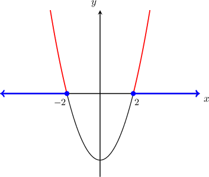
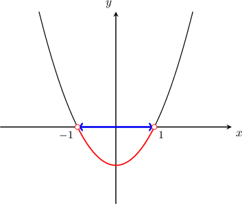
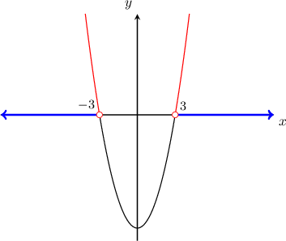
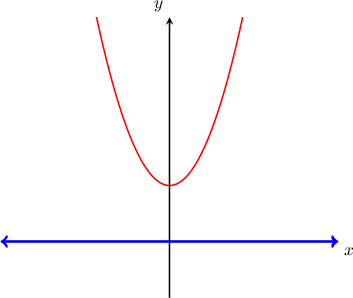
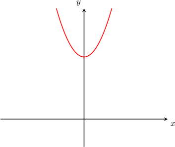

# Solving Elementary Quadratic Inequalities

Source: https://www.mathacademy.com/topics/1495?courseId=120
Topic ID: 1495

## Prerequisites

- [Solving Quadratic Equations Using a Difference of Squares](../../../high-school/traditional/lessons/algebra-i/394-solving-quadratic-equations-using-a-difference-of-squares.md)
- [Absolute Value Inequalities](../../../high-school/traditional/lessons/algebra-i/451-absolute-value-inequalities.md)
- [Roots of Quadratic Functions](../../../high-school/traditional/lessons/algebra-i/661-roots-of-quadratic-functions.md)
- [Rationalizing Denominators](../../../middle-school/lessons/grade-8/1318-rationalizing-denominators.md)

## Lesson

### Introduction

Suppose we need to solve the inequality

$$

x^2\geq 4.

$$

Let's start by bringing all the terms to the left-hand side, so

$$

\begin{aligned}𝑥^{2}−4 & ≥0.\end{aligned}

$$

Now, we consider the corresponding parabola given by $y = x^2-4$ and find its roots, as follows:

$$

\begin{aligned}𝑥^{2}−4 & =0 \\ 𝑥^{2}−2^{2} & =0 \\ (𝑥−2)(𝑥+2) & =0\end{aligned}

$$

So the roots are $x= \pm2.$

Solving the inequality $x^2-4 \geq 0$ is equivalent to finding the values of $x$ for which the parabola $y=x^2-4$ is above or on the $x$-axis (where ${\color{red}y \ge 0}$).

Since the leading coefficient of $x^2-4$ is positive, the parabola opens upward (like $\smile$). Therefore, the solution set lies outside the roots (and includes the roots), as shown below.

So, the solution to the initial inequality is $x \in {\color{blue}(-\infty, -2] \cup [2, +\infty)}.$

### Example: Solving an Elementary Quadratic Inequality Using the Graphical Method

#### Question

Solve the inequality $x^2< 1$ using a graphical method.

#### Explanation

Bringing all the terms to the left-hand side, we have

$$

\begin{aligned}𝑥^{2} & <1 \\ 𝑥^{2}−1 & <0.\end{aligned}

$$

Now, we consider the corresponding parabola given by $y = x^2-1$ and find its roots:

$$

\begin{aligned}𝑥^{2}−1 & =0 \\ 𝑥^{2}−1^{2} & =0 \\ (𝑥−1)(𝑥+1) & =0\end{aligned}

$$

So the roots are $x= \pm 1.$

Solving the inequality $x^2-1 < 0$ is equivalent to finding the values of $x$ for which the parabola $y=x^2-1$ is below the $x$-axis (where ${\color{red}y < 0}$).

Since the leading coefficient of the quadratic expression is positive, the parabola opens upward. Therefore, the solution set lies between the roots (but it does not include them), as shown below.

Therefore, the solution is $x \in {\color{blue}(-1, 1)}.$

### Solving an Elementary Quadratic Inequality Using the Absolute Value Method

We can also solve quadratic inequalities by reducing them to absolute value expressions.

For example, to solve the inequality $x^2 > 1,$ we can start by taking the square root of both sides of the inequality:

$$

\begin{aligned}𝑥^{2} & >1 \\ \sqrt{𝑥^{2}} & >\sqrt{1} \\ |𝑥| & >1\end{aligned}

$$

Using the definition of absolute value, we must have $x>1$ or $x<-1.$

So, the solution is $x \in (-\infty, -1) \cup (1,\infty).$

**Remember:** For any number $a$ that is zero or positive,

- the equation $|x| < a$ has the solution $-a < x < a,$

- the equation $|x| \leq a$ has the solution $-a \leq x \leq a,$

- the equation $|x| > a$ has the solution $x > a$ or $x < -a,$ and

- the equation $|x| \geq a$ has the solution $x \geq a$ or $x \leq -a.$

### Example: Solving an Elementary Quadratic Inequality Using the Absolute Value Method

#### Question

Solve the inequality $x^2 \leq 2$ using the absolute value method.

#### Explanation

Taking the square root of both sides of the inequality, we get

$$

\begin{aligned}𝑥^{2} & ≤2 \\ \sqrt{𝑥^{2}} & ≤\sqrt{2} \\ |𝑥| & ≤\sqrt{2}.\end{aligned}

$$

Now, using the definition of absolute value, we must have

$$

-\sqrt 2\leq x \leq \sqrt 2.

$$

Therefore, the solution is $x \in [-\sqrt 2,\sqrt 2].$

### Example: Solving an Elementary Quadratic Inequality by Manipulating the Inequality First

#### Question

Solve $3x^2-6 > 3+2x^2.$

#### Explanation

First, let's simplify the inequality:

$$

\begin{aligned}3𝑥^{2}−6 & >3+2𝑥^{2} \\ 3𝑥^{2}−2𝑥^{2} & >6+3 \\ 𝑥^{2} & >9\end{aligned}

$$

Now, we can use either of two methods to solve the inequality.

**

Taking the square root of both sides of the inequality, we get

$$

\begin{aligned}\sqrt{𝑥^{2}} & >\sqrt{9} \\ |𝑥| & >3.\end{aligned}

$$

Now, using the definition of absolute value, we must have $x>3$ or $x<-3.$

So, the solution is $x \in (-\infty,-3)\cup(3,+\infty).$

**

Starting from $x^2>9$ and moving all terms to the left-hand side, we reach

$$

x^2-9 > 0 .

$$

Now, we consider the corresponding parabola given by $y=x^2-9$ and find its roots:

$$

\begin{aligned}𝑥^{2}−9 & =0 \\ (𝑥+3)(𝑥−3) & =0\end{aligned}

$$

So the roots are $x=\pm 3.$

Since the leading coefficient of $x^2-9$ is positive, the parabola opens upward. Therefore, the solution to the given inequality ($y>0$) lies outside of the roots (but does not include them).

Therefore, the solution is $x \in (-\infty,-3)\cup(3,+\infty).$

### Solving Elementary Quadratic Inequalities with No Solutions or All Real Solutions

Let's consider the inequality $x^2 \geq -4.$ We can solve this equation using either of the two methods that we've learned.

- **Method 1:** Solving an Absolute Value Inequality We know that the square of *any* real number is greater than or equal to zero. Therefore, the square of any real number is also greater than or equal to $-4,$ since $x^2 \geq 0 > -4.$ Therefore, *any* real number will satisfy the inequality $x^2 \geq -4.$ So, we conclude that the solution to the inequality is $x\in(-\infty,\infty).$

- **Method 2:** Picturing a Quadratic Curve Let's bring all the terms to the left-hand side, and then plot the parabola $y = x^2+4.$ The desired inequality ($y \geq 0$) is always satisfied, so the solution is $x \in (-\infty, \infty).$

### Example: Elementary Quadratic Inequalities with No Solutions or All Real Solutions

#### Question

Solve the inequality $x^2< -9.$

#### Explanation

We can solve this equation using either of the two methods that we've learned.

**

We know that the square of ** real number is greater than or equal to zero. Therefore, it is impossible for the square of a real number to be smaller than $-9.$

So, the inequality $x^2 < -9$ has no solutions.

**

Let's bring all the terms to the left-hand side,

$$

x^2+9 < 0,

$$

and then plot the parabola $y=x^2+9.$ The desired inequality ($y<0$) is never satisfied, so there are no solutions.

