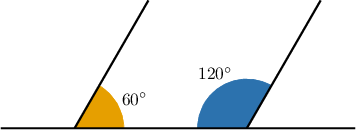
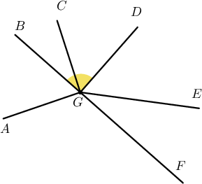
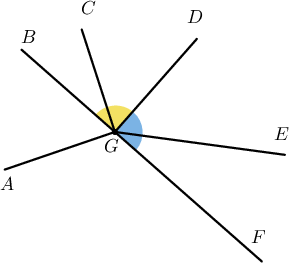
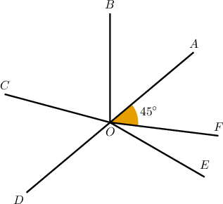
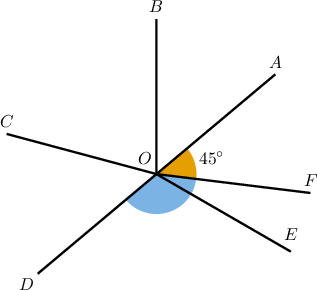
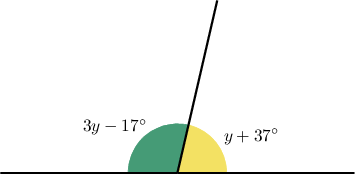

# Supplementary Angles

Source: https://www.mathacademy.com/topics/1511?courseId=120
Topic ID: 1511

## Prerequisites

- [Distributing the Negative Sign in a Linear Expression](../../../middle-school/lessons/grade-7/137-distributing-the-negative-sign-in-a-linear-expression.md)
- [Solving Problems With Angles](../../../middle-school/lessons/grade-7/1437-solving-problems-with-angles.md)

## Lesson

### Introduction

Two angles are **supplementary** if their measures add up to $180^\circ.$

These angles are supplementary because the sum of their measures is $180^\circ{:}$

$$

105^\circ +75^\circ = 180^\circ

$$

A **linear pair** is a pair of adjacent angles formed when two lines intersect. The angles shown above form a linear pair.

The **linear pair postulate** states the following:

If two angles form a linear pair, then they are supplementary.

The converse is *not* true. That is, if two angles are supplementary, they do not necessarily form a linear pair.

To see why, consider the diagram shown below:

Although the angles are supplementary (the sum of their measures is $120^\circ + 60^\circ = 180^\circ$), they do not form a linear pair of angles since they are not adjacent.

### Example: Identifying Supplementary Angles

#### Question

What angle is supplementary to $\angle DGB$ in the diagram above?

#### Explanation

Two angles are supplementary if their measures add up to $180^\circ,$ a straight angle.

Only $\angle DGF$ is supplementary to $\angle DGB$ in the given diagram.

### Example: Calculating Supplementary Angles

#### Question

Given that $\overline{AD}$ is a segment, what is the measure of $\angle FOD?$

#### Explanation

Two angles are supplementary if their measures add up to $180^\circ,$ a straight angle.

Since $\overline{AD}$ is a segment, we have that $\angle AOF$ and $\angle FOD$ are supplementary.

$$

m \angle AOF + m \angle FOD = 180^\circ

$$

Therefore, the measure of $\angle FOD$ is given by

$$

\begin{aligned}𝑚∠𝐹𝑂𝐷 & =180^{∘}−𝑚∠𝐴𝑂𝐹 \\ & =180^{∘}−45^{∘} \\ & =135^{∘}\end{aligned}

$$

### Example: Calculating Supplementary Angles From a Description

#### Question

Find the measure of an angle that's supplementary to an angle of $(7x -63)^\circ.$

#### Explanation

Two angles are supplementary if their measures add up to $180^\circ.$

So, the measure of an angle that's supplementary to an angle of $(7x -63)^\circ$ must be

$$

\begin{aligned}180^{∘}−(7𝑥−63)^{∘} & =(180−7𝑥+63)^{∘} \\ & =(180+63−7𝑥)^{∘} \\ & =(243−7𝑥)^{∘}.\end{aligned}

$$

### Example: Finding an Unknown Quantity Using Supplementary Angles

#### Question

Solve for $y$ given the figure above.

#### Explanation

Since the two angles are supplementary, the sum of their measures is equal to $180^\circ$. Therefore:

$$

\begin{aligned}(3𝑦−17^{∘})+(𝑦+37^{∘}) & =180^{∘} \\ 4𝑦+20^{∘} & =180^{∘} \\ 4𝑦 & =160^{∘} \\ 𝑦 & =40^{∘}\end{aligned}

$$
