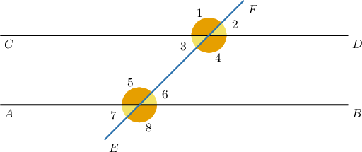
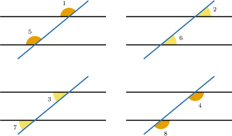
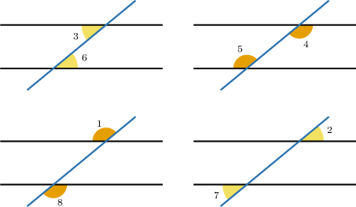
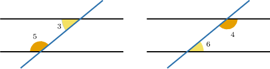
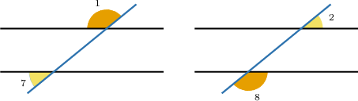
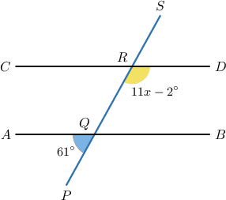
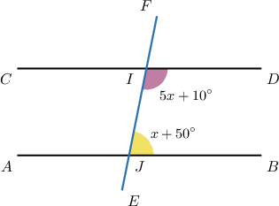
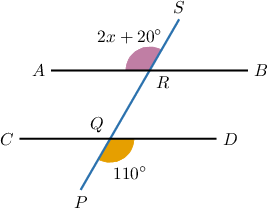

# Angle Criteria for Parallel Lines

Source: https://www.mathacademy.com/topics/1512?courseId=120
Topic ID: 1512

## Prerequisites

- [Consecutive Angles](../../../middle-school/lessons/grade-8/4104-consecutive-angles.md)

## Lesson

### Introduction

We know that when a transversal crosses two parallel lines, a set of $8$ interesting angles are formed, some of which are congruent and others of which are supplementary.

The reverse is also true: when certain angles formed by a transversal are congruent or supplementary, then the two lines that the transversal crosses must be parallel.

More precisely, two lines are parallel if they are crossed by a transversal such that:

- the **corresponding angles are congruent**:

- or, the **alternate (interior or exterior) angles are congruent**

- or, the **consecutive (interior or exterior) angles are supplementary**.

If at least one pair of angles satisfies the conditions above, then the two lines are parallel.

**Watch out:** When two lines are parallel, we also know that the vertical angles are congruent and the adjacent are supplementary. These, however, are true conditions for any pair of crossing lines, and therefore cannot be used as criteria for parallel lines.

### Example: Finding an Unknown Quantity Using the Corresponding Angles Criteria for Parallel Lines

#### Question

Given the lines $\overset{\longleftrightarrow}{AB},\, \overset{\longleftrightarrow}{CD},$ and $\overset{\longleftrightarrow}{PS}$ shown above, for which value of $x$ is $\overset{\longleftrightarrow}{AB} \parallel \overset{\longleftrightarrow}{CD}?$

#### Explanation

First, notice that $\angle PQA$ and $\angle PQB$ are supplementary angles. So, we have:

$$

\begin{aligned}𝑚∠𝑃𝑄𝐵+𝑚∠𝑃𝑄𝐴 & =180^{∘} \\ 𝑚∠𝑃𝑄𝐵+61^{∘} & =180^{∘} \\ 𝑚∠𝑃𝑄𝐵 & =119^{∘}\end{aligned}

$$

The lines $\overset{\longleftrightarrow}{AB}$ and $\overset{\longleftrightarrow}{CD}$ are cut by the transversal $\overset{\longleftrightarrow}{PS}.$

The angles $\angle PQB$ and $\angle QRD$ are corresponding angles. To have parallel lines, the corresponding angles must be congruent.

To have $\overset{\longleftrightarrow}{AB} \parallel \overset{\longleftrightarrow}{CD},$ we need $\angle PQB\cong\angle QRD.$ So, these two angles must have the same measure:

$$

\begin{aligned}𝑚∠𝑃𝑄𝐵 & =𝑚∠𝑄𝑅𝐷 \\ 119^{∘} & =11𝑥−2^{∘} \\ 121^{∘} & =11𝑥 \\ 11^{∘} & =𝑥\end{aligned}

$$

Therefore, $x = 11^\circ.$

### Example: Finding an Unknown Quantity Using the Consecutive Angles Criteria for Parallel Lines

#### Question

Given the lines $\overset{\longleftrightarrow}{AB},$ $\overset{\longleftrightarrow}{CD},$ and $\overset{\longleftrightarrow}{EF}$ shown below, which value of $x$ means that $\overset{\longleftrightarrow}{AB} \parallel \overset{\longleftrightarrow}{CD}?$

#### Explanation

The lines $\overset{\longleftrightarrow}{AB}$ and $\overset{\longleftrightarrow}{CD}$ are cut by the transversal $\overset{\longleftrightarrow}{EF}.$

The angles $\angle BJI$ and $\angle JID$ are consecutive interior angles. To have parallel lines, the consecutive interior angles must be supplementary.

To have $\overset{\longleftrightarrow}{AB} \parallel \overset{\longleftrightarrow}{CD},$ we need $m\angle BJI + m\angle JID = 180^\circ.$

Substituting into this equation, we can solve for $x\mathbin{:}$

$$

\begin{aligned}𝑚∠𝐵𝐽𝐼+𝑚∠𝐽𝐼𝐷 & =180^{∘} \\ 𝑥+50^{∘}+5𝑥+10^{∘} & =180^{∘} \\ 6𝑥+60^{∘} & =180^{∘} \\ 6𝑥 & =120^{∘} \\ 𝑥 & =20^{∘}\end{aligned}

$$

### Example: Finding an Unknown Quantity Using the Alternate Angles Criteria for Parallel Lines

#### Question

For which value of $x$ is $\overset{\longleftrightarrow}{AB}\parallel \overset{\longleftrightarrow}{CD}?$

#### Explanation

The lines $\overset{\longleftrightarrow}{AB}$ and $\overset{\longleftrightarrow}{CD}$ are cut by the transversal $\overset{\longleftrightarrow}{PS}.$

The angles $\angle ARS$ and $\angle PQD$ are alternate exterior angles. To have parallel lines, the alternate exterior angles must be congruent.

To have $\overset{\longleftrightarrow}{AB} \parallel \overset{\longleftrightarrow}{CD},$ we need $m\angle ARS = m\angle PQD$.

Substituting into this equation, we can solve for $x\mathbin{:}$

$$

\begin{aligned}𝑚∠𝐴𝑅𝑆 & =𝑚∠𝑃𝑄𝐷 \\ 2𝑥+20^{∘} & =110^{∘} \\ 2𝑥 & =90^{∘} \\ 𝑥 & =45^{∘}\end{aligned}

$$
