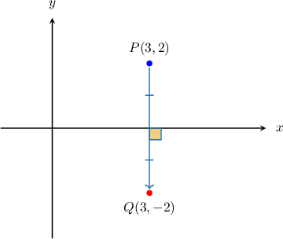
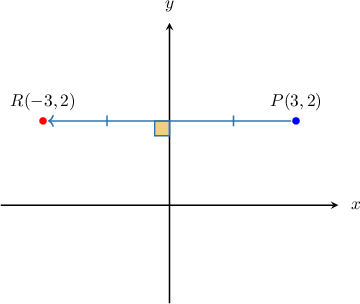
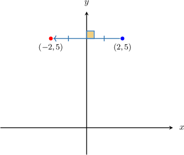
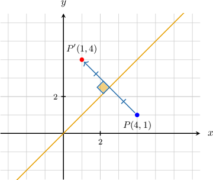
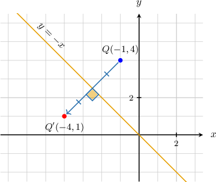
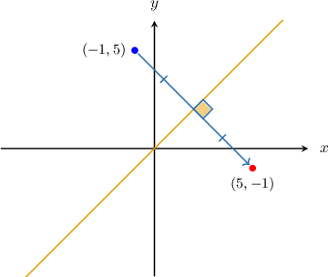
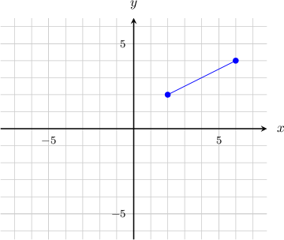
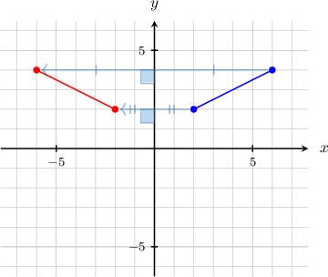
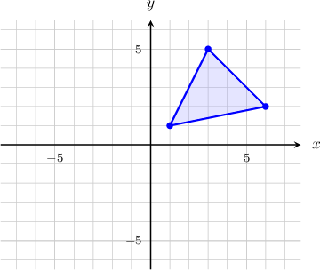
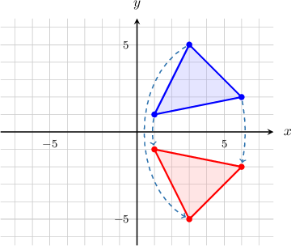

# Reflections of Geometric Figures in the Cartesian Plane

Source: https://www.mathacademy.com/topics/1518?courseId=120
Topic ID: 1518

## Prerequisites

- [Graphing Linear Equations](../../../middle-school/lessons/grade-7/95-graphing-linear-equations.md)
- [Segment Bisectors and the Perpendicular Bisector Theorem](../../../middle-school/lessons/grade-7/521-segment-bisectors-and-the-perpendicular-bisector-theorem.md)
- [Translations of Geometric Figures](../../../high-school/traditional/lessons/geometry/1516-translations-of-geometric-figures.md)

## Lesson

### Introduction

A **reflection** can be thought of as "mirroring" or "flipping" an object over a **line of reflection.**

When a point is reflected in the $x$-axis, the $x$-coordinate remains the same, but the $y$-coordinate is transformed into its opposite (i.e., its sign is changed). The following function can represent this transformation:

$$

(x,y) \mapsto (x,-y)

$$

For example, reflecting the point $P(3,2)$ in the $x$-axis gives the point $Q(3,-2),$ as shown below.

On the other hand, when a point is reflected in the $y$-axis, the $y$-coordinate remains the same, but the $x$-coordinate is transformed into its opposite (its sign is changed). The following function can represent this transformation:

$$

(x,y) \mapsto (-x,y)

$$

For example, reflecting the point $P(3,2)$ in the $y$-axis gives the point $R(-3,2),$ as shown below.

### Example: Reflecting Points Across the Axes in the Cartesian Plane

#### Question

The point $(2, 5)$ is reflected across the $y$-axis. What are the coordinates of the resulting point?

#### Explanation

Reflection across the $y$-axis can be represented by the function

$$

(x,y)\mapsto(-x,y).

$$

Applying this function to the point $(2,5),$ we have

$$

(2,5) \mapsto (-2,5).

$$

Therefore, the resulting point is $(-2,5).$

### Reflection Across Other Special Lines in the Cartesian Plane

When a point is reflected across the line $y = x,$ the $x$-coordinate and $y$-coordinate are swapped. This transformation can be represented by the function

$$

(x,y) \mapsto (y,x).

$$

For example, reflecting the point $P(4,1)$ in the line $y=x$ gives the point $P'(1,4),$ as shown below:

When a point is reflected in the line $y = -x$, the $x$-coordinate and $y$-coordinate swap and are transformed into their opposites (their signs are changed). This transformation can be represented by the function

$$

(x,y) \mapsto (-y,-x).

$$

For example, reflecting the point $Q(-1,4)$ in the line $y=-x$ gives the point $Q'(-4,1),$ as shown below:

### Example: Reflecting Points Across the Lines Y=X and Y=-X

#### Question

The point $(-1, 5)$ is reflected across the line $y=x.$ What are the coordinates of the resulting point?

#### Explanation

The reflection across the line $y=x$ is represented by the function

$$

(x,y)\mapsto(y,x).

$$

Applying this function to the point $(-1,5),$ we have

$$

(-1,5) \mapsto (5,-1).

$$

Therefore, the resulting point is $(5,-1).$

### Example: Reflecting Line Segments in the Cartesian Plane

#### Question

The segment shown below is reflected across the $y$-axis. Draw the resulting segment.

#### Explanation

To reflect a segment across a line, we

- reflect the endpoints of the segment, and then

- draw the segment connecting the reflected endpoints.

Reflection across the $y$-axis can be represented by the function

$$

(x,y)\mapsto (-x,y).

$$

Therefore, our two endpoints $(2,2)$ and $(6, 4)$ are mapped to the following points by the reflection:

$$

\begin{aligned}(2,2) & ↦(−2,2) \\ (6,4) & ↦(−6,4)\end{aligned}

$$

Therefore, reflecting our segment across the $y$-axis, we obtain the following result:

### Example: Reflecting Polygons in the Cartesian Plane

#### Question

The triangle shown below is reflected across the $x$-axis. Draw the resulting triangle.

#### Explanation

To reflect a polygon across a line we

- reflect the vertices of the polygon, and then

- draw the edges connecting the reflected vertices.

Therefore, reflecting our polygon across the $x$-axis, we obtain the following result:

