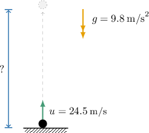
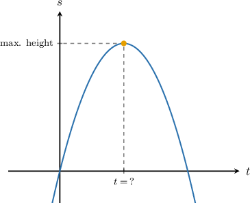

# Modeling Upwards Vertical Motion

Source: https://www.mathacademy.com/topics/1534?courseId=120
Topic ID: 1534

## Prerequisites

- [Modeling Downwards Vertical Motion](../../../high-school/traditional/lessons/algebra-i/688-modeling-downwards-vertical-motion.md)
- [The Axis of Symmetry of a Parabola](../../../high-school/traditional/lessons/algebra-i/704-the-axis-of-symmetry-of-a-parabola.md)

## Lesson

### Introduction

Suppose we toss a ball vertically upwards with initial velocity $u=24.5\,\text{m/s},$ as shown below. How do we determine the ball's height after $1$ second?

The displacement of an object after being projected vertically upward can be modeled using the equation

$$

s=ut + \dfrac{1}{2}gt^2.

$$

Let's recall what each variable represents:

- $s$ is the displacement from the starting position, measured in meters.

- $u$ is the initial velocity, measured in meters per second.

- $t$ is time, measured in seconds.

- $g=-9.8\,\text{m/s}^2$ is the acceleration due to gravity.

**Important**: In this situation, we take the constant $g$ to be *negative* because the ball moves *against* gravity. In other words, the ball travels upward, yet gravity is trying to pull the ball back down to Earth.

To determine the height of the ball after one second, we substitute $u = 24.5, t=1,$ and $g=-9.8$ into our equation for $s,$ and evaluate:

$$

\begin{aligned}𝑠 & =𝑢𝑡+\frac{1}{2}𝑔𝑡^{2} \\ & =(24.5)(1)+\frac{1}{2}(−9.8)(1)^{2} \\ & =24.5−4.9 \\ & =19.6\end{aligned}

$$

Therefore, after one second, the ball is $19.6\,\text{m}$ above the ground.

### Example: Upwards Vertical Motion: Solving for Displacement

#### Question

A cannonball is shot straight up from a platform $5 \, \text{m}$ above the ground with an initial velocity of $22 \, \text{m/s}.$ How high above the ground is the cannonball after $3$ seconds?

#### Explanation

To solve this problem, we use the formula

$$

s=ut+\dfrac{1}{2}gt^2,

$$

where $s$ is the displacement, measured from the starting position in the direction of the initial motion, $u$ is the initial velocity, $t$ is the time since the beginning of the motion, and $g$ is the acceleration due to gravity.

Let's summarize the information we have:

- The initial velocity of the cannonball is $u=22\,\text{m/s}.$

- The cannonball is moving for $t=3\,\text{s}.$

- The acceleration due to gravity is $g=-9.8\,\text{m/s}^2.$ Notice that $g$ is ** since the cannonball's motion acts ** gravity.

Substituting these values into the formula, we obtain the following:

$$

\begin{aligned}𝑠 & =(22)⋅3−\frac{1}{2}(9.8)⋅(3)^{2} \\ & =66−4.9(9) \\ & =66−44.1 \\ & =21.9\end{aligned}

$$

Therefore, after $3$ seconds the cannonball is $21.9\,\text{m}$ above the platform.

Finally, we add the height of the $5\,\text{m}$ platform:

$$

5 + 21.9 = 26.9 \,\text{m}

$$

Therefore, after $3$ seconds, the cannonball is $26.9\,\text{m}$ above the ground.

### Example: Upwards Vertical Motion: Solving for an Initial Velocity

#### Question

An object is projected vertically upwards, attaining a height of $40 \, \text{m}$ in $2\,\text{s}.$ What was the initial velocity of the object?

#### Explanation

To solve this problem, we use the formula

$$

s=ut+\dfrac{1}{2}gt^2,

$$

where $s$ is the displacement, measured from the starting position in the direction of the initial motion, $u$ is the initial velocity, $t$ is the time since the beginning of the motion, and $g$ is the acceleration due to gravity.

Let's summarize the information we have:

- The object is moving for $t=2\,\text{s}.$

- The displacement of the object is $s=40\, \text{m}.$

- The acceleration due to gravity is $g=-9.8\,\text{m/s}^2.$ Notice that $g$ is ** since the object's motion acts ** gravity.

Substituting these values into the formula and solving for $u,$ we obtain the following:

$$

\begin{aligned}𝑠 & =𝑢𝑡+\frac{1}{2}𝑔𝑡^{2} \\ (40) & =𝑢(2)+\frac{1}{2}(−9.8)(2)^{2} \\ 40 & =2𝑢−19.6 \\ 59.6 & =2𝑢 \\ 29.8 & =𝑢 \\ 𝑢 & =29.8\end{aligned}

$$

Therefore, the initial velocity of the object was $29.8\,\text{m/s}.$

### Example: Calculating the Maximum Height of an Object

#### Question

A marble is projected vertically upward with an initial velocity of $15.7 \, \text{m/s}.$ Find the maximum height reached by the marble. Round your answer to one decimal place.

#### Explanation

To solve this problem, we use the formula

$$

s=ut+\dfrac{1}{2}gt^2,

$$

where $s$ is the displacement, measured from the starting position in the direction of the initial motion, $u$ is the initial velocity, $t$ is the time since the beginning of the motion, and $g$ is the acceleration due to gravity.

Let's summarize the information we have:

- The initial velocity of the marble is $u=15.7\,\text{m/s}.$

- The acceleration due to gravity is $g=-9.8\,\text{m/s}^2.$ Notice that $g$ is ** since the marble's motion acts ** gravity.

Substituting these values into the formula, we obtain the following:

$$

\begin{aligned}𝑠 & =𝑢𝑡+\frac{1}{2}𝑔𝑡^{2} \\ & =15.7𝑡+\frac{1}{2}(−9.8)𝑡^{2} \\ & =15.7𝑡−4.9𝑡^{2} \\ & =−4.9𝑡^{2}+15.7𝑡\end{aligned}

$$

The function $s(t)$ is a downward parabola, and the maximum height corresponds to the vertex of the parabola.

The $t$-coordinate of the vertex can be found using the formula

$$

t= -\dfrac{b}{2a}.

$$

In our case, we have $a = -4.9$ and $b=15.7$, which gives

$$

t=-\dfrac{15.7}{2(-4.9)}=1.602\,040... \approx 1.6020.

$$

So the marble attains its maximum height at $t=1.6020$ seconds. The height of the marble at this time is

$$

\begin{aligned}𝑠 & =−4.9𝑡^{2}+15.7𝑡 \\ & =−4.9(1.6020)^{2}+15.7(1.6020) \\ & =12.576... \\ & ≈12.6\,m.\end{aligned}

$$

Therefore, the marble reached a maximum height of $12.6\,\text{m}$ in $1.6\,\text{s}.$
