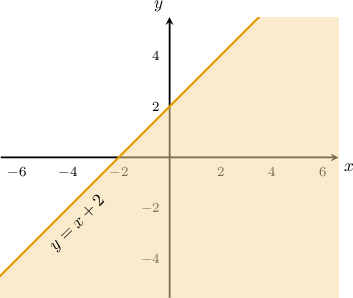
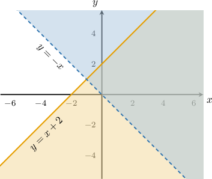
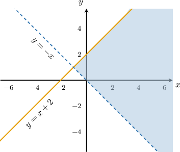
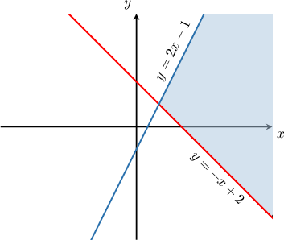
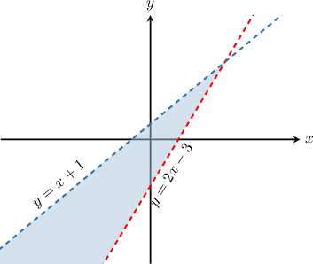
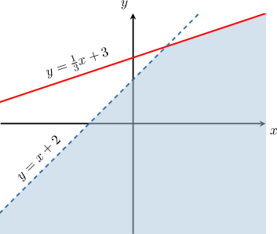
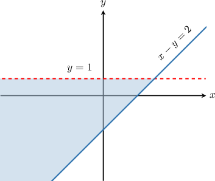

# Systems of Linear Inequalities

Source: https://www.mathacademy.com/topics/1535?courseId=120
Topic ID: 1535

## Prerequisites

- [Introduction to Systems of Linear Equations](../../../middle-school/lessons/grade-7/2225-introduction-to-systems-of-linear-equations.md)
- [Further Graphing of Two-Variable Linear Inequalities](../../../high-school/traditional/lessons/algebra-i/3822-further-graphing-of-two-variable-linear-inequalities.md)

## Lesson

### Introduction

Just as we can have a system of linear equations, we can also have systems of linear inequalities. For example, the system

is solved by the points that satisfy the inequalities *and* simultaneously.

To find the points that satisfy both inequalities, we first draw the graph of the inequality

Now, on top of the diagram above, we draw the graph of the second inequality,

The solution to the system is the *intersection* of the two regions (i.e., the part that is shaded twice).

The important thing to realize is that *any* point in the shaded region above satisfies *both* inequalities.

### Example: Working With Systems Containing "Or Equal To" Inequalities

#### Question

Which system of inequalities defines the shaded region shown above?

#### Explanation

Consider the line $y = 2x - 1.$ Since the line is solid, the inequality is an "or equal to" inequality. Also, since the shaded region lies ** the line, the inequality is a "less than" inequality. So the corresponding inequality is

$$

y \leq 2x - 1.

$$

Now consider the line $y = -x+2.$ Since the line is solid, the inequality is an "or equal to" inequality. Also, since the shaded region lies ** the line, the inequality is a "greater than" inequality. So the corresponding inequality is

$$

y \geq -x + 2.

$$

Therefore, the system of inequalities that defines our shaded region is

$$

\begin{aligned}𝑦≤2𝑥−1 \\ 𝑦≥−𝑥+2.\end{aligned}

$$

### Example: Working With Systems Containing Strict Inequalities

#### Question

Which system of inequalities defines the shaded region shown above?

#### Explanation

Consider the line $y=2x-3.$ Since the line is dashed, the inequality is strict. Also, since the shaded region lies ** the line, the inequality is a "greater than" inequality. So the corresponding inequality is

$$

y \gt 2x - 3.

$$

Now consider the line $y = x + 1.$ Since the line is dashed, the inequality is strict. Also, since the shaded region lies ** the line, the inequality is a "less than" inequality. So the corresponding inequality is

$$

y \lt x+1.

$$

Therefore, the system of inequalities that defines the shaded region is

$$

\begin{aligned}𝑦>2𝑥−3 \\ 𝑦<𝑥+1.\end{aligned}

$$

### Example: Working With Systems Containing Mixed Inequalities

#### Question

Which of the following systems of inequalities represents the shaded region shown in the graph above?

#### Explanation

Consider the line $y = \dfrac{1}{3}x+3.$ Since the line is solid, the inequality is an "or equal to" inequality. Also, since the shaded region lies ** the line, the inequality is a "less than" inequality. So the corresponding inequality is

$$

y \leq \dfrac{1}{3}x+3.

$$

Now consider the line $y = x+2.$ Since the line is dashed, the inequality is strict. Also, since the shaded region lies ** the line, the inequality is a "less than" inequality. So the corresponding inequality is

$$

y \lt x+2.

$$

Therefore, the system of inequalities that defines the shaded region is

$$

\begin{aligned}𝑦≤\frac{1}{3}𝑥+3 \\ 𝑦<𝑥+2.\end{aligned}

$$

### Example: Working With Systems Containing Inequalities Presented in Standard Form

#### Question

What system of inequalities defines the shaded region shown below?

#### Explanation

Consider the line $y=1.$ Since the line is dashed, the inequality is strict. Also, since the shaded region lies ** the line, the inequality is a "less than" inequality. So the corresponding inequality is

$$

y < 1.

$$

Now consider the line $x - y = 2.$ Since the line is solid, the inequality is an "or equal to" inequality. Writing the equation of this line in slope-intercept form, we have

$$

y =x- 2.

$$

Now, since the shaded region lies ** the line, the inequality is a "greater than" inequality. So the corresponding inequality is

$$

y \geq x - 2,

$$

which we can rewrite as

$$

x-y \leq 2.

$$

Therefore, the system of inequalities that defines the shaded region is

$$

\begin{aligned}𝑦<1 \\ 𝑥−𝑦≤2.\end{aligned}

$$
