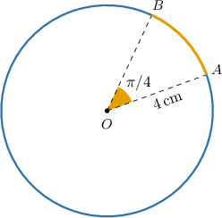
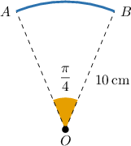
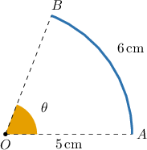
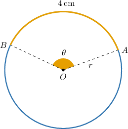

# Calculating Arc Length Using Radians

Source: https://www.mathacademy.com/topics/1605?courseId=120
Topic ID: 1605

## Prerequisites

- [Central Angles and Arcs](../../../high-school/traditional/lessons/geometry/550-central-angles-and-arcs.md)
- [Introduction to Radians](../../../high-school/traditional/lessons/geometry/764-introduction-to-radians.md)

## Lesson

### Introduction

Suppose that we are given a sector of a circle of radius $4\,\text{cm},$ like the one in the diagram below, where $m\angle AOB = \dfrac{\pi}4$ radians. How can we find the length of the arc $\overset{\frown}{AB}?$

Let the length of the arc $\overset{\frown}{AB}$ be denoted by $s.$ To find $s,$ we can use the **arc length formula** stated below:

$$

s = r \cdot \theta,

$$

where $r$ is the radius of the circle and $\theta$ is the central angle. Note that for this formula to work, $\theta$ *must* be in radians.

In our example, we have $r = 4$ and $\theta = \dfrac{\pi}{4}.$ So, the arc length is given by

$$

\begin{aligned}𝑠 & =4⋅\frac{𝜋}{4}=𝜋\,cm.\end{aligned}

$$

**Note:** To see where the arc length formula comes from, the trick is to set up a proportion.

The ratio of the arc length $s$ to the circumference $C$ must be equal to the ratio of the angle $\theta$ to a full revolution of $2\pi$ radians. So, we have

$$

\dfrac{s}{C} = \dfrac{\theta}{2\pi}.

$$

Substituting $C = 2\pi r$ and making $s$ the subject of the equation, we get

$$

\begin{aligned}\frac{𝑠}{2𝜋𝑟} & =\frac{𝜃}{2𝜋} \\ 2𝜋×\frac{𝑠}{2𝜋𝑟} & =2𝜋×\frac{𝜃}{2𝜋} \\ \frac{𝑠}{𝑟} & =𝜃 \\ 𝑠 & =𝑟𝜃.\end{aligned}

$$

### Example: Finding an Arc Length Using the Arc Length Formula

#### Question

The diagram below shows a sector of a circle of radius $10 \text{cm}.$ Given that the measure of its central angle is $\dfrac{\pi}{4}$ radians, find the length of the arc $\overset{\frown}{AB}.$

#### Explanation

The central angle is $\theta = \dfrac{\pi}{4}$ radians and the radius is $r = 10\,\text{cm}.$

We find the length of $\overset{\frown}{AB}$ using the arc length formula:

$$

\begin{aligned}𝑠=𝑟⋅𝜃=10⋅\frac{𝜋}{4}=\frac{5𝜋}{2}\,cm\end{aligned}

$$

### Example: Finding the Measure of an Angle Using the Arc Length Formula

#### Question

Given that the length of the arc $\overset{\frown}{AB}$ in the circular sector below is $6\,\text{cm},$ find the value of $\theta$ in radians.

#### Explanation

Here, the length of the arc is $s = 6\,\text{cm}$ and the radius is $r = 5\,\text{cm}.$

Rearranging the arc length formula, we have

$$

\begin{aligned}𝑠 & =𝑟⋅𝜃 \\ 𝜃 & =\frac{𝑠}{𝑟}.\end{aligned}

$$

Therefore,

$$

\theta = \dfrac{s}{r} = \dfrac{6}{5} \, \text{rad}.

$$

### Example: Determining the Radius of a Circular Sector Using the Arc Length Formula

#### Question

Given that the length of the arc $\overset{\frown}{AB}$ in the circle below is $4\,\text{cm},$ and that $\theta =2$ radians, what is the radius of the circle?

#### Explanation

Here, the length of the arc is $s=4 \, \text{cm}$ and the central angle is $\theta=2.$

Rearranging the arc length formula, we have

$$

\begin{aligned}𝑠 & =𝑟⋅𝜃 \\ 𝑟 & =\frac{𝑠}{𝜃}.\end{aligned}

$$

Therefore,

$$

r = \dfrac{s}{\theta} = \dfrac{4}{2} = 2 \, \text{cm}.

$$
