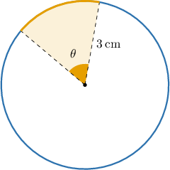
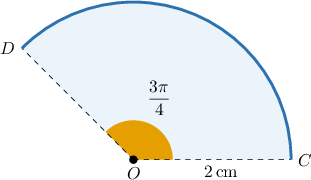
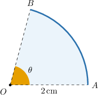
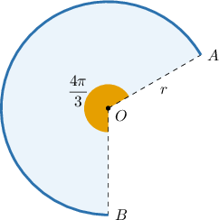

# Calculating Areas of Sectors Using Radians

Source: https://www.mathacademy.com/topics/1606?courseId=120
Topic ID: 1606

## Prerequisites

- [Fractions of Fractions](../../../middle-school/lessons/grade-7/323-fractions-of-fractions.md)
- [Calculating Arc Length Using Radians](../../../high-school/traditional/lessons/geometry/1605-calculating-arc-length-using-radians.md)
- [Areas of Circles](../../../high-school/traditional/lessons/geometry/1745-areas-of-circles.md)

## Lesson

### Introduction

A sector of a circle of radius $3\,\textrm{cm}$ and its corresponding central angle measuring $\theta=\dfrac{\pi}{3}$ radians are shown below. How can we calculate the area of the circular sector?

Let $\mathcal{A}$ be the area of the sector. To find a formula for $\mathcal{A},$ the trick is to set up a proportion.

The ratio of the sector area ($\mathcal{A}$) to the total area ($\pi r^2$) must be equal to the ratio of the angle ($\theta$) to a full revolution ($2\pi$). So, we have

$$

\begin{aligned}\frac{A}{𝜋𝑟^{2}} & =\frac{𝜃}{2𝜋} \\ 𝜋𝑟^{2}⋅\frac{A}{𝜋𝑟^{2}} & =𝜋𝑟^{2}⋅\frac{𝜃}{2𝜋} \\ A & =\frac{𝑟^{2}𝜃}{2}.\end{aligned}

$$

In our example, we have $r=3$ and $\theta= \dfrac{\pi}{3},$ so we get

$$

\begin{aligned}A & =\frac{3^{2}⋅\frac{𝜋}{3}}{3}=\frac{3𝜋}{2}\,cm^{2}.\end{aligned}

$$

**Note:** The formula $\mathcal A = \dfrac{r^2 \theta}{2}$ is very important, and we will use it throughout this lesson and beyond. You should aim to remember it. It's also important to note that the angle $\theta$ must be in radians.

### Example: Finding the Area of a Circular Sector

#### Question

The diagram below shows a sector of a circle of radius $2 \, \textrm{cm}.$ Given that $m\angle COD = \dfrac{3\pi}{4}$ radians, find the area of the sector $COD.$

#### Explanation

Here, we have the central angle $\theta = \dfrac{3\pi}{4}$ and radius $r = 2 \, \textrm{cm}.$

To find the area of the sector, we use the formula $\mathcal{A} = \dfrac{r^2 \theta}{2}.$ Substituting the known values into this formula gives

$$

\begin{aligned}A & =\frac{𝑟^{2}𝜃}{2} \\ & =\frac{2^{2}⋅(\frac{3𝜋}{4})}{4} \\ & =\frac{4⋅(\frac{3𝜋}{4})}{4} \\ & =\frac{3𝜋}{2}\,cm^{2}.\end{aligned}

$$

### Example: Finding the Measure of a Sector's Angle Given Its Area and Radius

#### Question

The area of the circular sector below is $\dfrac{5}{6}\pi\textrm{cm}^2.$ What is the measure of its central angle $\theta,$ in radians, if the radius $r$ of the circle is $2\,\textrm{cm}?$

#### Explanation

Here, we are given that the area of the sector is $\mathcal{A}=\dfrac{5}{6}\textrm{cm}^2$ and the radius is $r=2\,\textrm{cm}.$

Rearranging the formula for the area of a sector, we have

$$

\begin{aligned}A & =\frac{𝑟^{2}𝜃}{2} \\ 𝑟^{2}𝜃 & =2A \\ 𝜃 & =\frac{2A}{𝑟^{2}}.\end{aligned}

$$

Therefore,

$$

\begin{aligned}𝜃 & =\frac{2⋅A}{𝑟^{2}} \\ & =\frac{2⋅(\frac{5}{6}𝜋)}{6} \\ & =\frac{1}{2}⋅\frac{5}{6}𝜋 \\ & =\frac{5}{12}𝜋.\end{aligned}

$$

### Example: Determining the Radius of a Sector Given Its Area and Central Angle

#### Question

The area of the circular sector shown below is $6\pi\,\textrm{m}^2.$ If the measure of the central angle corresponding to the major arc is $\dfrac{4}{3}\pi$ radians, what is the radius of the circle?

#### Explanation

Here, we are given that the area of the sector is $\mathcal{A}=6\pi\,\textrm{m}^2$ and the central angle is $\theta=\dfrac{4}{3}\pi$ radians.

Rearranging the formula for the area of a sector, we have

$$

\begin{aligned}A & =\frac{𝑟^{2}𝜃}{2} \\ 𝑟^{2}𝜃 & =2A \\ 𝑟^{2} & =\frac{2A}{𝜃}.\end{aligned}

$$

Therefore,

$$

\begin{aligned}𝑟^{2} & =\frac{2⋅A}{𝜃} \\ & =\frac{2⋅6𝜋}{(\frac{4}{3}𝜋)} \\ & =12𝜋÷\frac{4𝜋}{3} \\ & =12𝜋⋅\frac{3}{4𝜋} \\ & =\frac{36𝜋}{4𝜋} \\ & =9.\end{aligned}

$$

Finally,

$$

r=\sqrt{9} = 3\,\textrm{m}.

$$
