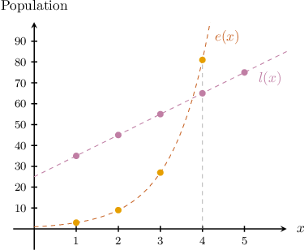

# Linear vs. Exponential Growth and Decay

Source: https://www.mathacademy.com/topics/1859?courseId=120
Topic ID: 1859

## Prerequisites

- [Exponential Functions](../../../high-school/traditional/lessons/algebra-i/1153-exponential-functions.md)
- [The Quotient Rule for Exponents](../../../middle-school/lessons/grade-8/1223-the-quotient-rule-for-exponents.md)
- [Constructing Linear Functions](../../../high-school/traditional/lessons/algebra-i/6219-constructing-linear-functions.md)

## Lesson

### Introduction

The relationship between two variables $x$ and $y$ is **linear** if there is a **common difference** between successive values of $y.$

For example, consider the relationship between $x$ and $y$ shown below.

This is a linear relationship. As $x$ increases by $1,$ the respective value of $y$ increases by ${\color{SandyBrown}{2}}.$

In this case, the common difference is ${\color{SandyBrown}{2}}.$

We can calculate the common difference for any linear relationship by subtracting any value of $y$ from the one that precedes it. In our case,

$$

\begin{aligned}2 & =4−2 \\ & =6−4 \\ & =8−6.\end{aligned}

$$

### Exponential Relationships

The relationship between two variables $x$ and $y$ is **exponential** if there is a **common ratio** between successive values of $y.$

For example, consider the relationship between $x$ and $y$ shown below.

This is an exponential relationship. As $x$ increases by $\color{SteelBlue}1$, the respective value of $y$ increases by a *factor* of ${\color{SandyBrown}3}.$

In this case, the common ratio is ${\color{SandyBrown}{3}}.$

We can calculate the common ratio for any exponential relationship by dividing any $y$ value by the one that precedes it. In our case,

$$

\begin{aligned}3 & =\frac{3}{1} \\ & =\frac{9}{3} \\ & =\frac{27}{9}.\end{aligned}

$$

### Example: Identifying True Statements Regarding a Relationship Between Two Variables

#### Question

Consider the relationship between $x$ and $y$ shown below.

Which of the following statements are true?

1. The relationship between $x$ and $y$ is linear

2. The relationship between $x$ and $y$ is exponential

3. If $x$ is increased by $1,$ then $y$ increases by a factor of $10$

#### Explanation

To determine if the relationship is linear or exponential, we need to determine how $y$ changes as $x$ increases at each step:

- For a linear relationship, there should be a common ** between successive values of $y.$

- For an exponential relationship, there should be a common ** between successive values of $y.$

With that in mind, let's examine each statement.

- Statement I is false, while statement II is true. Let's check for a common ratio by dividing successive values of $y.$ We see that and similarly, Since the ** of any two successive terms is constant, the relationship is **. In this case, the common ratio is $5.$

- Statement III is false. When $x$ increases by $1,$ the respective value of $y$ increases by a factor of $5,$ not $10.$

Therefore, the correct answer is "II only."

### Example: Classifying the Type of Growth Given a Table of Values

#### Question

The following table shows the relationship between $V$, the value of a painting (in dollars), and $t$, the elapsed time (in years) since it was completed.

What kind of function best models this relationship?

#### Explanation

To determine if the relationship is linear or exponential, we need to determine how $V$ changes as $t$ increases at each step:

- For a linear relationship, there should be a common ** between successive values of $V.$

- For an exponential relationship, there should be a common ** between successive values of $V.$

Let's check whether the table shows a linear or exponential relationship with that in mind.

- First, let's check for a common ratio by dividing successive values of $V{:}$ This list of quotients shows a definite (although approximate) common ratio.

- Now, let's check for a linear pattern by finding the difference between successive values of $V{:}$ This list of differences does not show a definite common difference.

Therefore, the function that best models the relationship is an exponential function with a common ratio of approximately $1.25.$

### Linear vs. Exponential Growth

A function that grows exponentially will always, at some point, overtake a function that grows linearly. Functions that grow exponentially grow very rapidly.

For example, suppose that the function

$$

l(x)=10x+25

$$

models the population of lizard species $A$ in a nature reserve, while

$$

e(x)=3^x

$$

models the population of lizard species $B$, where $x$ is the number of years since the last census.

At some point, the population of species $B$ will overtake the population of species $A.$ But when will this happen?

To find how many years it takes for the population of species $B$ to be larger than the population of species $A,$ we must find the value of $x$ for which $e(x)$ first exceeds $l(x).$ So, we create a table of values for $l(x)$ and $e(x),$ as follows:

We see that $e(x)$ first exceeds $l(x)$ when $x=4.$ Therefore, the population of species $B$ will be larger than the population of species $A$ after $4$ years.

Plotting $l(x)$ and $e(x)$ on a set of coordinate axes, we get the following:

Notice that the points corresponding to $e(x)$ lie above those corresponding to $l(x)$ for $x\geq 4.$

### Example: Finding the Point When an Exponential Function First Exceeds a Linear Function

#### Question

Consider the linear function $l(x) = 5x+10$ and the exponential function $e(x)=2^x$, where $x$ is a positive integer. At which value of $x$ does the exponential function first exceed the linear function?

#### Explanation

To find the value of $x$ for which $e(x)$ first exceeds $l(x),$ we create a table of values of the two functions for increasing integer values of $x$ until $l(x) < e(x),$ as follows:

Therefore, we see that $e(x)$ first exceeds $l(x)$ when $x=6.$
