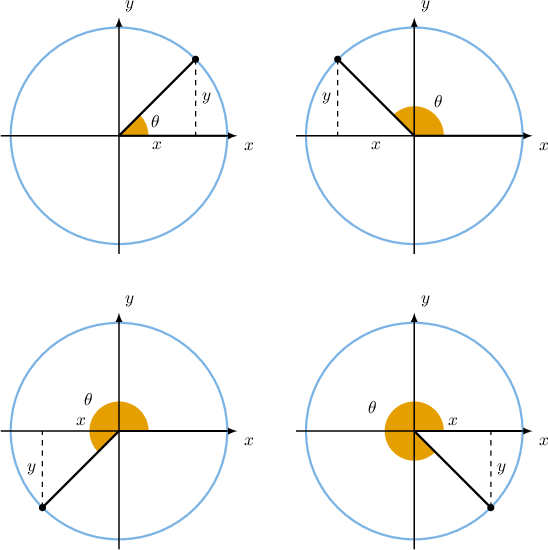
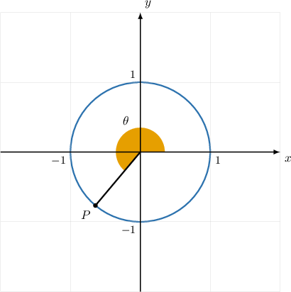
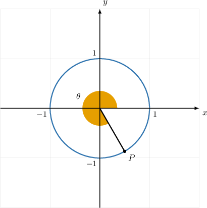
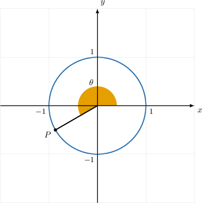

# Extending the Pythagorean Identity to All Quadrants

Source: https://www.mathacademy.com/topics/2021?courseId=120
Topic ID: 2021

## Prerequisites

- [Using the Pythagorean Identity in the First Quadrant](../../../high-school/traditional/lessons/algebra-ii/1453-using-the-pythagorean-identity-in-the-first-quadrant.md)
- [Extending the Trigonometric Ratios Using Angles in Radians](../../../high-school/traditional/lessons/algebra-ii/4037-extending-the-trigonometric-ratios-using-angles-in-radians.md)

## Lesson

### Introduction

For any point on the unit circle, we can draw a right triangle whose hypotenuse is the line segment between the origin and the point.

Each hypotenuse is the radius of the unit circle and consequently has a length equal to $1.$

Therefore, the coordinates of *any* point on the unit circle must satisfy the Pythagorean theorem:

$$

x^2+y^2=1.

$$

We can use this fact to find one coordinate of a point on the unit circle given the other.

For example, suppose that the $x$-coordinate of the point $A$ in the fourth quadrant on the unit circle is $\dfrac{3}{7}.$ To find the $y$-coordinate, we substitute $x=\dfrac{3}{7}$ into the above and solve for $y\mathbin{:}$

$$

\begin{aligned} x^2+y^2&=1\\[5pt] \left(\dfrac{3}{7}\right)^2+y^2&=1\\[5pt] \dfrac{9}{49}+y^2&=1\\[5pt] y^2&= 1-\dfrac{9}{49}\\[5pt] y^2&= \dfrac{40}{49}\\[5pt] y&= \sqrt{\dfrac{40}{49}}\\[5pt] y &= \pm \dfrac{2\sqrt{10}}{7} \end{aligned}

$$

Since $A$ lies in the *fourth* quadrant, $y$ must be *negative*. So we select the negative answer. Therefore, $y=-\dfrac{2\sqrt{10}}{7}.$

### Example: Applying the Pythagorean Theorem to the Unit Circle

#### Question

The point $P$ is located in the second quadrant and lies on the unit circle. The $y$-coordinate of $P$ is $\dfrac{\sqrt 2}{2}.$ What is the $x$-coordinate of $P?$

#### Explanation

Since the point $P$ lies on the unit circle, it must satisfy the Pythagorean theorem:

$$

x^2+y^2=1 .

$$

Substituting $y=\dfrac{\sqrt 2}{2}$ into the above and solving for $x,$ we get

$$

\begin{aligned}𝑥^{2}+𝑦^{2} & =1 \\ 𝑥^{2}+(\frac{\sqrt{2}}{2})^{2} & =1 \\ 𝑥^{2}+\frac{1}{2} & =1 \\ 𝑥^{2} & =1−\frac{1}{2} \\ 𝑥^{2} & =\frac{1}{2} \\ 𝑥 & =±\sqrt{\frac{1}{2}} \\ 𝑥 & =±\frac{\sqrt{2}}{2}.\end{aligned}

$$

Finally, we select the negative answer since $x$ is negative in the second quadrant. Therefore, $x = -\dfrac{\sqrt{2}}{2}.$

### The Pythagorean Identity

By the Pythagorean theorem, we know that the equation

$$

x^2+y^2 = 1

$$

holds for any point $(x,y)$ on the unit circle.

Now, we also know that for any point on the unit circle, the coordinates $(x,y)$ are related to the central angle $\theta$ via the formulas

$$

x = \cos\theta, \qquad y = \sin\theta.

$$

Substituting the above into the Pythagorean Identity, we get

$$

\begin{aligned}𝑥^{2}+𝑦^{2} & =1 \\ (cos⁡𝜃)^{2}+(sin⁡𝜃)^{2} & =1 \\ cos^{2}⁡𝜃+sin^{2}⁡𝜃 & =1.\end{aligned}

$$

The last equation is called the **Pythagorean trigonometric identity**, and it holds for *every* angle $\theta.$ This includes negative angles and angles that are larger than one full rotation.

### Example: Computing a Trigonometric Ratio Using the Pythagorean Identity

#### Question

The diagram above shows the unit circle. Given that $\sin\theta=-\dfrac{3}{4},$ what is the value of $\cos \theta?$

#### Explanation

We can use the Pythagorean identity to find $\cos\theta\mathbin{:}$

$$

\begin{aligned}sin^{2}⁡𝜃+cos^{2}⁡𝜃 & =1 \\ cos^{2}⁡𝜃 & =1−sin^{2}⁡𝜃 \\ cos⁡𝜃 & =±\sqrt{1−sin^{2}⁡𝜃}\end{aligned}

$$

Substituting $\sin\theta = -\dfrac{3}{4}$ gives

$$

\begin{aligned}cos⁡𝜃 & =±\sqrt{1−(−\frac{3}{4})^{2}} \\ & =±\sqrt{1−\frac{9}{16}} \\ & =±\sqrt{\frac{7}{16}} \\ & =±\frac{\sqrt{7}}{4}.\end{aligned}

$$

We select the negative answer since $\cos\theta$ is negative in the third quadrant. So, $\cos\theta = -\dfrac {\sqrt {7}}{4}.$

### Example: Computing a Tangent or Cotangent Using the Pythagorean Identity

#### Question

The diagram above shows the unit circle. Given that $\sin\theta=-\dfrac{\sqrt 3}{2},$ what is the value of $\tan\theta?$

#### Explanation

We can use the Pythagorean identity to find $\cos\theta\mathbin{:}$

$$

\begin{aligned}sin^{2}⁡𝜃+cos^{2}⁡𝜃 & =1 \\ cos^{2}⁡𝜃 & =1−sin^{2}⁡𝜃 \\ cos⁡𝜃 & =±\sqrt{1−sin^{2}⁡𝜃}\end{aligned}

$$

Substituting $\sin\theta = -\dfrac{\sqrt 3}{2}$ gives

$$

\begin{aligned}cos⁡𝜃 & =±\sqrt{1−(−\frac{\sqrt{3}}{2})^{2}} \\ & =±\sqrt{1−\frac{3}{4}} \\ & =±\sqrt{\frac{1}{4}} \\ & =±\frac{1}{2}.\end{aligned}

$$

We select the positive answer since $\cos\theta$ is positive in the fourth quadrant. So, $\cos\theta = \dfrac 1 2.$

Finally, knowing that $\tan\theta = \dfrac{\sin\theta}{\cos\theta},$ we have

$$

\tan\theta = \dfrac{\left(-\dfrac{\sqrt 3}{2}\right)}{\left(\dfrac{1}{2}\right)} =-\sqrt 3.

$$

### Example: Computing a Reciprocal Trigonometric Ratio Using the Pythagorean Identity

#### Question

The diagram above shows the unit circle. Given that the $x$-coordinate of the point $P$ is $-\dfrac{\sqrt 3}{2},$ what is $\csc\theta?$

#### Explanation

We're given that $x=-\dfrac{\sqrt 3}{2}$ at the point $P.$ Therefore, we have

$$

\cos\theta = -\dfrac{\sqrt 3}{2}.

$$

We can use the Pythagorean identity to find $\sin\theta\mathbin{:}$

$$

\begin{aligned}sin^{2}⁡𝜃+cos^{2}⁡𝜃 & =1 \\ sin^{2}⁡𝜃 & =1−cos^{2}⁡𝜃 \\ sin⁡𝜃 & =±\sqrt{1−cos^{2}⁡𝜃}\end{aligned}

$$

Substituting $\cos\theta = -\dfrac{\sqrt 3}{2}$ gives

$$

\begin{aligned}sin⁡𝜃 & =±\sqrt{1−(−\frac{\sqrt{3}}{2})^{2}} \\ & =±\sqrt{1−\frac{3}{4}} \\ & =±\sqrt{\frac{1}{4}} \\ & =±\frac{1}{2}.\end{aligned}

$$

We select the negative answer since $\sin\theta$ is negative in the third quadrant. So, $\sin\theta = -\dfrac 1 2.$

Finally, knowing that $\csc\theta = \dfrac{1}{\sin\theta},$ we have

$$

\csc\theta = \dfrac{1}{\left(-\dfrac{1}{2}\right)} =-2.

$$
