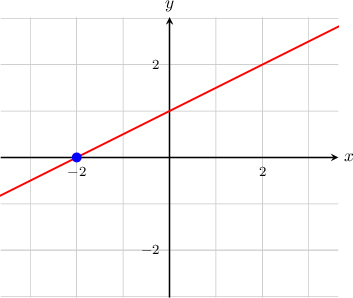
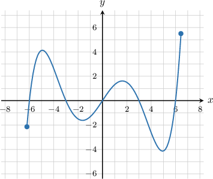
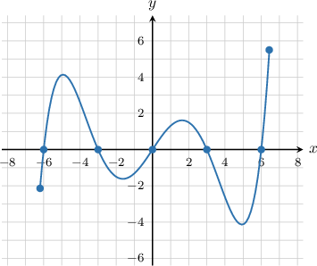
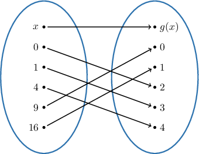

# The Roots of a Function

Source: https://www.mathacademy.com/topics/2022?courseId=120
Topic ID: 2022

## Prerequisites

- [Graphs of Functions](../../../high-school/traditional/lessons/algebra-i/3821-graphs-of-functions.md)

## Lesson

### Introduction

The **roots** of a function are the values of the input $x$ for which the function equals zero. For this reason, roots are sometimes also called **zeros**.

Algebraically, the roots of a function are the solutions for $x$ in the following equation:

$$

f(x)=0

$$

For example, if $f(x) = \dfrac{1}{2}x+1,$ then we can find the roots by solving the equation $f(x) = 0,$ as follows:

$$

\begin{aligned}𝑓(𝑥) & =0 \\ \frac{1}{2}𝑥+1 & =0 \\ \frac{1}{2}𝑥 & =−1 \\ 𝑥 & =−2\end{aligned}

$$

So, this function has a single root: $x=-2.$

Graphically, the roots of a function are the $x$-intercepts. For example, for the graph of $f(x) = \dfrac{1}{2}x+1$ shown below, we can see that the function intercepts the $x$-axis at $x=-2.$

When shown on a graph, the roots of a function are also called the $\boldsymbol x$**-intercepts.**

### Example: Finding the Roots of a Function Given Its Graph

#### Question

What are the roots of the function shown below?

#### Explanation

The roots of the function are the $x$-intercepts. Therefore, the roots are $x=-6,-3,0,3,6.$

### Example: Finding the Roots of a Function Given a Table

#### Question

If $f(x)$ is given by the table shown below, what are its roots?

#### Explanation

The roots of the function are the values of $x$ such that $f(x)=0.$ In the given table, we see that $f(-2)=0$ and $f(1)=0.$

Therefore, the roots of the function are $x=-2$ and $x=1.$

### Example: Finding the Roots of a Function Given a Mapping Diagram

#### Question

What are the roots of the function $g(x)$ defined by the mapping diagram shown below?

#### Explanation

The roots of the function are the values of $x$ such that $g(x)=0.$ In the given mapping diagram, we see that $g(9) = 0.$

Therefore, the only root of the function is $x=9.$

### Example: Finding the Roots Given a Function Definition

#### Question

What is the root of the function $f(x)=2-4x?$

#### Explanation

The roots are the solutions to the equation $f(x)=0,$ which we solve as follows:

$$

\begin{aligned}𝑓(𝑥) & =0 \\ 2−4𝑥 & =0 \\ 4𝑥 & =2 \\ 𝑥 & =\frac{1}{2}\end{aligned}

$$

Therefore, the function has the single root $x=\dfrac12.$
