# Unbounded Behavior of Functions Near a Point

Source: https://www.mathacademy.com/topics/2046?courseId=120
Topic ID: 2046

## Prerequisites

- [Increasing and Decreasing Functions](../../../high-school/traditional/lessons/algebra-i/1628-increasing-and-decreasing-functions.md)

## Lesson

### Introduction

Sometimes, a function might increase or decrease without bound when its input gets close to a specific value.

For example, consider the function whose graph is shown below:

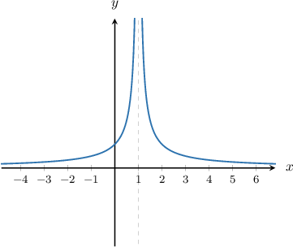

As the input $x$ gets closer to $1,$ the values of the function get larger and larger.

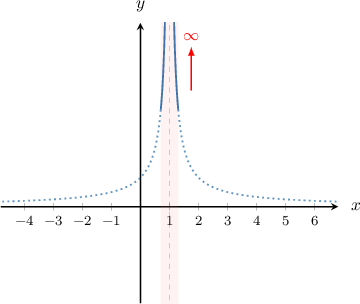

When this happens, we say that the function approaches "infinity", or that it has an **infinite limit** at $x=1.$ We can write this mathematically, as follows:

$$

f(x) \rightarrow \infty\quad \text{as}\quad x \rightarrow 1

$$

In words, this reads "the function $f(x)$ approaches infinity as $x$ approaches $1$".

Now, consider the function $y = g(x),$ shown below. This is an example of a function that *decreases* without bound.

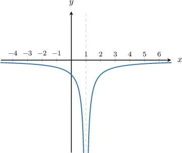

The function $g(x)$ approaches negative infinity as $x$ approaches $1.$ So, we can write

$$

g(x) \rightarrow -\infty\quad \text{as } \quad x \rightarrow 1.

$$

In words, this reads "the function $g(x)$ approaches negative infinity as $x$ approaches $1$".

### Example: Identifying Points Where a Function Approaches Infinity

#### Question

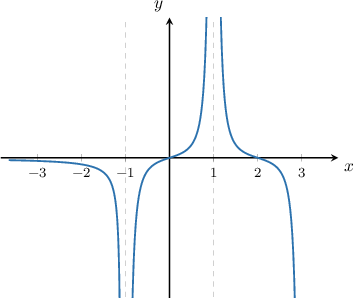

The graph of the function $g(x)$ is shown above. Find the value of $b-a,$ given the following:

- $g(x)\rightarrow -\infty$ as $x\rightarrow a$

- $g(x)\rightarrow \infty$ as $x\rightarrow b$

#### Explanation

From the given graph, we see that as $x$ approaches $-1,$ the values of $g(x)$ decrease, approaching $-\infty.$

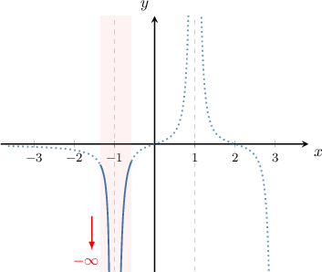

So, we can write

$$

g(x) \to -\infty \quad \text{as} \quad x \to -1.

$$

Therefore, $a = -1.$

From the given graph, we see that as $x$ approaches $1,$ the values of $g(x)$ increase, approaching $\infty.$

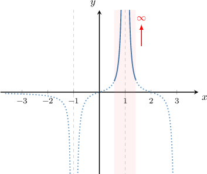

So, we can write

$$

g(x) \to \infty \quad \text{as} \quad x \to 1.

$$

Therefore, $b =1.$

Finally,

$$

b - a = 1 - (-1) = 2.

$$

### Example: Classifying Infinite Behavior of a Function

#### Question

The graph of $y=f(x)$ is shown below. Which of the following is true when $x\rightarrow 2?$

1. $f(x) \rightarrow \infty$

2. $f(x) \rightarrow 2$

3. $f(x) \rightarrow -\infty$

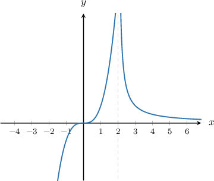

#### Explanation

From the given graph, we see that as $x$ approaches $2,$ the values of $f(x)$ increase, approaching $\infty.$

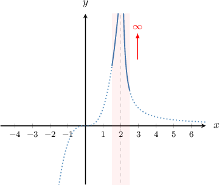

Therefore, the correct answer is "I only".

### One-Sided Infinite Behavior of Functions

We know that some functions approach infinity as $x$ approaches a certain value, like the function $y=f(x)$ plotted below.

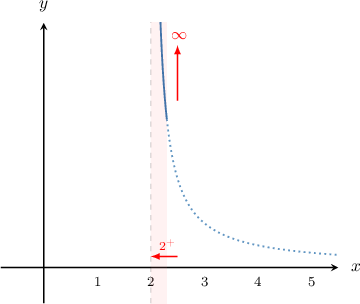

Here, the function shoots upwards when $x$ approaches $2$ *from the right*, that is, from the positive direction of the $x$-axis.

We say that the function approaches positive infinity as $x$ approaches $2$ from the right, and we write

$$

f(x) \rightarrow \infty \quad \text{as} \quad x \rightarrow 2^+,

$$

where the superscript $+$ next to the $2$ indicates that $x$ approaches $2$ from the right.

Similar to the case above, we can have a function that shoots upwards or downwards when $x$ approaches a finite value *from the left*, that is, from the negative direction of the $x$-axis. Consider the function $y=g(x),$ shown below.

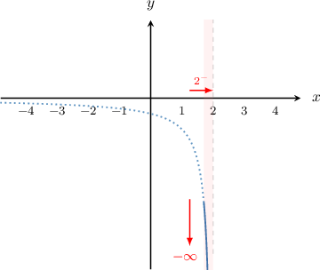

We say that the function approaches negative infinity as $x$ approaches $2$ from the left, and we write

$$

g(x) \rightarrow -\infty \quad \text{as} \quad x \rightarrow 2^-,

$$

where the superscript $-$ indicates that $x$ approaches $2$ from the left.

### Example: Recognizing One-Sided Infinite Behavior of a Function

#### Question

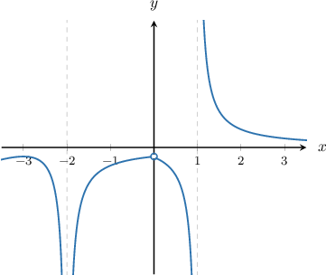

The graph of is shown above. Which of the following is true when

#### Explanation

The notation means that approaches **.

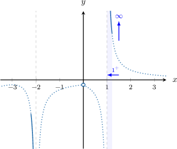

From the given graph, we see that as approaches from the right, the values of increase, approaching

Therefore, as So, the correct answer is "III only".

### Vertical Asymptotes of Functions

We know that some functions approach infinity as $x$ approaches a certain value from one side, like the functions $y=f(x)$ and $y=g(x)$ plotted below.

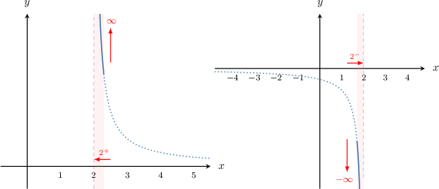

We call the line $x=2$ a **vertical asymptote** of the functions $y = f(x)$ and $y=g(x).$

An asymptote is a line that a function gets very close to but never touches. In general, if a function $f(x)$ has an infinite limit (positive or negative) at a point $a,$ then we write

$$

f(x) \rightarrow \pm \infty \quad \text{as} \quad x \rightarrow a^+

$$

or

$$

f(x)\rightarrow \pm\infty \quad \text{as} \quad x \rightarrow a^-

$$

and $x=a$ is a vertical asymptote of the function.

### Example: Identifying Vertical Asymptotes

#### Question

Consider the graph of $y = f(x)$ shown below. What is the equation of its vertical asymptote?

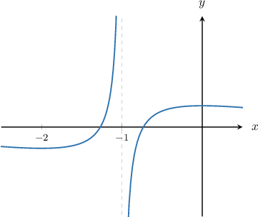

#### Explanation

Recall that $x = a$ is called a vertical asymptote of $y = f(x)$ if $f(x) \to \pm \infty$ as $x \to a^+$ or $x \to a^-.$

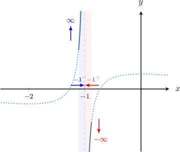

From the given graph, we see that as $x$ approaches $-1$ from the left, the values of $f(x)$ increase, approaching $\infty.$ Also, notice that as $x$ approaches $-1$ from the right, the values of $f(x)$ decrease, approaching $-\infty.$

So, we can write:

- $f(x) \to \infty$ as $x \to -1^-$

- $f(x) \to -\infty$ as $x \to -1^+$

These give us the same asymptote $x = -1.$
