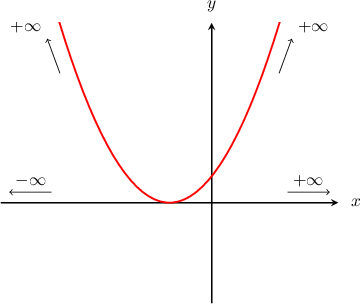
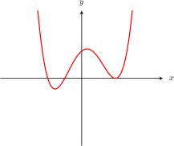
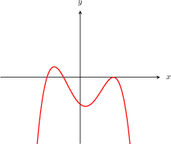
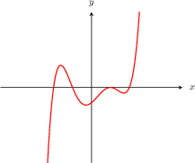
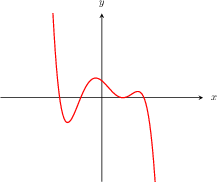
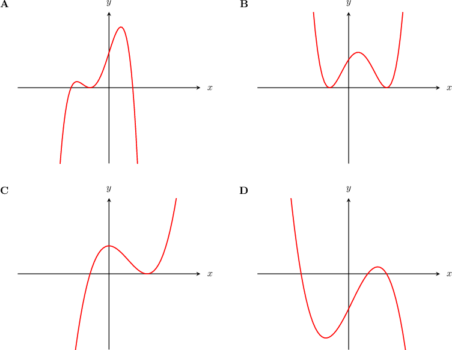
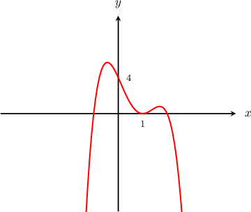
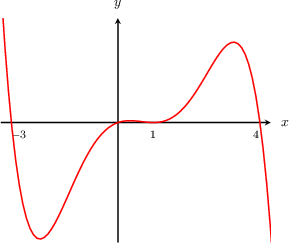

# End Behavior of Polynomials

Source: https://www.mathacademy.com/topics/2050?courseId=120
Topic ID: 2050

## Prerequisites

- [Graphing Cubic Curves Containing One Distinct Real Root](../../../high-school/traditional/lessons/algebra-ii/2084-graphing-cubic-curves-containing-one-distinct-real-root.md)

## Lesson

### Introduction

The **end behavior of a function** refers to what the function does when the input value $x$ is very large (either positive or negative).

For example, consider the polynomial $p(x)=x^2+2x+1.$ We can understand its behavior for very large $x$ by looking at its graph.

Let's inspect the graph as $x$ becomes very large.

- As $x$ becomes very large in the *positive* direction, the polynomial $p(x)$ grows very large in the positive direction as well. So, we say that "the polynomial $p(x)$ approaches positive infinity as $x$ approaches positive infinity," and we write

- As $x$ becomes very large in the *negative* direction, the polynomial $p(x)$ again grows very large in the positive direction. So, we say that "the polynomial $p(x)$ approaches positive infinity as $x$ approaches negative infinity," and we write

We can confirm this by evaluating the function at large values of $x.$

- For large *positive* inputs, the values of $p(x)$ get larger.

- For large *negative* inputs, the values of $p(x)$ again get larger.

As you can see from the above computations, it is the leading term that "decides" the behavior of the function at infinity.

In general, to determine the end behavior of a polynomial, all we have to do is look at the leading term. Let's see how to do this.

**Note:** The "$+$" sign is often dropped from the notation for positive infinity. Whenever you see an infinity symbol without a sign in front of it $(\infty),$ it means positive infinity $(+\infty).$

### The End Behavior of a General Polynomial

In general, if we have a polynomial

$$

f(x) = a_nx^n+a_{n-1}x^{n-1}+...+a_{1}x + a_0

$$

with leading coefficient $a_n\neq 0,$ the end behavior of the polynomial is always

$$

f(x) \rightarrow +\infty \quad \text{or} \quad f(x) \rightarrow -\infty

$$

as $x \rightarrow \pm \infty.$ The sign of infinity depends on whether the leading exponent is even or odd, and on the sign of the leading coefficient.

- If the leading coefficient is *positive*, then $f(x) \to +\infty$ as $x \to +\infty.$ Otherwise, if the leading coefficient is *negative*, then $f(x) \to -\infty$ as $x \to +\infty.$

- If the leading exponent is *even*, then the end behavior as $x \to +\infty$ is the *same* as the end behavior as $x \to -\infty.$ Otherwise, if the leading exponent is *odd*, then the end behavior as $x \to +\infty$ is *opposite* the end behavior as $x \to -\infty.$

The different cases are summarized in the table below.

### Example: Identifying the Graph of a Polynomial

#### Question

Which of the following could be the graph of $y =2x^3- 6 x^2 +8?$

#### Explanation

Let's call $P(x)$ the given polynomial:

$$

P(x)=2x^3 -6 x^2 + 8

$$

The degree ($n=3$) is odd and the leading coefficient ($a_3 = 2$) is positive. Therefore, the polynomial has the following end behavior:

- $P(x)$ approaches $-\infty$ as as $x$ approaches $-\infty.$

- $P(x)$ approaches $\infty$ as $x$ approaches $\infty.$

Only the graph $\textbf{C}$ satisfies these conditions.

### A Mnemonic Trick for Remembering the End Behavior Rules

If you can't remember all the different cases, there's a trick you can use to determine the sign of infinity:

- Substitute $+1$ and $-1$ into the leading term of your polynomial and check the sign of the result.

- The sign of the result corresponds to the sign of infinity approached by the function for $x\rightarrow +\infty$ and $x\rightarrow -\infty,$ respectively.

To illustrate, consider the following polynomial:

$$

P(x) = 2x^3 -6 x^2 + 8

$$

Here, the leading term is $2x^3.$ Applying the trick, we have that

- $2(+1)^3 = {\color{blue}\mathbf+2},$ which indicates that $P(x) \rightarrow {\color{blue}\mathbf +\infty}$ as $x \rightarrow +\infty.$

- $2(-1)^3 ={\color{red}\mathbf-2},$ which indicates that $P(x) \rightarrow {\color{red}\mathbf-\infty}$ as $x \rightarrow -\infty.$

### Example: Identifying the Polynomial Given its Graph

#### Question

Which of the following polynomials is shown in the diagram above?

1. $-2 x^4 + 6 x^3 - 2 x^2 - 6 x + 4$

2. $-2 x^5 + 6 x^4 + 5 x^3 - 2 x^2 - 3 x + 1$

3. $3 x^4 + 5 x^3 - 2 x^2 - 3 x - 4$

4. $- x^4 + 5 x^3 - 2 x^2 - 3 x - 1$

#### Explanation

Let's call $P(x)$ the polynomial shown in the diagram.

The end behavior of $P(x)$ is

- $P(x)\to-\infty$ as $x\to-\infty,$ and

- $P(x)\to-\infty$ as $x\to \infty.$

Consequently,

- the degree of $P(x)$ is even, and

- the leading coefficient of $P(x)$ is negative.

So, $P(x)$ is neither II nor III.

Lastly, note that the $y$-intercept is $4,$ which means that $P(0)$ must be equal to $4.$

Therefore, $P(x)$ is given by polynomial I.

### Example: Identifying True Statements Regarding the Graph of a Polynomial

#### Question

The graph of a polynomial $Q(x)$ is shown below.

Which of the following statements are true?

1. The coefficient of the leading term is positive.

2. The degree of $Q(x)$ is odd.

3. The constant term is negative.

#### Explanation

The end behavior of $P(x)$ is

- $Q(x)\to\infty$ as $x\to-\infty,$ and

- $Q(x)\to-\infty$ as $x\to\infty.$

Consequently,

- the degree of $Q(x)$ is odd, and

- the leading coefficient of $Q(x)$ is negative.

So I is false, and II is true.

Lastly, note that the $y$-intercept is $0,$ which means that $Q(0)$ must be equal to $0,$ and therefore the constant term must be equal to $0.$ So, III is false.

Therefore, the correct answer is "II only".
